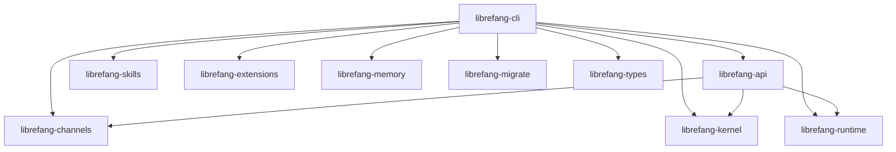

# Other — librefang-cli

# librefang-cli

The command-line interface and primary binary distribution for the LibreFang Agent OS. This crate produces the `librefang` executable, which serves as the entry point for running agents, managing configurations, and interacting with the system.

## Overview

`librefang-cli` is a thin orchestration layer that wires together the domain crates of the LibreFang ecosystem. It does not implement business logic itself — instead, it handles:

- CLI argument parsing (via `clap`)
- Configuration file discovery and loading
- Feature-gated channel adapter selection
- Build metadata embedding (git SHA, build date, compiler version)
- Optional OpenTelemetry telemetry initialization
- Terminal UI rendering (via `ratatui`)

## Binary

The produced binary is named **`librefang`**, built from `src/main.rs`.

```toml
[[bin]]
name = "librefang"
path = "src/main.rs"
```

## Dependency Graph

The CLI sits at the top of the crate dependency tree, pulling in every domain module:



## Feature Flags

Feature flags control which channel adapters and optional subsystems are compiled into the binary. This exists primarily to keep developer iteration fast — heavy dependencies like `matrix-sdk-crypto`, `lettre`, `imap`, `rumqttc`, and `nostr-sdk` are excluded by default.

| Feature | Description |
|---|---|
| `default` | Enables `core-channels` (Telegram, Discord, Slack, webhook, ntfy) + `telemetry`. This is what you get with a plain `cargo build`. |
| `all-channels` | Enables every channel adapter. Used by release CI to produce full binaries. Does **not** imply `telemetry` on its own. |
| `mini` | Minimal channel set for resource-constrained environments. |
| `android` | All channels except email, due to a `rustls-connector` + `rustls-platform-verifier` incompatibility on Android (`Verifier::new_with_extra_roots` not implemented). |
| `telemetry` | Enables OpenTelemetry tracing exporters. Pulls in `opentelemetry`, `opentelemetry_sdk`, and `tracing-opentelemetry`. |

### Build Commands for Common Scenarios

```bash
# Fast developer build (core channels only, ~30s cold)
cargo build -p librefang-cli

# Release binary with all channels (used by CI)
cargo build -p librefang-cli --release --features all-channels

# Minimal footprint build
cargo build -p librefang-cli --no-default-features --features mini

# Android target (no email channel)
cargo build -p librefang-cli --target aarch64-linux-android --no-default-features --features android

# All channels without telemetry (explicit opt-out)
cargo build -p librefang-cli --no-default-features --features all-channels
```

> **Note:** If you build with `--no-default-features --features all-channels`, telemetry is disabled because `all-channels` does not include it. Add `telemetry` explicitly if you need both.

## Build Script (`build.rs`)

The build script captures environment metadata at compile time and injects it via `cargo:rustc-env` directives. These are accessible at runtime via `env!()` macros:

| Environment Variable | Source | Example Value |
|---|---|---|
| `GIT_SHA` | `git rev-parse --short HEAD` | `a1b2c3d` |
| `BUILD_DATE` | `date -u +%Y-%m-%d` | `2025-01-15` |
| `RUSTC_VERSION` | `rustc --version` | `rustc 1.82.0` |

All three gracefully fall back to `"unknown"` if the command fails (e.g., building from a tarball without git).

Usage in source code:
```rust
let version = format!(
    "{} ({} {})",
    env!("CARGO_PKG_VERSION"),
    env!("GIT_SHA"),
    env!("BUILD_DATE"),
);
```

## Memory Allocator

On non-MSVC targets (Linux, macOS, BSD), the binary uses **tikv-jemallocator** with `disable_initial_exec_tls` enabled:

```rust
#[cfg(not(target_env = "msvc"))]
#[global_allocator]
static GLOBAL: tikv_jemallocator::Jemalloc = tikv_jemallocator::Jemalloc;
```

This is defined as a workspace dependency and linked automatically via the `Cargo.toml` dependency on `tikv-jemallocator`.

## Key External Dependencies

| Crate | Purpose |
|---|---|
| `clap` | CLI argument parsing and shell completion generation |
| `clap_complete` | Shell completion scripts (bash, zsh, fish, etc.) |
| `ratatui` | Terminal UI framework for interactive views |
| `tracing` / `tracing-subscriber` | Structured logging and trace collection |
| `colored` | Colored terminal output |
| `toml` / `toml_edit` | Configuration file reading and writing |
| `fluent` / `unic-langid` | Internationalization (i18n) support |
| `open` | Open URLs/files in the system default application |
| `zeroize` | Secure memory zeroing for sensitive data |

## Connection to Other Modules

The CLI is the assembly point. It does not define data types, channel logic, or runtime behavior — it delegates:

- **`librefang-api`** — HTTP server startup, routing, and the channel feature flags that propagate through the dependency tree
- **`librefang-kernel`** — Core agent logic and lifecycle management
- **`librefang-runtime`** — Process registry and execution environment
- **`librefang-channels`** — Channel adapter implementations (Telegram, Discord, Matrix, etc.)
- **`librefang-skills`** — Skill/plugin loading and execution
- **`librefang-extensions`** — Extension system
- **`librefang-memory`** — Persistent agent memory
- **`librefang-migrate`** — Database migration runner
- **`librefang-types`** — Shared type definitions

## Contributing

When adding a new dependency or channel adapter, consider whether it should be behind a feature flag. Heavy or platform-specific dependencies (crypto libraries, async runtimes for specific protocols, native TLS stacks) should be gated to avoid slowing down the default developer build.