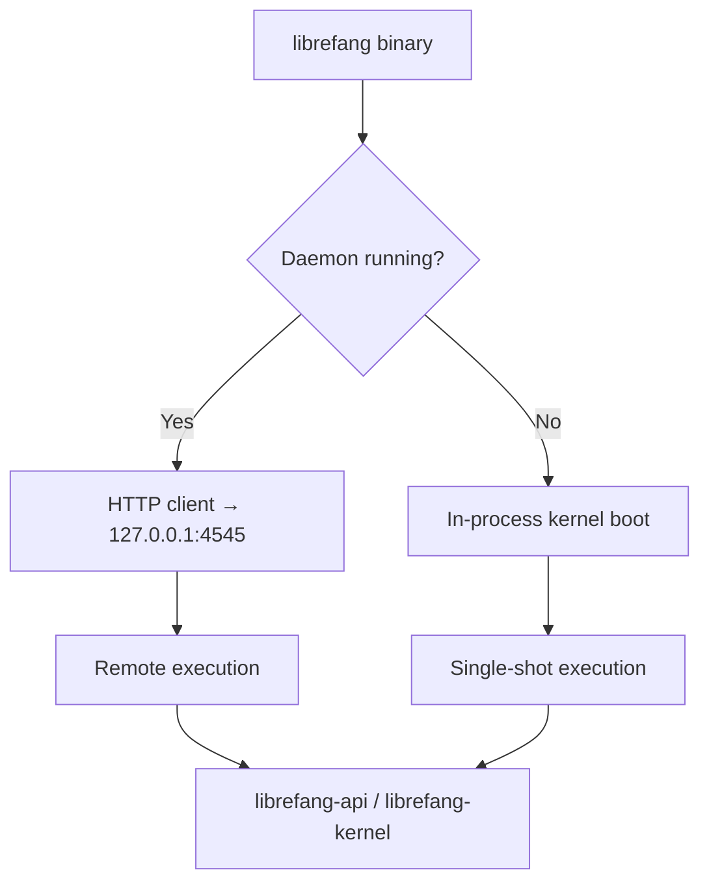

# Other — librefang-cli

# librefang-cli

The command-line interface for the LibreFang Agent OS. This crate produces the `librefang` binary, which serves as both the daemon launcher and the primary administrative tool for interacting with agents, channels, skills, and the runtime environment.

## Architecture Overview

The CLI operates in one of two modes depending on whether a daemon is already running:

- **Daemon mode**: When `librefang start` has been run, subsequent CLI invocations communicate with the running daemon over HTTP at `http://127.0.0.1:4545` (default). Commands are dispatched remotely via `reqwest`.
- **Standalone mode**: When no daemon is detected, commands boot an in-process kernel for single-shot operation. This means most `librefang` subcommands work without a running server.



## Build-Time Metadata

The `build.rs` script injects three environment variables at compile time:

| Variable | Source | Example |
|---|---|---|
| `GIT_SHA` | `git rev-parse --short HEAD` | `a3f8c12` |
| `BUILD_DATE` | `date -u +%Y-%m-%d` | `2025-01-15` |
| `RUSTC_VERSION` | `rustc --version` | `rustc 1.82.0` |

These are accessible via `env!("GIT_SHA")`, `env!("BUILD_DATE")`, and `env!("RUSTC_VERSION")` in the binary, and are used in version output, diagnostic commands (`librefang doctor`), and telemetry.

## Feature Flags

Feature flags control which channel adapters and optional subsystems are compiled into the binary. This is the primary mechanism for reducing compile times during development.

### Default features

```
default = ["librefang-api/core-channels", "telemetry"]
```

Compiles with core channel adapters (Telegram, Discord, Slack, Webhook, Ntfy) and telemetry enabled. This is sufficient for most development workflows.

### Full feature set

| Feature | Includes | Use case |
|---|---|---|
| `all-channels` | All ~25 channel adapters | Release binaries, full installs |
| `mini` | Minimal adapter set | Testing, constrained environments |
| `android` | All channels except email | Android builds (see compatibility note below) |
| `telemetry` | OpenTelemetry + tracing integration | Production observability |

### Build commands for common scenarios

```bash
# Fast developer build (core channels only)
cargo build -p librefang-cli

# Full release binary (all channels + telemetry from defaults)
cargo build -p librefang-cli --release --features all-channels

# Minimal build for testing
cargo build -p librefang-cli --no-default-features --features mini

# All channels without telemetry (explicit opt-out)
cargo build -p librefang-cli --no-default-features --features all-channels
```

> **Note**: `all-channels` does not implicitly enable `telemetry`. Release CI builds with `--features all-channels` without `--no-default-features`, so the default `telemetry` feature remains active. If you use `--no-default-features --features all-channels`, add `telemetry` explicitly to retain observability.

### Android compatibility

The `android` feature excludes the email channel due to an incompatibility between `rustls-connector` 0.23.0 and `rustls-platform-verifier` 0.7.0 — specifically, `Verifier::new_with_extra_roots` is not implemented for the Android platform. This avoids a compile failure when targeting Android.

## Key Commands

| Command | Description |
|---|---|
| `librefang start` | Start the daemon (HTTP API + dashboard) |
| `librefang init` | Write a starter config to `~/.librefang/config.toml` |
| `librefang agent <subcommand>` | Spawn, list, or message agents |
| `librefang doctor` | Diagnose the local environment and configuration |
| `librefang help` | Full command catalog |

All subcommands support `--help` for detailed usage information.

## Dependencies and Crate Relationships

The CLI sits at the top of the dependency graph, pulling in nearly every workspace crate to assemble a complete runtime:

```
librefang-cli
├── librefang-types        # Shared type definitions
├── librefang-kernel       # Core agent kernel (in-process mode)
├── librefang-api          # HTTP API layer, channel feature gates
├── librefang-channels     # Channel adapter implementations
├── librefang-migrate      # Database migrations
├── librefang-skills       # Agent skill system
├── librefang-extensions   # Extension loading
├── librefang-memory       # Agent memory / context management
├── librefang-runtime      # Process registry, runtime utilities
├── clap / clap_complete   # CLI argument parsing, shell completions
├── tokio                  # Async runtime
├── tracing-*              # Structured logging and diagnostics
├── reqwest (blocking)     # HTTP client for daemon communication
├── ratatui                # Terminal UI framework
└── opentelemetry*         # Optional telemetry export (feature-gated)
```

### Global allocator

On non-MSVC targets (`cfg(not(target_env = "msvc"))`), the binary uses `tikv-jemallocator` with `disable_initial_exec_tls` as the global allocator. This provides better performance for the allocation-heavy workloads typical of agent orchestration.

## Configuration

The CLI expects configuration at `~/.librefang/config.toml`. Running `librefang init` generates a starter file. Configuration is read using the `toml` and `toml_edit` crates — the latter enables programmatic config modification from within the tool.

Localization is handled via the `fluent` and `unic-langid` crates, supporting internationalized CLI output.

## Shell Completions

The `clap_complete` dependency enables shell completion generation. Completions are typically generated via a built-in subcommand (e.g., `librefang completions <shell>`) — consult `librefang help` for the exact invocation.