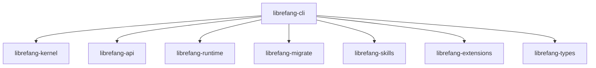

# Other — librefang-cli

# librefang-cli

The command-line interface for LibreFang Agent OS. Produces the `librefang` binary that serves as the primary entry point for interacting with the agent system.

## Role in the Workspace

`librefang-cli` sits at the top of the dependency graph. It pulls in nearly every other workspace crate and orchestrates them behind a `clap`-based CLI surface. It does not contain business logic itself — it wires together the kernel, API, runtime, migrations, skills, and extensions, then delegates work to those layers.



## Binary

| Binary name | Source |
|---|---|
| `librefang` | `src/main.rs` |

## Feature Flags

Features control which channel backends and telemetry are compiled in. They gate the corresponding features in `librefang-api`.

| Feature | Default | Effect |
|---|---|---|
| `all-channels` | **on** | Enables every channel backend in `librefang-api` |
| `mini` | off | Minimal channel subset (useful for smaller builds) |
| `telemetry` | **on** | Enables OpenTelemetry tracing via `opentelemetry_sdk` and `tracing-opentelemetry` |

The default profile gives you a full-featured binary with all channels and telemetry. For constrained environments, build with `--no-default-features --features mini`.

## Build Script (`build.rs`)

The build script runs three tasks at compile time:

### 1. Git Hooks Configuration

Automatically sets the repository's hooks path to `scripts/hooks` so every developer gets consistent git hooks after their first build.

### 2. Version Metadata Injection

Captures three pieces of build-time metadata and exposes them as environment variables, available to the binary via `env!()` or `option_env!()`:

| Variable | Source | Example Value |
|---|---|---|
| `GIT_SHA` | `git rev-parse --short HEAD` | `a1b2c3d` |
| `BUILD_DATE` | `date -u +%Y-%m-%d` | `2025-01-15` |
| `RUSTC_VERSION` | `rustc --version` | `rustc 1.75.0` |

If any command fails (e.g., building from a tarball without git), the value falls back to `"unknown"`.

These variables are intended for display in `--version` output or diagnostic logging.

## Key Dependencies

### Internal Workspace Crates

- **librefang-types** — Shared type definitions
- **librefang-kernel** — Core agent logic and state management
- **librefang-api** — Channel backends and communication layer
- **librefang-migrate** — Database schema migrations
- **librefang-skills** — Skill/plugin definitions
- **librefang-extensions** — Extension system
- **librefang-runtime** — Agent runtime execution

### Notable External Crates

| Crate | Purpose |
|---|---|
| `clap` / `clap_complete` | CLI argument parsing and shell completion generation |
| `ratatui` | Terminal UI rendering |
| `colored` | Colored terminal output |
| `fluent` / `unic-langid` | Internationalization (i18n) |
| `rusqlite` | Embedded SQLite database |
| `reqwest` (blocking) | HTTP client for operations that can't be async |
| `rustls` | TLS without OpenSSL dependency |
| `tokio` | Async runtime |
| `tracing` / `tracing-subscriber` | Structured logging and diagnostics |
| `toml` / `toml_edit` | Configuration file reading and modification |
| `open` | Open URLs/files in the system default handler |
| `walkdir` | Recursive directory traversal |
| `zeroize` | Secure memory clearing for sensitive data |

## Configuration and Data Paths

The `dirs` crate resolves standard platform directories (config, data, cache) for the agent's filesystem layout. Configuration files are typically TOML, read with `toml` and edited in-place with `toml_edit`.

## Adding a New CLI Subcommand

1. Define the subcommand variant in the `clap` derive structure (in `src/main.rs` or a sub-module).
2. Add a match arm in the main dispatch logic.
3. Delegate to the appropriate workspace crate — avoid implementing logic directly in the CLI layer.
4. If the subcommand needs new functionality, add it to `librefang-kernel` or the relevant crate first, then call it from the CLI.

## Building

```bash
# Full build (default features)
cargo build -p librefang-cli

# Minimal build without telemetry or all channels
cargo build -p librefang-cli --no-default-features --features mini

# Install to ~/.cargo/bin
cargo install --path librefang-cli
```