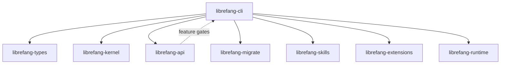

# Other — librefang-cli

# librefang-cli

The command-line interface for LibreFang Agent OS. Produces the `librefang` binary that serves as the primary entry point for interacting with the agent system — whether through terminal commands, an interactive TUI, or shell completions.

## Build-Time Metadata

The `build.rs` script injects environment variables at compile time for version reporting:

| Variable | Source | Example |
|---|---|---|
| `GIT_SHA` | `git rev-parse --short HEAD` | `a3f7c2d` |
| `BUILD_DATE` | `date -u +%Y-%m-%d` | `2025-01-15` |
| `RUSTC_VERSION` | `rustc --version` | `rustc 1.82.0` |

As a side effect, the build script also configures Git to use the shared hooks in `scripts/hooks/` by running `git config core.hooksPath scripts/hooks`. This runs silently on every build and is non-fatal if it fails (e.g., outside a Git checkout).

## Feature Flags

The binary is compiled in one of three profiles, each propagating downstream into `librefang-api`:

```
default  →  librefang-api/all-channels + telemetry
all-channels  →  librefang-api/all-channels
mini  →  librefang-api/mini  (minimal channel set, no telemetry)
telemetry  →  librefang-api/telemetry + OpenTelemetry SDK + tracing-otlp layer
```

The `mini` profile is useful for resource-constrained deployments where only a subset of communication channels are needed. The `default` profile is the full-fat build for developer and production workstations.

## Dependency Architecture



The CLI is the top-level orchestrator. It pulls in every other workspace crate and wires them together based on user commands. Notable dependency roles:

- **librefang-kernel / librefang-runtime** — Core execution engine and runtime environment.
- **librefang-api** — Communication channel layer. Feature flags here control which protocols are available.
- **librefang-migrate** — Database migration runner (backed by `rusqlite`).
- **librefang-skills / librefang-extensions** — Plugin systems for agent capabilities.
- **librefang-types** — Shared type definitions across the workspace.

## Key External Dependencies

| Crate | Role in the CLI |
|---|---|
| `clap` + `clap_complete` | Argument parsing and shell completion generation |
| `ratatui` | Interactive terminal UI mode |
| `colored` | Colored terminal output for non-TUI commands |
| `reqwest` (blocking) | Synchronous HTTP requests (e.g., fetching resources or updates) |
| `rusqlite` | Local SQLite database access |
| `toml` / `toml_edit` | Reading and writing TOML configuration files |
| `fluent` + `unic-langid` | Internationalization (i18n) of CLI messages |
| `tracing` + `tracing-subscriber` | Structured logging and diagnostics |
| `rustls` | TLS without native OpenSSL dependency |
| `opentelemetry_sdk` / `tracing-opentelemetry` | Optional distributed telemetry export |

## Building and Running

```bash
# Full build (default features)
cargo build -p librefang-cli

# Minimal build for constrained environments
cargo build -p librefang-cli --no-default-features --features mini

# Run the binary
cargo run -p librefang-cli -- <args>

# Or directly after install
librefang --help
```

The binary embeds its version metadata at compile time, so it can report exact commit, build date, and compiler version at runtime without needing Git or network access.

## Notes for Contributors

- The build script is non-hermetic: it shells out to `git`, `date`, and `rustc`. CI environments must have these available, or the variables fall back to `"unknown"`.
- The `reqwest` dependency uses its **blocking** feature. If you need async HTTP elsewhere, prefer adding a separate `reqwest` entry or gating it behind a feature to avoid pulling in the blocking runtime in contexts that don't need it.
- Shell completions are generated via `clap_complete`. If you add or rename subcommands, remember to regenerate completion scripts.
- The `fluent` i18n system expects FTL resource files at a conventional path. When adding user-facing strings, add them to the FTL files rather than hardcoding English text.