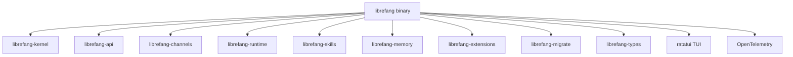

# Other — librefang-cli

# librefang-cli

The command-line interface for LibreFang Agent OS. Produces the `librefang` binary, which serves as the primary entry point for running agents, managing configurations, performing migrations, and interacting with the system's skill and memory subsystems.

## Architecture



The CLI aggregates nearly every library crate in the workspace. It is a thick frontend: argument parsing, configuration loading, telemetry setup, and orchestration all happen here before delegating to the underlying libraries.

## Feature Flags

| Feature | Default | Effect |
|---------|---------|--------|
| `default` | ✓ | Enables `all-channels` and `telemetry` |
| `all-channels` | ✓ (via default) | Activates all channel backends in `librefang-api` |
| `mini` | ✗ | Minimal build using `librefang-api/mini` — only essential channel support |
| `telemetry` | ✓ (via default) | Enables OpenTelemetry tracing exports via `opentelemetry`, `opentelemetry_sdk`, and `tracing-opentelemetry` |

To build a slim binary with no telemetry and minimal channel support:

```bash
cargo build -p librefang-cli --no-default-features --features mini
```

## Build Script (`build.rs`)

The build script performs four tasks at compile time:

1. **Git hooks configuration** — Runs `git config core.hooksPath scripts/hooks` so that all developers share the same hook scripts from the repository on their first build. Failures are silently ignored (e.g., outside a git checkout).

2. **Git commit hash** — Captures the short SHA via `git rev-parse --short HEAD` and exposes it as the `GIT_SHA` environment variable, embedded into the binary for `--version` output.

3. **Build date** — Captures the UTC date via `date -u +%Y-%m-%d` and embeds it as `BUILD_DATE`.

4. **Rustc version** — Captures `rustc --version` output and embeds it as `RUSTC_VERSION`.

All three embedded values fall back to `"unknown"` when the commands fail (e.g., building from a tarball without git installed).

These values are accessed in source via `env!("GIT_SHA")`, `env!("BUILD_DATE")`, and `env!("RUSTC_VERSION")`.

## Key Dependencies and Their Roles

### CLI Framework
- **clap** / **clap_complete** — Argument parsing and shell completion generation. The CLI uses the derive pattern; subcommands map to the major functional areas (agent lifecycle, migrations, configuration, etc.).

### Terminal Output
- **ratatui** — Full terminal UI rendering for interactive modes (e.g., agent monitoring dashboards, conversation views).
- **colored** — Colored stdout/stderr output for status messages and logs.

### Async Runtime
- **tokio** — The async runtime driving the agent loop, channel listeners, and API server.

### Observability
- **tracing** / **tracing-subscriber** — Structured logging throughout the application.
- **opentelemetry** / **opentelemetry_sdk** / **tracing-opentelemetry** *(optional, via `telemetry` feature)* — Export traces to an OpenTelemetry-compatible backend.

### Internationalization
- **fluent** / **unic-langid** — Localization framework for user-facing CLI messages. Translation files are loaded at runtime based on the system locale.

### Storage
- **rusqlite** — Direct SQLite access for local databases (agent state, memory stores).
- **toml** / **toml_edit** — Reading and programmatically editing TOML configuration files while preserving formatting and comments.

### Networking
- **reqwest** *(blocking feature)* — Synchronous HTTP client for operations like registration, update checks, or downloading skill packages where async isn't necessary.
- **rustls** — TLS backend for secure connections.

### System
- **libc** — Low-level system calls (signal handling, process management).
- **tikv-jemallocator** *(non-MSVC targets only)* — Replaces the system allocator for improved performance on Linux/macOS.
- **open** — Opens URLs or files in the user's default application (e.g., opening a dashboard in the browser).
- **zeroize** — Secure memory zeroing for sensitive data (API keys, tokens).

## Memory Allocator

On non-Windows targets, the binary uses tikv-jemallocator with `disable_initial_exec_tls` to avoid issues with `dlopen`. This is configured in the binary's entry point, not in the library crates.

## Configuration Loading

The CLI reads configuration from the standard XDG config directory (via the **dirs** crate), typically `~/.config/librefang/`. Configuration is TOML-based, loaded and validated through `librefang-types`, and hot-reloadable in long-running processes via **arc-swap**.

## Relationship to Other Crates

| Crate | How the CLI Uses It |
|-------|-------------------|
| `librefang-kernel` | Core agent lifecycle management and orchestration |
| `librefang-api` | HTTP/WebSocket API server for external control |
| `librefang-channels` | Channel backends for communicating with LLM providers and external services |
| `librefang-runtime` | Process registry and runtime execution environment |
| `librefang-skills` | Skill discovery, loading, and execution |
| `librefang-extensions` | Extension system for plugins and addons |
| `librefang-memory` | Agent memory storage and retrieval (short-term, long-term, episodic) |
| `librefang-migrate` | Database schema migrations on startup |
| `librefang-types` | Shared types, configuration structs, error types |

## Development Notes

- The binary entry point is `src/main.rs`. It initializes the tokio runtime, sets up tracing subscribers, loads configuration, runs pending migrations via `librefang-migrate`, and then dispatches to the appropriate subcommand handler.
- When adding a new subcommand, define it in the clap App derive structure and implement the handler in the appropriate module within `src/`.
- Shell completions can be generated at runtime via the `clap_complete` integration — users can source completions for their shell without installing extra tooling.