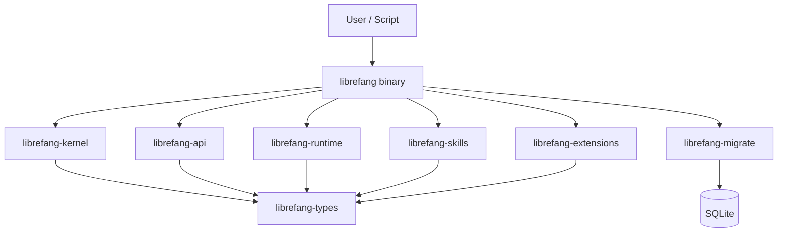

# Other — librefang-cli

# librefang-cli

The command-line interface for LibreFang Agent OS. This crate produces the `librefang` binary — the primary way users interact with the agent system, whether through direct commands, a terminal UI, or background services.

## Role in the Codebase

`librefang-cli` is the **top-level executable crate**. It doesn't contain business logic itself; instead, it wires together the library crates and provides the user-facing entry point:

```
librefang (binary)
 ├── librefang-kernel      — core orchestration
 ├── librefang-api         — communication channels
 ├── librefang-runtime     — process/task runtime
 ├── librefang-skills      — skill definitions & loading
 ├── librefang-extensions  — extension management
 ├── librefang-migrate     — database schema migrations
 └── librefang-types       — shared type definitions
```

## Build Script (`build.rs`)

The build script runs three tasks at compile time:

| Task | Environment Variable | Purpose |
|------|---------------------|---------|
| Git hooks setup | — | Runs `git config core.hooksPath scripts/hooks` so all developers share the same hooks |
| Git SHA capture | `GIT_SHA` | Short commit hash via `git rev-parse --short HEAD` |
| Build date capture | `BUILD_DATE` | UTC date in `YYYY-MM-DD` format |
| Rustc version capture | `RUSTC_VERSION` | Full `rustc --version` output |

These environment variables are embedded at compile time and used for version display (`--version` output, diagnostics, logs). All fallback to `"unknown"` if the commands fail (e.g., building from a tarball without git).

## Feature Flags

Features control which communication channels and observability stack get compiled in:

| Feature | Default | Effect |
|---------|---------|--------|
| `all-channels` | ✓ (via `default`) | Enables all transport/channel backends in `librefang-api` |
| `mini` | ✗ | Compiles a minimal channel subset from `librefang-api` — use for constrained builds |
| `telemetry` | ✓ (via `default`) | Enables OpenTelemetry tracing via `opentelemetry_sdk` and `tracing-opentelemetry` |

To build a minimal binary:

```toml
# In a Cargo.toml override or .cargo/config.toml
[features]
default = ["mini"]
```

## Key Dependencies and What They Enable

### CLI Framework
- **clap** / **clap_complete** — Argument parsing and shell completion generation.

### Terminal UI
- **ratatui** — Full TUI framework. The CLI likely offers an interactive dashboard mode alongside single-command usage.

### Storage & Migrations
- **rusqlite** — Embedded SQLite for local state, configuration, and session history.
- **librefang-migrate** — Schema migrations run at startup or on demand.

### Networking & Security
- **reqwest** (with `blocking`) — HTTP client for API calls and resource fetching.
- **rustls** — TLS backend; avoids OpenSSL dependency.

### Observability
- **tracing** / **tracing-subscriber** — Structured logging throughout the application.
- **opentelemetry_sdk** / **tracing-opentelemetry** — Optional distributed tracing export.

### Configuration
- **toml** / **toml_edit** — Reading and writing TOML config files while preserving formatting and comments.
- **dirs** — Respects OS-standard config/cache/data directories.

### Internationalization
- **fluent** / **unic-langid** — Localization framework for user-facing messages.

### Utilities
- **colored** — Colored terminal output.
- **walkdir** — Recursive directory traversal (skill/extension discovery).
- **open** — Open URLs or files in the system default application.
- **zeroize** — Secure memory clearing for sensitive data.
- **uuid** — Unique identifiers.
- **libc** — Low-level system calls (likely for signal handling or process management).
- **chrono** — Timestamp handling.

### Memory Allocator
On non-MSVC targets, **tikv-jemallocator** replaces the system allocator for improved performance with `disable_initial_exec_tls` to avoid linker issues in certain environments.

## Architecture Overview



The CLI crate is the composition root — it parses user input, initializes the runtime and database, loads skills and extensions, then delegates execution to the appropriate library crate.

## Building

```bash
# Standard build (all channels + telemetry)
cargo build -p librefang-cli

# Minimal build
cargo build -p librefang-cli --no-default-features --features mini

# Release binary
cargo build --release -p librefang-cli
# Output: target/release/librefang
```

## Compile-Time Variables

The build script injects these via `cargo:rustc-env`, accessible in code as:

```rust
env!("GIT_SHA")       // e.g., "a1b2c3d"
env!("BUILD_DATE")    // e.g., "2025-01-15"
env!("RUSTC_VERSION") // e.g., "rustc 1.82.0 (f6e511eec 2024-10-15)"
```

Use these in `--version` output or diagnostic logs.

## Notes for Contributors

- **Git hooks** are auto-configured on first build. The hooks live in `scripts/hooks/` at the repository root.
- The `clap_complete` dependency suggests shell completions can be generated — look for a `completions` subcommand in the CLI.
- When adding new features that gate optional functionality, prefer delegating the feature flag to the relevant library crate rather than adding logic in the CLI itself.
- The `reqwest` dependency uses `blocking` mode — if async HTTP is needed, coordinate with the tokio runtime already in use.