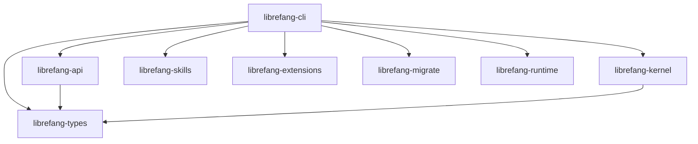

# Other — librefang-cli

# librefang-cli

The primary command-line interface for LibreFang Agent OS. This crate produces the `librefang` binary and acts as the top-level aggregator, pulling in nearly every workspace crate to deliver a unified CLI experience.

## Role in the Workspace

`librefang-cli` sits at the apex of the dependency graph. It does not implement business logic itself — instead it wires together the kernel, API, skills, extensions, migration, and runtime layers behind a `clap`-driven command interface and an optional `ratatui`-based TUI.



## Feature Flags

Features control the binary's size and capability set:

| Feature | Default | Effect |
|---------|---------|--------|
| `all-channels` | **on** | Enables all communication channels via `librefang-api/all-channels` |
| `mini` | off | Builds a stripped-down variant via `librefang-api/mini` — excludes heavyweight channels |
| `telemetry` | **on** | Enables OpenTelemetry tracing export (`opentelemetry_sdk`, `tracing-opentelemetry`) |

To build the minimal binary:

```bash
cargo build --package librefang-cli --no-default-features --features mini
```

## Build Script (`build.rs`)

The build script runs three tasks at compile time:

### 1. Git Hooks Configuration

Automatically sets the repository's hooks path to `scripts/hooks` on every build. This ensures all developers share the same commit checks without manual setup. The command failure is silently ignored (e.g., when building outside a git checkout).

### 2. Embedding Build Metadata

Three environment variables are emitted and available at runtime via `env!()` or `option_env!()`:

| Variable | Source | Example Value |
|----------|--------|---------------|
| `GIT_SHA` | `git rev-parse --short HEAD` | `a3f7c2d` |
| `BUILD_DATE` | `date -u +%Y-%m-%d` | `2025-01-15` |
| `RUSTC_VERSION` | `rustc --version` | `rustc 1.82.0` |

These are used in `--version` output and diagnostic logs. All three gracefully fall back to `"unknown"` when the source command is unavailable (e.g., building from a tarball without git).

### 3. Platform Note

On non-MSVC targets (Linux, macOS, BSD), the build links against **tikv-jemallocator** with `disable_initial_exec_tls` for improved allocation performance. MSVC builds use the system allocator.

## Key Dependencies and Their Roles

| Crate | Purpose in the CLI |
|-------|--------------------|
| `librefang-kernel` | Core agent lifecycle and state management |
| `librefang-api` | Communication channel adapters (gRPC, HTTP, etc.) |
| `librefang-skills` | Skill loading and execution |
| `librefang-extensions` | Extension system |
| `librefang-migrate` | Database schema migrations |
| `librefang-runtime` | Process registry and runtime utilities |
| `librefang-types` | Shared domain types |
| `clap` / `clap_complete` | Argument parsing and shell completion generation |
| `ratatui` | Terminal UI rendering |
| `tokio` | Async runtime |
| `tracing` / `tracing-subscriber` | Structured logging |
| `rusqlite` | Local SQLite storage |
| `reqwest` | HTTP client (blocking feature enabled for synchronous operations) |
| `rustls` | TLS without OpenSSL dependency |
| `toml` / `toml_edit` | Configuration file reading and modification |
| `fluent` / `unic-langid` | Internationalization (i18n) |
| `zeroize` | Secure memory clearing for sensitive data |
| `colored` | Terminal color output |

## Building

```bash
# Full build (default features)
cargo build --package librefang-cli

# Release binary
cargo build --package librefang-cli --release

# Minimal binary without telemetry or full channels
cargo build --package librefang-cli --no-default-features --features mini
```

The resulting binary is located at `target/debug/librefang` or `target/release/librefang`.

## Extending

To add a new workspace crate into the CLI:

1. Add the dependency to `librefang-cli/Cargo.toml`.
2. Import and wire the crate into the relevant `clap` subcommand in `src/main.rs`.
3. If the crate introduces optional heavyweight dependencies, consider gating it behind a new feature flag that mirrors the `mini`/`all-channels` pattern.