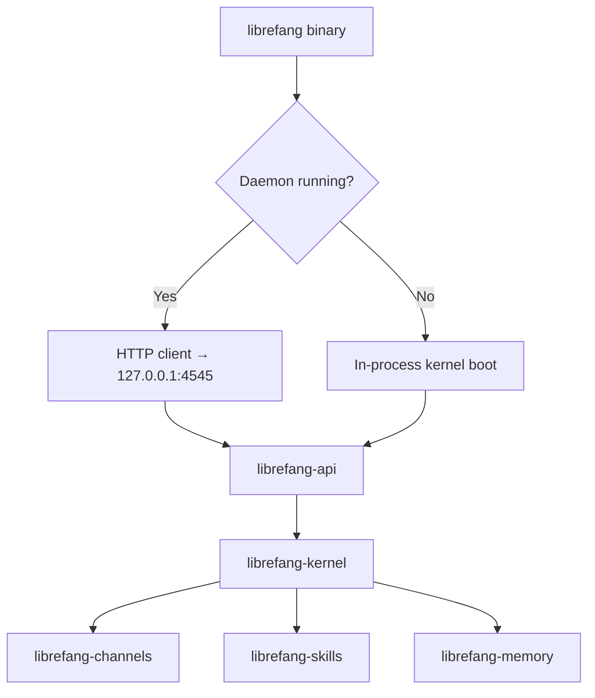

# Other — librefang-cli

# librefang-cli

The command-line interface for the [LibreFang](https://github.com/librefang/librefang) Agent OS. This crate produces the `librefang` binary and serves as the primary entry point for interacting with the system.

## Architecture

`librefang-cli` operates in one of two modes depending on whether a daemon is already running:

- **Daemon mode** (`librefang start`) — starts a long-running process hosting the HTTP API and dashboard. Subsequent CLI invocations communicate with it over HTTP at `http://127.0.0.1:4545`.
- **Single-shot mode** — when no daemon is detected, commands boot an in-process kernel, execute the requested operation, and exit.



The crate itself is intentionally thin — it handles CLI parsing via `clap`, dispatches to the appropriate logic in `librefang-api` or `librefang-kernel`, and manages lifecycle concerns (signals, logging, telemetry setup).

## Commands

| Command | Description |
|---|---|
| `librefang start` | Start the daemon (HTTP API + dashboard) |
| `librefang init` | Write a starter `~/.librefang/config.toml` |
| `librefang agent <subcommand>` | Spawn, list, or message agents |
| `librefang doctor` | Diagnose the local environment |
| `librefang help` | Full command catalog |

Every subcommand accepts `--help` for detailed usage.

## Feature Flags

Feature flags control which channel adapters are compiled in. The default feature set is tuned for fast developer iteration — heavy dependencies like `matrix-sdk-crypto`, `lettre`, `imap`, `rsa`, `rumqttc`, and `nostr-sdk` are excluded unless explicitly requested.

| Feature | Includes | Use Case |
|---|---|---|
| `default` | `core-channels` (telegram, discord, slack, webhook, ntfy) + `telemetry` | Day-to-day development |
| `all-channels` | All ~25 channel adapters | Release builds |
| `mini` | Minimal channel set | Constrained environments |
| `android` | All channels except email | Android targets (rustls incompatibility) |
| `telemetry` | OpenTelemetry + tracing-opentelemetry | Production observability |

### Build Examples

```bash
# Fast developer build (default features)
cargo build -p librefang-cli

# Release binary with all channels (CI pipeline)
cargo build -p librefang-cli --release --features all-channels

# Minimal build without telemetry
cargo build -p librefang-cli --no-default-features --features mini

# All channels + telemetry (explicit, no defaults)
cargo build -p librefang-cli --no-default-features --features all-channels,telemetry
```

**Important**: `all-channels` does not imply `telemetry`. If you build with `--no-default-features --features all-channels`, add `telemetry` explicitly if needed. Release CI builds without `--no-default-features`, so the default `telemetry` feature remains active.

### Android Caveat

The `android` feature excludes `channel-email` due to an incompatibility between `rustls-connector` 0.23.0 and `rustls-platform-verifier` 0.7.0 — specifically, `Verifier::new_with_extra_roots` is not implemented for the Android target.

## Build-Time Metadata

The `build.rs` script injects three environment variables at compile time:

| Variable | Source | Fallback |
|---|---|---|
| `GIT_SHA` | `git rev-parse --short HEAD` | `"unknown"` |
| `BUILD_DATE` | `date -u +%Y-%m-%d` | `"unknown"` |
| `RUSTC_VERSION` | `rustc --version` | `"unknown"` |

These are available in the binary via `env!()` macros and are typically displayed in `--version` output and diagnostic commands.

## Workspace Dependencies

This crate sits at the top of the dependency graph and pulls in nearly every workspace crate:

- **`librefang-types`** — shared type definitions
- **`librefang-kernel`** — core agent runtime
- **`librefang-api`** — HTTP API layer and command handlers
- **`librefang-channels`** — messaging channel adapters (feature-gated)
- **`librefang-migrate`** — database migration logic
- **`librefang-skills`** — agent skill system
- **`librefang-extensions`** — extension loading
- **`librefang-memory`** — agent memory persistence
- **`librefang-runtime`** — execution runtime
- **`librefang-acp`** — access control policy (with `kernel-adapter` feature)

## Memory Allocator

On non-MSVC targets, `tikv-jemallocator` is used as the global allocator with `disable_initial_exec_tls` to avoid issues in certain TLS scenarios. MSVC targets use the system allocator.

## Telemetry Stack

When the `telemetry` feature is enabled, the CLI initializes:

- `opentelemetry` — metrics and trace export
- `opentelemetry_sdk` — SDK configuration
- `tracing-opentelemetry` — bridge between `tracing` spans and OpenTelemetry

This is configured at startup alongside `tracing-subscriber` for log output.