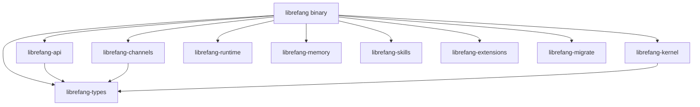

# Other — librefang-cli

# librefang-cli

The command-line interface for LibreFang Agent OS. This crate produces the `librefang` binary — the primary way operators interact with the agent system. It acts as the composition root, pulling together the kernel, API, channels, skills, memory, extensions, and runtime into a single executable.

## Architecture



The CLI itself contains minimal business logic. Its job is wiring: parsing command-line arguments, loading configuration, initializing subsystems, and delegating to the appropriate library crate.

## Feature Flags

Features control which communication channels and optional subsystems are compiled in. They map directly to features in `librefang-api` and `librefang-channels`.

| Flag | Default | Purpose |
|------|---------|---------|
| `default` | ✓ | Enables all channels plus telemetry |
| `all-channels` | — | All communication channels |
| `mini` | — | Minimal channel subset for constrained environments |
| `android` | — | All channels except email (avoids a rustls-platform-verifier incompatibility on Android) |
| `telemetry` | via default | OpenTelemetry tracing export via `tracing-opentelemetry` |

The Android exclusion exists because `rustls-connector` 0.23.0 combined with `rustls-platform-verifier` 0.7.0 does not implement `Verifier::new_with_extra_roots` on Android targets.

To build a minimal binary:

```bash
cargo build --package librefang-cli --no-default-features --features mini
```

## Build Script (`build.rs`)

The build script runs three tasks at compile time:

1. **Git hooks configuration** — Sets `core.hooksPath` to `scripts/hooks` so all developers share the same hooks automatically on first build.

2. **Version metadata** — Injects three environment variables available at runtime via `env!()`:
   - `GIT_SHA` — Short commit hash (e.g., `a3f7c21`), or `"unknown"` outside a git tree.
   - `BUILD_DATE` — UTC date in `YYYY-MM-DD` format.
   - `RUSTC_VERSION` — Full rustc version string.

These are typically displayed in `--version` output or diagnostic logs.

## Key Dependencies

### CLI Framework
- **clap** / **clap_complete** — Argument parsing and shell completion generation.

### TUI
- **ratatui** — Terminal user interface rendering. Used for interactive dashboards or real-time agent monitoring.

### Async Runtime
- **tokio** — Async runtime. The binary uses the multi-threaded runtime.
- **tikv-jemallocator** (non-MSVC only) — Replaces the system allocator for improved performance on Linux/macOS. Disabled with `disable_initial_exec_tls` to avoid issues in certain linking contexts.

### Storage & Data
- **rusqlite** — Embedded SQLite for local state persistence.
- **librefang-memory** — Agent memory subsystem.
- **librefang-migrate** — Database migration management.

### Networking
- **reqwest** (blocking feature) — Used for synchronous HTTP calls during setup or bootstrap operations.
- **rustls** — TLS backend for secure channel communication.

### Observability
- **tracing** / **tracing-subscriber** — Structured logging.
- **opentelemetry** / **tracing-opentelemetry** (optional) — Distributed trace export when the `telemetry` feature is enabled.

### Localization
- **fluent** / **unic-langid** — Internationalization framework for user-facing messages.

### Configuration
- **toml** / **toml_edit** — Reading and programmatically modifying TOML config files. `toml_edit` preserves formatting and comments when writing back.
- **dirs** — Standard OS directories for config/cache/data paths.

## Crate Relationships

The CLI sits at the top of the dependency tree. It depends on every other LibreFang crate but nothing depends on it. This is intentional — all reusable logic lives in library crates, keeping the binary thin and testable.

| Crate | Role in CLI |
|-------|-------------|
| `librefang-kernel` | Core agent lifecycle and orchestration |
| `librefang-api` | HTTP/WebSocket API surface |
| `librefang-channels` | Communication channel implementations |
| `librefang-runtime` | Process registry and runtime management |
| `librefang-skills` | Agent capability definitions |
| `librefang-extensions` | Extension loading and management |
| `librefang-memory` | Persistent memory and context |
| `librefang-migrate` | Database schema migrations at startup |
| `librefang-types` | Shared type definitions |

## Building

Standard Cargo build. The binary name is `librefang`:

```bash
# Full build with all features
cargo build --package librefang-cli

# Release build
cargo build --release --package librefang-cli

# Cross-compile for Android (NDK required)
cargo build --target aarch64-linux-android --no-default-features --features android
```

The resulting binary is at `target/debug/librefang` or `target/release/librefang`.

## Testing

Dev-dependencies include `tempfile` for tests that need isolated filesystem operations. Tests run via `cargo test --package librefang-cli`.