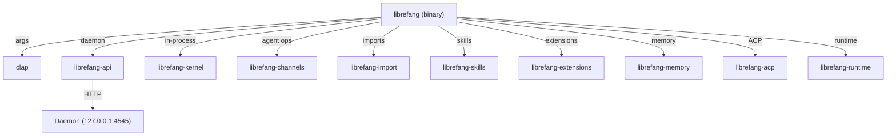

# Other — librefang-cli

# librefang-cli

CLI front-end for the LibreFang Agent OS. Produces the `librefang` binary.

## Overview

`librefang-cli` is the primary user-facing entry point for LibreFang. It provides a `clap`-based command tree (`librefang start`, `librefang agent …`, `librefang doctor`, etc.) and operates in one of two modes:

- **Daemon mode** — `librefang start` launches a long-running HTTP API server (default `http://127.0.0.1:4545`) plus a dashboard. Subsequent CLI invocations communicate with the running daemon over HTTP.
- **Single-shot mode** — when no daemon is detected, commands boot an in-process kernel via `librefang-kernel` for one-off execution and then exit.

The crate is intentionally thin: argument parsing, I/O formatting, and orchestration live here, while all substantive logic is delegated to the library crates listed below.

## Architecture


```mermaid
graph TD
    CLI["librefang (binary)"]
    CLI -->|args| CLAP["clap"]
    CLI -->|daemon| API["librefang-api"]
    CLI -->|in-process| KERNEL["librefang-kernel"]
    CLI -->|agent ops| CHANNELS["librefang-channels"]
    CLI -->|imports| IMPORT["librefang-import"]
    CLI -->|skills| SKILLS["librefang-skills"]
    CLI -->|extensions| EXT["librefang-extensions"]
    CLI -->|memory| MEMORY["librefang-memory"]
    CLI -->|ACP| ACP["librefang-acp"]
    CLI -->|runtime| RT["librefang-runtime"]
    API -->|HTTP| REMOTE["Daemon (127.0.0.1:4545)"]
```

### Crate dependencies

| Crate | Role in the CLI |
|---|---|
| `librefang-kernel` | Boots the in-process agent kernel for single-shot commands. |
| `librefang-api` | HTTP client surface when talking to a running daemon. |
| `librefang-channels` | Channel adapter registry (now lightweight — adapters run as sidecars). |
| `librefang-import` | Bulk-import workflows. |
| `librefang-skills` | Skill registry and execution. |
| `librefang-extensions` | Extension loading and lifecycle. |
| `librefang-memory` | Persistent memory / context store. |
| `librefang-runtime` | Shared runtime primitives. |
| `librefang-acp` | Agent Communication Protocol — kernel adapter feature enabled. |
| `librefang-types` | Shared domain types. |

## Feature flags

Defined in `Cargo.toml`.

### `telemetry` *(default)*

Enables OpenTelemetry tracing via `opentelemetry` and `tracing-opentelemetry`, and propagates the same feature into `librefang-api`. This is the recommended production build.

### `mini`

An **empty** alias. Historically `mini` excluded heavy channel adapters from the binary, but since all channel adapters now run as out-of-process sidecars (`librefang.sidecar.adapters.*` in the SDK package), the `mini` artifact is byte-identical to the default-features build. It exists solely so that existing CI release jobs (`cli_linux_mini`, `cli_mac_mini`, `cli_windows_mini`) continue to produce `librefang-${target}-mini.tar.gz` without modification. Those jobs and this alias should be retired in a follow-up.

### Removed features

`android`, `all-channels`, `core-channels`, and individual `channel-*` features no longer exist. The Android-specific `rustls-connector` workaround that motivated them was tied to in-process IMAP/SMTP code paths that have been removed. Release CI now builds with `--features telemetry` unconditionally.

## Build-time metadata (`build.rs`)

The build script stamps three environment variables into the compiled binary at build time. These are accessible via `env!()` in `src/main.rs` (e.g., for `librefang --version` output or diagnostic logging).

| Variable | Source | Purpose |
|---|---|---|
| `GIT_SHA` | CI env or `git rev-parse` | Short (7-char) commit hash. |
| `BUILD_DATE` | `chrono::Utc::now()` | UTC date in `YYYY-MM-DD`. |
| `RUSTC_VERSION` | `rustc --version` output | Full rustc version string. |

### Git SHA resolution order

```
1. GITHUB_SHA env var     → truncate to 7 chars
2. CI_COMMIT_SHA env var  → truncate to 7 chars
3. `which("git")` → `git rev-parse --short HEAD`
4. "unknown" fallback
```

CI environment variables are preferred because they are authoritative on hosted runners and avoid spawning a subprocess. When falling back to `git`, the binary is resolved via `which::which("git")` rather than relying on shell PATH lookup semantics (see issue #5667).

The build date is captured via `chrono::Utc::now()` instead of shelling out to `date -u +%Y-%m-%d`, eliminating a platform-specific process spawn (BSD and GNU `date` accept different flags) and keeping the build script reproducible across hosts.

### Rebuild triggers

The build script emits `cargo:rerun-if-env-changed` for `GITHUB_SHA`, `CI_COMMIT_SHA`, and `SOURCE_DATE_EPOCH` so cargo invalidates the script when these inputs change.

## Global allocator

On non-MSVC targets (`cfg(not(target_env = "msvc"))`), the binary uses `tikv-jemallocator` with `disable_initial_exec_tls` as the global allocator. This is configured in `src/main.rs` via the standard `#[global_allocator]` attribute.

## Notable dependencies

| Dependency | Usage |
|---|---|
| `clap` / `clap_complete` | CLI argument parsing and shell completion generation. |
| `ratatui` | Terminal UI for interactive/dashboard mode. |
| `colored` | Colored terminal output. |
| `reqwest` (blocking) | HTTP client for daemon communication. |
| `fluent` / `unic-langid` | Internationalization (i18n) of CLI strings. |
| `toml` / `toml_edit` | Reading and modifying `~/.librefang/config.toml`. |
| `rusqlite` | Local SQLite for single-shot / offline operation. |
| `zeroize` | Secure clearing of sensitive in-memory data. |
| `open` | Cross-platform "open URL/file" for dashboard links. |
| `rustls` | TLS without OpenSSL dependency. |

## Configuration

`librefang init` writes a starter configuration to `~/.librefang/config.toml`. The `dirs` crate resolves the platform-appropriate config directory. Configuration is read at startup and can reference channel adapter endpoints, telemetry exporters, and runtime parameters.

## Development

```bash
# Default build (telemetry enabled)
cargo build -p librefang-cli

# Build for release
cargo build -p librefang-cli --release

# Run with version output (verifies build metadata)
cargo run -p librefang-cli -- --version

# Run tests
cargo test -p librefang-cli
```

Tests use `tempfile` for isolated filesystem fixtures.