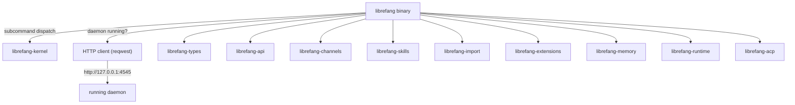

# Other — librefang-cli

# librefang-cli

The `librefang-cli` crate produces the `librefang` binary — the primary command-line interface for the LibreFang Agent OS. It serves dual roles:

- **Daemon mode** (`librefang start`): launches a long-running process exposing an HTTP API on `http://127.0.0.1:4545` and serving a dashboard.
- **Single-shot mode**: when no daemon is running, most commands boot an in-process kernel, execute the requested operation, and exit.

## Architecture

```mermaid
graph TD
    CLI["librefang binary"] -->|"subcommand dispatch"| Kernel["librefang-kernel"]
    CLI -->|"daemon running?"| HTTP["HTTP client (reqwest)"]
    HTTP -->|"http://127.0.0.1:4545"| Daemon["running daemon"]
    CLI --> Types["librefang-types"]
    CLI --> API["librefang-api"]
    CLI --> Channels["librefang-channels"]
    CLI --> Skills["librefang-skills"]
    CLI --> Import["librefang-import"]
    CLI --> Extensions["librefang-extensions"]
    CLI --> Memory["librefang-memory"]
    CLI --> Runtime["librefang-runtime"]
    CLI --> ACP["librefang-acp"]
```

When a daemon is already running, the CLI acts as a thin HTTP client, forwarding commands to the daemon's API. When no daemon is present, the CLI creates an in-process kernel instance to handle the request directly.

## Commands

| Command | Description |
|---------|-------------|
| `librefang start` | Start the daemon (HTTP API + dashboard) |
| `librefang init` | Write a starter `~/.librefang/config.toml` |
| `librefang agent <subcommand>` | Spawn, list, or message agents |
| `librefang doctor` | Diagnose the local environment |
| `librefang help` | Print full command catalog |

Any subcommand accepts `--help` for detailed usage.

## Feature Flags

Defined in `Cargo.toml`:

### `telemetry` *(default)*

Enables OpenTelemetry tracing integration. Propagates the feature to `librefang-api` and pulls in the `opentelemetry` and `tracing-opentelemetry` crates.

### `mini`

An **empty alias** retained purely for backward compatibility with existing CI release jobs (`cli_linux_mini`, `cli_mac_mini`, `cli_windows_mini`). These jobs produce `librefang-${target}-mini.tar.gz` artifacts. Since per-channel cargo features were removed (all channel adapters now run as out-of-process sidecars), the `mini` build is byte-identical to the default-features build. This alias should be retired in a follow-up along with the associated CI jobs.

### Removed features

- `core-channels`, `all-channels`, `android`: Previously gated in-process channel adapters (IMAP, SMTP, etc.). These code paths no longer exist; channel adapters run as sidecar processes (`librefang.sidecar.adapters.*` in the SDK package).

## Build Script (`build.rs`)

The build script injects three compile-time environment variables that the binary reads (likely in a `version()` or `--version` handler):

| Variable | Source | Purpose |
|----------|--------|---------|
| `GIT_SHA` | CI env var or `git rev-parse --short HEAD` | Short (7-char) commit hash |
| `BUILD_DATE` | `chrono::Utc::now()` formatted as `%Y-%m-%d` | UTC build date |
| `RUSTC_VERSION` | `rustc --version` output | Compiler version |

### Git SHA resolution order

The `resolve_git_sha()` function tries sources in priority order:

1. **`GITHUB_SHA`** — set by GitHub Actions (full 40-char SHA, truncated to 7).
2. **`CI_COMMIT_SHA`** — set by GitLab CI and generic CI systems (full SHA, truncated to 7).
3. **`git rev-parse --short HEAD`** — resolved by locating `git` via the `which` crate rather than relying on shell PATH lookup.
4. **`"unknown"`** — fallback if none of the above succeed.

The `short_sha()` helper truncates a full SHA to 7 characters, matching `git rev-parse --short HEAD`'s default behavior.

### Reproducibility notes

- Build date uses `chrono::Utc::now()` instead of shelling out to the platform `date` command, avoiding BSD/GNU flag incompatibilities.
- The `git` binary is resolved via `which::which("git")` rather than bare-name invocation, making PATH resolution explicit and portable.
- `cargo:rerun-if-env-changed` directives ensure the build script re-runs when CI environment variables change.

## Dependencies

### Workspace crates

| Crate | Role |
|-------|------|
| `librefang-types` | Shared type definitions |
| `librefang-kernel` | Core agent kernel |
| `librefang-api` | HTTP API layer (default features disabled) |
| `librefang-channels` | Channel adapter traits (default features disabled) |
| `librefang-import` | Data import functionality |
| `librefang-skills` | Agent skill system |
| `librefang-extensions` | Extension loading |
| `librefang-memory` | Agent memory management |
| `librefang-runtime` | Runtime execution support |
| `librefang-acp` | Agent communication protocol (with `kernel-adapter` feature) |

### Notable external dependencies

- **clap** / **clap_complete**: CLI argument parsing and shell completion generation
- **tokio**: Async runtime
- **reqwest** (with `blocking`): HTTP client for daemon communication
- **ratatui**: Terminal UI framework (for TUI-based commands or dashboard views)
- **tracing** / **tracing-subscriber**: Structured logging
- **serde_json** / **toml** / **toml_edit**: Configuration file handling
- **rusqlite**: SQLite for local storage
- **zeroize**: Secure memory zeroing for sensitive data
- **fluent** / **unic-langid**: Internationalization support

### Platform-specific

On non-MSVC targets, **tikv-jemallocator** is used as the global memory allocator (with `disable_initial_exec_tls` feature) for improved performance. This is configured via `#[global_allocator]` in `src/main.rs`.

## Configuration

The CLI expects configuration at `~/.librefang/config.toml`, created by `librefang init`. The `toml_edit` dependency suggests the CLI both reads and programmatically modifies this file (e.g., during `init` or agent configuration commands).