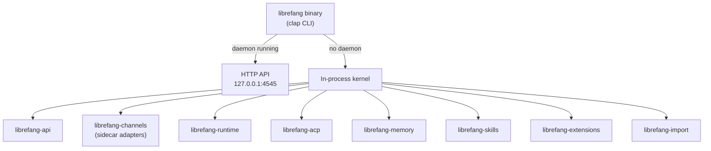

# Other — librefang-cli

# librefang-cli

Command-line interface for the LibreFang Agent OS. Produces the `librefang` binary.

## Operational Modes

The CLI operates in one of two modes depending on whether a daemon is already running:

- **Daemon mode** — When `librefang start` has launched the background daemon, subsequent CLI invocations talk to it over HTTP at `http://127.0.0.1:4545` (default). Commands are forwarded; no in-process kernel is created.
- **Single-shot mode** — When no daemon is running, commands that need the kernel boot one in-process, execute, and terminate. This is the path used by `librefang doctor`, one-off `librefang agent spawn` calls, and similar invocations.

## Architecture


```mermaid
graph TD
    CLI["librefang binary<br/>(clap CLI)"]
    CLI -->|daemon running| HTTP["HTTP API<br/>127.0.0.1:4545"]
    CLI -->|no daemon| Kernel["In-process kernel"]
    Kernel --> API["librefang-api"]
    Kernel --> Channels["librefang-channels<br/>(sidecar adapters)"]
    Kernel --> Runtime["librefang-runtime"]
    Kernel --> ACP["librefang-acp"]
    Kernel --> Memory["librefang-memory"]
    Kernel --> Skills["librefang-skills"]
    Kernel --> Extensions["librefang-extensions"]
    Kernel --> Import["librefang-import"]
```

## Cargo Features

| Feature | Default | Description |
|---------|---------|-------------|
| `telemetry` | **yes** | Enables OpenTelemetry tracing via `librefang-api/telemetry`, `opentelemetry`, and `tracing-opentelemetry`. |
| `mini` | no | **Deprecated no-op alias.** Previously selected a reduced channel set. All channel adapters now run as out-of-process sidecars, so this feature is byte-identical to the default build. It exists solely so legacy CI jobs (`cli_linux_mini`, `cli_mac_mini`, `cli_windows_mini`) continue to produce their `librefang-${target}-mini.tar.gz` artifacts. Those jobs should be retired and this feature removed. |

Historical features `core-channels`, `all-channels`, `android`, and per-adapter `channel-*` flags have been removed. Channel adapters live in the `librefang-channels` crate but execute as out-of-process sidecars (`librefang.sidecar.adapters.*` in the SDK package), so there are no in-process cargo features to gate.

## Build Script (`build.rs`)

The build script injects compile-time metadata as environment variables accessible via `env!()` in `main.rs`:

| Variable | Source | Example |
|----------|--------|---------|
| `GIT_SHA` | CI env or `git rev-parse --short HEAD` | `a1b2c3d` |
| `BUILD_DATE` | `chrono::Utc::now()` (UTC, date only) | `2025-01-15` |
| `RUSTC_VERSION` | `rustc --version` output | `rustc 1.82.0` |

### Git SHA Resolution (`resolve_git_sha`)

Priority order:

1. `GITHUB_SHA` environment variable (GitHub Actions). Truncated to 7 characters via `short_sha`.
2. `CI_COMMIT_SHA` environment variable (GitLab CI / generic). Also truncated.
3. `git rev-parse --short HEAD`, with the `git` binary located via `which::which("git")` to avoid depending on shell PATH lookup semantics.
4. `"unknown"` if all methods fail.

The build script declares `cargo:rerun-if-env-changed` for `GITHUB_SHA`, `CI_COMMIT_SHA`, and `SOURCE_DATE_EPOCH` so cargo correctly invalidates the build script when these inputs change.

`BUILD_DATE` is captured using `chrono::Utc::now()` rather than shelling out to `date`, avoiding platform-specific flag differences between BSD and GNU `date`.

## Global Allocator

On non-MSVC targets (`cfg(not(target_env = "msvc"))`), the binary uses **tikv-jemallocator** with `disable_initial_exec_tls` as the global allocator. MSVC targets (Windows) use the system default.

## Key Dependencies

| Crate | Role |
|-------|------|
| `librefang-kernel` | Core agent orchestration engine |
| `librefang-api` | HTTP API layer (feature-gated telemetry) |
| `librefang-channels` | Channel adapter definitions (sidecar dispatch) |
| `librefang-runtime` | Agent execution runtime |
| `librefang-acp` | Agent Communication Protocol (kernel-adapter feature) |
| `librefang-types` | Shared type definitions |
| `librefang-memory` | Agent memory/state management |
| `librefang-skills` | Skill definitions and loading |
| `librefang-extensions` | Extension system |
| `librefang-import` | Agent/conversation import |
| `clap` / `clap_complete` | CLI argument parsing and shell completions |
| `ratatui` | Terminal UI (dashboard) |
| `tracing` / `tracing-subscriber` | Structured logging |
| `tokio` | Async runtime |
| `reqwest` (blocking) | HTTP client for daemon communication |

## Common Commands

```
librefang start              # Start the daemon (HTTP API + dashboard)
librefang init               # Write starter ~/.librefang/config.toml
librefang agent spawn        # Create a new agent
librefang agent list         # List running agents
librefang agent message      # Send a message to an agent
librefang doctor             # Diagnose the local environment
librefang help               # Show full command catalog
```

Any subcommand accepts `--help` for detailed usage.

## Configuration

Default config path: `~/.librefang/config.toml`. Generated by `librefang init`. The CLI also reads `dirs`-resolved XDG paths for cross-platform config location.

## Build for Release

```bash
# Standard build with telemetry
cargo build -p librefang-cli --release

# Mini build (identical output; alias kept for CI compatibility)
cargo build -p librefang-cli --release --features mini

# Without telemetry
cargo build -p librefang-cli --release --no-default-features
```