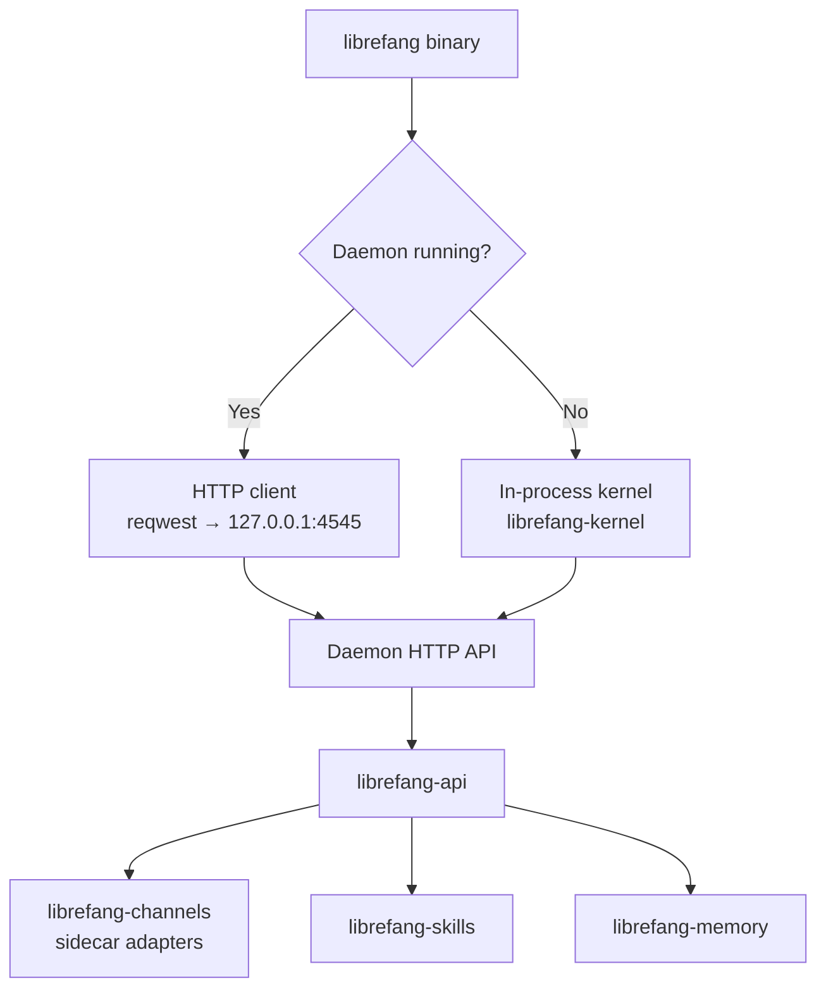

# Other — librefang-cli

# librefang-cli

Command-line interface for the LibreFang Agent OS. Ships the `librefang` binary that serves as the primary entry point for interacting with the system — either as a long-running daemon or as a single-shot tool for agent management, configuration, and diagnostics.

## Overview

The CLI operates in two modes:

- **Daemon mode** (`librefang start`) — starts a background process exposing an HTTP API and dashboard at `http://127.0.0.1:4545`. Subsequent CLI invocations communicate with the running daemon over HTTP via `reqwest`.
- **Standalone mode** — when no daemon is detected, commands boot an in-process kernel instance to fulfill the request and exit. This makes most commands work without requiring a running server.

```mermaid
graph TD
    A[librefang binary] --> B{Daemon running?}
    B -->|Yes| C[HTTP client<br>reqwest → 127.0.0.1:4545]
    B -->|No| D[In-process kernel<br>librefang-kernel]
    C --> E[Daemon HTTP API]
    D --> E
    E --> F[librefang-api]
    F --> G[librefang-channels<br>sidecar adapters]
    F --> H[librefang-skills]
    F --> I[librefang-memory]
```

## Common Commands

| Command | Description |
|---|---|
| `librefang start` | Start the daemon (HTTP API + dashboard) |
| `librefang init` | Write a starter `~/.librefang/config.toml` |
| `librefang agent <subcommand>` | Spawn, list, or message agents |
| `librefang doctor` | Diagnose the local environment |
| `librefang help` | Print full command catalog |

Every subcommand accepts `--help` for detailed usage.

## Feature Flags

Defined in `Cargo.toml` and controlled at build time:

| Feature | Default | Description |
|---|---|---|
| `telemetry` | **Yes** | Enables OpenTelemetry tracing via `opentelemetry` + `tracing-opentelemetry`. Propagates the same feature to `librefang-api`. |
| `mini` | No | **Deprecated empty alias.** Produces a binary byte-identical to the default build. Kept solely so existing release CI jobs (`cli_linux_mini`, `cli_mac_mini`, `cli_windows_mini`) continue to produce their `librefang-${target}-mini.tar.gz` artifacts. These jobs should be retired and the alias removed. |

### Removed features

The `android`, `all-channels`, and `core-channels` features were removed when channel adapters migrated to out-of-process sidecars (`librefang.sidecar.adapters.*` in the SDK package). The `librefang-channels` dependency still exists but no longer gates individual adapters behind cargo features. Android-specific `rustls-connector` workarounds were removed along with the in-process IMAP/SMTP code paths. Release CI now uses plain `--features telemetry` for all targets.

## Build Script (`build.rs`)

The build script injects version metadata into the binary at compile time by setting `cargo:rustc-env` variables. These are consumed at runtime (typically in a `version` or `about` string) via `env!()` macros.

### Injected environment variables

| Variable | Source | Example value |
|---|---|---|
| `GIT_SHA` | CI env or `git rev-parse` | `a1b2c3d` |
| `BUILD_DATE` | `chrono::Utc::now()` | `2025-01-15` |
| `RUSTC_VERSION` | `rustc --version` | `rustc 1.82.0` |

### Git SHA resolution

`resolve_git_sha()` follows a priority order:

1. `GITHUB_SHA` environment variable (GitHub Actions) — full 40-char SHA, truncated to 7.
2. `CI_COMMIT_SHA` environment variable (GitLab CI, generic CI) — full SHA, truncated to 7.
3. `git rev-parse --short HEAD` — `git` binary located via `which::which("git")` to avoid relying on shell PATH semantics.
4. `"unknown"` — fallback if none of the above succeed.

`short_sha()` truncates to 7 characters to match `git rev-parse --short HEAD` output.

The build script declares `rerun-if-env-changed` directives for `GITHUB_SHA`, `CI_COMMIT_SHA`, and `SOURCE_DATE_EPOCH` so Cargo correctly invalidates the build script when these values change across builds.

### Build date capture

Uses `chrono::Utc::now().format("%Y-%m-%d")` instead of shelling out to `date`. This avoids platform-specific differences between BSD and GNU `date` flag syntax and keeps the build deterministic across hosts.

## Architecture and Key Dependencies

The CLI sits at the top of the LibreFang crate dependency graph, pulling in nearly every other workspace crate:

| Crate | Role |
|---|---|
| `librefang-kernel` | Core agent runtime. Booted in-process for standalone mode. |
| `librefang-api` | HTTP API layer. Used both by the daemon server and the standalone client path. |
| `librefang-channels` | Channel adapter definitions. Now purely sidecar-driven; no feature gating per channel. |
| `librefang-types` | Shared types exchanged across all layers. |
| `librefang-import` | Agent/skill import functionality. |
| `librefang-skills` | Skill definitions and execution. |
| `librefang-extensions` | Extension loading and management. |
| `librefang-memory` | Persistent memory / context for agents. |
| `librefang-runtime` | Execution runtime for agent logic. |
| `librefang-acp` | Agent Communication Protocol, built with `kernel-adapter` feature for direct kernel integration. |

### User-interface crates

| Crate | Role |
|---|---|
| `clap` + `clap_complete` | Argument parsing and shell completion generation. |
| `ratatui` | Terminal UI rendering (used by interactive subcommands). |
| `colored` | ANSI color output for terminal display. |

### Infrastructure crates

| Crate | Role |
|---|---|
| `tokio` | Async runtime. |
| `tracing` + `tracing-subscriber` | Structured logging and trace output. |
| `reqwest` (blocking) | HTTP client for daemon communication. |
| `serde_json` + `toml` + `toml_edit` | Configuration file reading and programmatic editing. |
| `fluent` + `unic-langid` | Internationalization / localization. |
| `rusqlite` | SQLite storage (agent state, memory). |
| `arc-swap` | Lock-free atomic swapping of shared state. |
| `zeroize` | Secure memory zeroing for sensitive data. |
| `tikv-jemallocator` | Global allocator on non-MSVC targets (`disable_initial_exec_tls` feature). |
| `libc` | POSIX system calls for signal handling, process management. |
| `open` | Cross-platform "open URL/file" for launching browsers. |
| `rustls` | TLS without OpenSSL dependency. |

## Configuration

`librefang init` generates a starter configuration at `~/.librefang/config.toml`. The `dirs` crate resolves the platform-appropriate config directory. Configuration is read via `toml` and modified programmatically via `toml_edit` (preserving comments and formatting).

## Allocator

On non-MSVC targets (`cfg(not(target_env = "msvc"))`), `tikv-jemallocator` is used as the global allocator with the `disable_initial_exec_tls` feature. This avoids `initial-exec` TLS model issues that can cause problems in certain dynamic loading scenarios.

## Release Artifacts

CI produces platform-specific tarballs:

- `librefang-${target}.tar.gz` — default build with telemetry.
- `librefang-${target}-mini.tar.gz` — built with `--features mini`. **Currently byte-identical** to the default build since `mini` is an empty alias. These jobs and artifacts should be cleaned up.