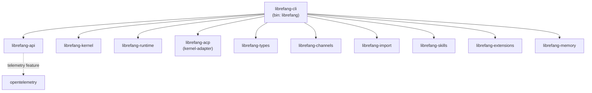

# Other — librefang-cli

# librefang-cli

Command-line interface for the LibreFang Agent OS. Produces the `librefang` binary.

## Overview

The CLI serves two operational modes:

1. **Daemon client** — When a daemon is already running (`librefang start`), the CLI communicates with it over HTTP at `http://127.0.0.1:4545` (default).
2. **Standalone** — If no daemon is available, commands boot an in-process kernel for single-shot execution.

This dual-mode design means every CLI invocation works regardless of whether the agent OS is already running as a background service.

## Build-Time Metadata

The `build.rs` script injects three environment variables into the compiled binary via `cargo:rustc-env=`, consumed at runtime for version strings and diagnostics.

### `GIT_SHA`

Resolved in priority order:

1. `GITHUB_SHA` environment variable (GitHub Actions)
2. `CI_COMMIT_SHA` environment variable (GitLab CI / generic CI)
3. `git rev-parse --short HEAD` via the `which` crate to locate the `git` binary
4. `"unknown"` if none of the above succeed

CI environment variables are preferred because they are authoritative on hosted runners and avoid spawning a subprocess. When falling back to `git`, the binary is resolved via `which::which("git")` rather than relying on shell PATH lookup.

Full 40-character SHAs from CI are truncated to 7 characters by `short_sha()` to match the output of `git rev-parse --short HEAD`.

### `BUILD_DATE`

Captured as UTC date (`YYYY-MM-DD`) using `chrono::Utc::now()` instead of shelling out to `date`. This avoids platform-specific differences between BSD and GNU `date` flag syntax.

### `RUSTC_VERSION`

Captured by invoking `rustc --version` during the build.

The build script declares `rerun-if-env-changed` directives for `GITHUB_SHA`, `CI_COMMIT_SHA`, and `SOURCE_DATE_EPOCH` so Cargo correctly invalidates the script output when these inputs change.

## Feature Flags

| Feature    | Default | Description |
|------------|---------|-------------|
| `telemetry`| Yes     | Enables OpenTelemetry tracing via `librefang-api/telemetry`, `opentelemetry`, and `tracing-opentelemetry` |
| `mini`     | No      | Empty alias retained for backward compatibility with release CI jobs (`cli_linux_mini`, `cli_mac_mini`, `cli_windows_mini`). Produces a byte-identical binary to the default-features build |

### Historical context

Previous versions gated in-process channel adapters (IMAP, SMTP, Telegram, etc.) behind `channel-*` cargo features. All channel adapters now run as out-of-process sidecars (`librefang.sidecar.adapters.*` in the SDK package), so those features were removed. The `android`, `all-channels`, and `core-channels` aliases were removed alongside them. Release CI for Android targets switched to `--features telemetry`.

## Dependency Architecture

```mermaid
graph TD
    CLI["librefang-cli<br/>(bin: librefang)"]
    CLI --> API["librefang-api"]
    CLI --> KERNEL["librefang-kernel"]
    CLI --> RUNTIME["librefang-runtime"]
    CLI --> ACP["librefang-acp<br/>(kernel-adapter)"]
    CLI --> TYPES["librefang-types"]
    CLI --> CHANNELS["librefang-channels"]
    CLI --> IMPORT["librefang-import"]
    CLI --> SKILLS["librefang-skills"]
    CLI --> EXT["librefang-extensions"]
    CLI --> MEMORY["librefang-memory"]
    API -.->|telemetry feature| OTEL["opentelemetry"]
```

The CLI sits at the top of the dependency graph, pulling in nearly every workspace crate. Key relationships:

- **`librefang-api`** — HTTP client for communicating with a running daemon; also provides the telemetry feature gate.
- **`librefang-kernel`** / **`librefang-runtime`** — Used when running in standalone mode to boot an in-process agent kernel.
- **`librefang-acp`** (with `kernel-adapter` feature) — Agent Control Protocol integration.
- **`librefang-channels`** — Channel adapter types (all run as sidecars; no in-process channel code).

### Global Allocator

On non-MSVC targets (`cfg(not(target_env = "msvc"))`), the binary uses `tikv-jemallocator` with `disable_initial_exec_tls` as the global allocator. This is configured at the binary level, not the library level, so downstream crates are unaffected.

## Common Commands

| Command | Description |
|---------|-------------|
| `librefang start` | Start the daemon (HTTP API + dashboard) |
| `librefang init` | Write a starter `~/.librefang/config.toml` |
| `librefang agent <subcommand>` | Spawn, list, or message agents |
| `librefang doctor` | Diagnose the local environment |
| `librefang help` | Full command catalog |

All subcommands accept `--help` for detailed usage.

## Key External Dependencies

| Crate | Purpose |
|-------|---------|
| `clap` / `clap_complete` | Argument parsing and shell completion generation |
| `tokio` | Async runtime |
| `tracing` / `tracing-subscriber` | Structured logging |
| `reqwest` (blocking) | HTTP client for daemon communication |
| `ratatui` | Terminal UI framework |
| `colored` | Terminal color output |
| `toml` / `toml_edit` | Configuration file reading and writing |
| `serde_json` | JSON serialization |
| `rusqlite` | SQLite for local state |
| `fluent` / `unic-langid` | Internationalization |
| `zeroize` | Secure memory clearing for sensitive data |
| `open` | Cross-platform "open URL/file" helper |
| `rustls` | TLS without OpenSSL dependency |
| `libc` | Low-level platform bindings |
| `dirs` | Standard directory paths |
| `walkdir` | Recursive directory traversal |
| `base64` | Base64 encoding/decoding |
| `uuid` | UUID generation |
| `chrono` | Date/time handling |
| `arc-swap` | Atomic reference swapping for shared state |

## Build Dependencies

- **`chrono`** — Used in `build.rs` for `BUILD_DATE` stamping (avoids platform-specific `date` shell commands).
- **`which`** — Used in `build.rs` to locate the `git` binary on PATH before invoking `git rev-parse`.

## Development Dependencies

- **`tempfile`** — Used in tests for temporary file and directory fixtures.