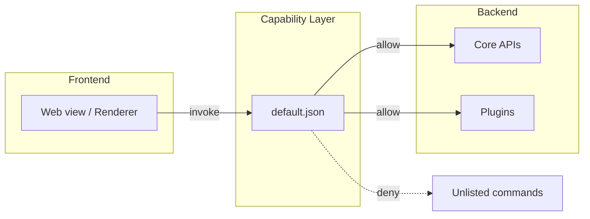

# Other — librefang-desktop-capabilities

# LibreFang Desktop Capabilities

## Overview

The `librefang-desktop-capabilities` module defines the **default permission set** for the LibreFang desktop application. It is a declarative Tauri configuration that controls which system-level APIs the app is authorized to use. Tauri's capability system acts as a security boundary — no plugin or core command can be invoked at runtime unless it has been explicitly granted permission in a capability file like this one.

This module lives under `librefang-desktop/capabilities/` and is consumed by the Tauri runtime at application startup.

## File Reference

### `default.json`

The sole file in this module. It declares a single capability scope:

| Field | Value | Purpose |
|---|---|---|
| `$schema` | References the Tauri JSON schema | Enables IDE validation and autocomplete |
| `identifier` | `"default"` | Unique name for this capability set |
| `description` | Human-readable summary | Documents intent for developers |
| `windows` | `["main"]` | Restricts these permissions to the `main` window only |
| `permissions` | Array of permission tokens (see below) | Grants access to specific Tauri commands |

## Granted Permissions

### Core and Plugin Defaults

These tokens each unlock a bundle of commands provided by their respective Tauri plugins or core modules:

| Permission | Source | What it enables |
|---|---|---|
| `core:default` | `tauri` core | Window management, event system, basic IPC |
| `notification:default` | `tauri-plugin-notification` | Sending native OS notifications |
| `shell:default` | `tauri-plugin-shell` | Executing shell commands and opening external programs/URLs |
| `dialog:default` | `tauri-plugin-dialog` | Native file pickers, message dialogs, confirmations |
| `autostart:default` | `tauri-plugin-autostart` | Registering the app to launch on system boot |
| `updater:default` | `tauri-plugin-updater` | Checking for and applying application updates |

### Global Shortcut (Granular Permissions)

Unlike the bundled defaults above, global shortcut permissions are specified individually. This follows the principle of least privilege — only the exact commands needed are exposed:

| Permission | Command it authorizes |
|---|---|
| `global-shortcut:allow-register` | Register a new system-wide keyboard shortcut |
| `global-shortcut:allow-unregister` | Remove a previously registered shortcut |
| `global-shortcut:allow-is-registered` | Query whether a shortcut is currently registered |

Notably absent is `global-shortcut:allow-unregister-all`, meaning the app cannot bulk-clear all shortcuts.

## Architecture and Security Model

Tauri's capability system is **deny-by-default**. The `default.json` file acts as an allowlist that bridges the frontend (web view) to privileged backend operations. Without an entry here, any `invoke()` call from the JavaScript layer to a protected command will be rejected at the IPC boundary.

The capability is scoped to the `"main"` window. If the application opens additional windows (e.g., an about dialog or a secondary panel), those windows will **not** inherit these permissions unless they are explicitly added to the `windows` array or a separate capability file targets them.

## How to Modify

### Adding a new permission

1. Identify the permission token from the plugin's documentation (e.g., `fs:allow-read-text-file` for `tauri-plugin-fs`).
2. Add the token string to the `permissions` array in `default.json`.
3. The change takes effect on the next application rebuild — no Rust code changes are required.

### Restricting to specific windows

If a permission should only apply to certain windows, create a **new capability file** alongside `default.json` with a different `identifier` and a targeted `windows` list, rather than broadening the existing one.

### Schema validation

The `$schema` field points to a remote JSON schema hosted on GitHub. IDEs like VS Code will automatically validate the file against this schema, catching invalid permission tokens or structural errors before runtime.

## Relationship to the Broader Codebase

This module has **no direct code dependencies** — it is pure configuration consumed by the Tauri build tooling. However, any frontend code that calls `invoke()` to use notifications, dialogs, shortcuts, autostart, or the updater depends implicitly on the permissions declared here. Removing a permission token will cause those frontend calls to fail silently or throw a runtime error, depending on the plugin's error handling.

When adding a new Tauri plugin to the project, corresponding permission entries must be added to this file (or a new capability file) for the plugin's commands to be callable from the renderer.