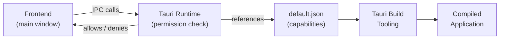

# Other — librefang-desktop-capabilities

# LibreFang Desktop — Capabilities (`librefang-desktop/capabilities/`)

## Overview

This directory contains the **Tauri capabilities configuration** for the LibreFang desktop application. Tauri's capability system is a permission model that controls which system APIs the application's frontend windows are allowed to invoke. Capabilities are defined in static JSON files, consumed by the Tauri build tooling at compile time, and enforced at runtime by the Tauri core.

The single file here — `default.json` — is the primary and currently only capability set. It grants the **main window** a curated set of permissions covering notifications, native dialogs, global keyboard shortcuts, auto-start registration, and in-app updates.

## File: `default.json`

```json
{
  "$schema": "https://raw.githubusercontent.com/nicedoc/tauri/refs/heads/dev/crates/tauri-utils/schema.json",
  "identifier": "default",
  "description": "Default permissions for the LibreFang desktop app",
  "windows": ["main"],
  "permissions": [
    "core:default",
    "notification:default",
    "dialog:default",
    "shell:default",
    "global-shortcut:allow-register",
    "global-shortcut:allow-unregister",
    "global-shortcut:allow-is-registered",
    "autostart:default",
    "updater:default"
  ]
}
```

### Structure

| Field | Value | Purpose |
|---|---|---|
| `$schema` | Tauri JSON Schema URL | Enables IDE autocomplete and validation for the capability file |
| `identifier` | `"default"` | Unique name for this capability set; referenced by the Tauri runtime |
| `description` | Human-readable string | Documents intent for developers |
| `windows` | `["main"]` | Restricts all listed permissions to only the `main` window — no other windows receive these grants |
| `permissions` | Array of permission identifiers | Each entry maps to a Tauri plugin or core API permission |

## Granted Permissions

### Core

| Permission | Effect |
|---|---|
| `core:default` | Baseline Tauri permissions — IPC bridge, window management, and essential app operations |

### Notifications

| Permission | Effect |
|---|---|
| `notification:default` | Send native desktop notifications via the OS notification center |

### Native Dialogs

| Permission | Effect |
|---|---|
| `dialog:default` | Open native file pickers, message boxes, and confirm/cancel dialogs |

### Shell

| Permission | Effect |
|---|---|
| `shell:default` | Open URLs or files in the user's default external applications (browser, etc.) |

### Global Shortcuts

| Permission | Effect |
|---|---|
| `global-shortcut:allow-register` | Register a system-wide keyboard shortcut that works even when the app is not focused |
| `global-shortcut:allow-unregister` | Remove a previously registered global shortcut |
| `global-shortcut:allow-is-registered` | Query whether a specific shortcut is currently registered |

These are specified individually (rather than using `global-shortcut:default`) to follow the principle of least privilege — only the three required operations are exposed.

### Auto-Start

| Permission | Effect |
|---|---|
| `autostart:default` | Register or unregister the app to launch automatically at system login |

### Updater

| Permission | Effect |
|---|---|
| `updater:default` | Check for, download, and install application updates |

## How It Connects to the Codebase



At **build time**, Tauri reads all JSON files in the `capabilities/` directory, resolves the referenced plugin permissions, and embeds an access control list into the compiled binary.

At **runtime**, every IPC call from the `main` window to a Tauri API is checked against this embedded ACL. If a permission is not listed here, the call is rejected — even if the corresponding plugin is installed and initialized on the Rust side.

## Adding New Permissions

When integrating a new Tauri plugin or a new API from an existing plugin:

1. **Install the plugin** on the Rust side (add to `Cargo.toml`, register in the builder).
2. **Add the required permission identifier(s)** to the `permissions` array in `default.json`. Refer to the plugin's documentation for available permission strings — they follow the pattern `<plugin-name>:<permission-scope>`.
3. **Use `:default`** for broad access during development, then narrow to specific `:allow-*` scopes for production.
4. **Rebuild** the application. The new capability is picked up automatically.

## Security Considerations

- The `windows` field explicitly scopes permissions to the `main` window. Any dynamically opened windows or webviews will have **no permissions** unless a separate capability file targets them.
- `shell:default` allows opening external URLs. If the app ever renders user-controlled content, ensure URLs are validated before passing them to the shell API.
- Global shortcuts are registered system-wide. Avoid overriding common OS shortcuts to prevent conflicts.

## Schema Validation

The `$schema` field points to the Tauri JSON Schema. Most editors (VS Code, JetBrains) will use this to provide autocomplete and flag invalid permission identifiers in real time. If working offline or against a different Tauri version, the schema URL can be updated accordingly.