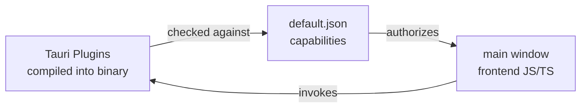

# Other — librefang-desktop-capabilities

# LibreFang Desktop — Capabilities Configuration

## Overview

This module defines the **default capability set** for the LibreFang desktop application using Tauri's capability-based security model. It is a static JSON configuration — there is no executable code, no runtime logic, and no function call graph. Its sole purpose is to declare which Tauri core APIs and plugin features the `main` window is authorized to use.

The file lives at:

```
librefang-desktop/capabilities/default.json
```

## How Tauri Capabilities Work

Tauri enforces a least-privilege security architecture. Every window in a Tauri application must explicitly declare which APIs it can access. Capabilities are the bridge between the frontend (web view) and the backend (Rust side). Without a capability entry, the frontend cannot invoke a given command or plugin — even if the plugin is compiled into the binary.

A capability JSON file specifies:

| Field | Purpose |
|-------|---------|
| `$schema` | Links to the Tauri JSON Schema for IDE validation and autocompletion |
| `identifier` | A unique name for this capability set |
| `description` | Human-readable summary |
| `windows` | Which windows this capability applies to (by label) |
| `permissions` | An ordered list of granted permission tokens |

## Granted Permissions

The `default` capability set grants the following permissions to the **main** window:

### Core

| Permission | Effect |
|------------|--------|
| `core:default` | Baseline Tauri core commands (event emit/listen, window creation basics, etc.) |

### Shell

| Permission | Effect |
|------------|--------|
| `shell:default` | Default shell plugin permissions, allowing the app to open URLs or execute permitted commands |

### Dialog

| Permission | Effect |
|------------|--------|
| `dialog:default` | Native OS dialog access — file pickers, message boxes, confirm prompts |

### Notification

| Permission | Effect |
|------------|--------|
| `notification:default` | Default set of notification permissions, enabling the app to post system notifications |

### Global Shortcut

| Permission | Effect |
|------------|--------|
| `global-shortcut:allow-register` | Register a system-wide keyboard shortcut |
| `global-shortcut:allow-unregister` | Unregister a previously registered shortcut |
| `global-shortcut:allow-is-registered` | Query whether a shortcut is currently registered |

> **Note:** The global-shortcut permissions are granted individually rather than via `global-shortcut:default`. This is an intentional choice — only the three specific commands are exposed, keeping the attack surface minimal. If you need additional global-shortcut commands in the future, add them explicitly.

### Autostart

| Permission | Effect |
|------------|--------|
| `autostart:default` | Allows the app to register itself as a login item / auto-start entry |

### Updater

| Permission | Effect |
|------------|--------|
| `updater:default` | Enables the in-app update flow (check for updates, download, install) |

## Relationship to the Rest of the Codebase



1. **At build time**, Tauri reads all files under `capabilities/` and embeds them into the compiled binary.
2. **At runtime**, when the frontend invokes a Tauri command (e.g., `invoke("plugin:notification|send_notification")`), the runtime checks whether the calling window's capability set includes the relevant permission token.
3. If the permission is missing, the call is silently rejected or returns a permission-denied error.

This file does not import from or call into any other LibreFang module. It is consumed entirely by the Tauri framework layer.

## Modifying Capabilities

### Adding a new permission

If you integrate a new Tauri plugin into the app (for example, `fs` for filesystem access), you must add the corresponding permission token here:

```json
"permissions": [
  "core:default",
  "fs:default",
  ...
]
```

Omitting the entry will cause all frontend calls to that plugin to fail at runtime with no obvious build-time error.

### Adding a second window

If the app gains additional windows (e.g., an "about" or "settings" window), you have two options:

- **Add the window label to `windows`:** `"windows": ["main", "settings"]` — grants the same permissions to both windows.
- **Create a separate capability file:** e.g., `capabilities/settings.json` with its own `identifier` and a scoped-down permission set. This is the recommended approach for windows that need fewer privileges.

### Schema validation

The `$schema` field points to the upstream Tauri schema. IDEs that support JSON Schema (VS Code, JetBrains) will provide autocompletion for valid permission tokens. If you upgrade Tauri versions, update the schema URL to match the new release to get accurate completions.