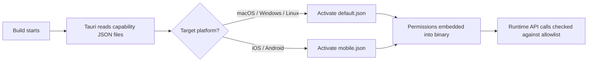

# Other — librefang-desktop-capabilities

# librefang-desktop/capabilities

Tauri capability definitions that govern which platform APIs the LibreFang desktop app may access. Two capability sets are provided — one for desktop platforms and a reduced set for mobile builds where certain plugins are not bundled.

## Purpose

Tauri's security model requires every privileged operation (file dialogs, shell execution, OS notifications, etc.) to be explicitly declared in a capability file. At build time, Tauri reads these JSON files, resolves the referenced plugin permissions, and embeds an allowlist into the compiled binary. Any API call not covered by an active capability is rejected at runtime.

Keeping capability definitions in one place makes it easy to audit the app's attack surface and to understand which features are available on each platform.

## File Reference

### `default.json`

The **desktop** capability set. It applies to the `main` window on macOS, Windows, and Linux.

| Permission | What it enables |
|---|---|
| `core:default` | Standard Tauri runtime APIs (window management, event system, IPC, etc.) |
| `notification:default` | Sending OS-level notifications |
| `shell:default` | Spawning child processes and opening URLs/paths in external applications |
| `dialog:default` | Native file open/save dialogs and message boxes |
| `global-shortcut:allow-register` | Registering system-wide keyboard shortcuts |
| `global-shortcut:allow-unregister` | Removing previously registered shortcuts |
| `global-shortcut:allow-is-registered` | Querying whether a shortcut is currently registered |
| `autostart:default` | Reading and writing the app's login-item / auto-start entry |
| `updater:default` | Checking for and applying application updates |

### `mobile.json`

A **stripped-down** capability set for iOS and Android. Desktop-only plugins (`shell`, `global-shortcut`, `autostart`, `updater`) are omitted because they either have no equivalent on mobile or are not bundled in mobile builds.

| Permission | What it enables |
|---|---|
| `core:default` | Standard Tauri runtime APIs |
| `notification:default` | OS-level push/local notifications |
| `dialog:default` | Native alert and confirmation dialogs |

## How Capabilities Are Resolved

1. **Build time** — The Tauri CLI discovers every `*.json` file under `capabilities/`, validates each one against the schema referenced in `$schema`, and selects the files whose `platforms` array includes the current build target.
2. **Runtime** — When the frontend (or a plugin) invokes a Tauri command, the runtime checks whether the command's permission identifier appears in the embedded set. Unauthorised calls return a permission-denied error.

## How to Modify

**Adding a new permission** (e.g., exposing a new plugin API):

1. Open the capability file that covers the target platform.
2. Append the permission identifier to the `permissions` array. Use the fully qualified name (`plugin-name:permission-name`) as listed in the plugin's documentation.
3. Rebuild the app. The Tauri CLI will validate the identifier at build time; a typo produces a clear error.

**Removing a permission:**

Delete the entry from the array and rebuild. Any frontend code that still calls the removed API will receive a runtime error, so coordinate with the UI layer.

**Adding a new platform-specific capability:**

Create a new JSON file in this directory following the same schema. Set `identifier` to a unique name, populate `platforms` and `windows` as needed, and list only the permissions that should be available. Tauri will automatically pick up the file on the next build.

## Conventions

- **One capability per platform group.** The project keeps a single `default.json` for all desktop OSes and a single `mobile.json` for mobile. If finer control becomes necessary (e.g., a permission that only makes sense on macOS), create a separate file with a restricted `platforms` array rather than overloading an existing one.
- **Use `:default` sets where possible.** Many plugins publish a `plugin-name:default` meta-permission that bundles the most commonly needed individual permissions. Prefer these over listing every atomic permission unless you need a narrower scope.
- **Schema pinning.** The `$schema` field points to a specific branch (`dev`) of the Tauri repository. When upgrading Tauri, verify the schema URL still resolves and re-validate the files.