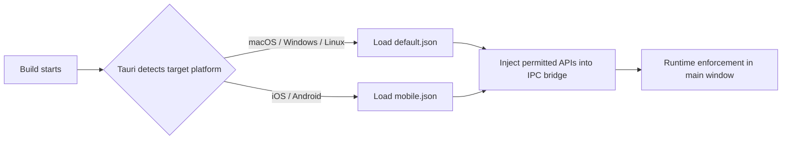

# Other — librefang-desktop-capabilities

# LibreFang Desktop Capabilities

## Overview

The `librefang-desktop/capabilities` module defines **Tauri security capability files** that control which system APIs and plugins the LibreFang application is permitted to access at runtime. These JSON files follow the [Tauri capability schema](https://raw.githubusercontent.com/nicedoc/tauri/refs/heads/dev/crates/tauri-utils/schema.json) and are consumed by the Tauri build system to generate the permission grants enforced by the application's IPC layer.

Tauri's capability system is a deny-by-default security model. No plugin or core API is accessible unless explicitly listed in a capability file. This module is the single source of truth for those grants.

## Capability Files

### `default.json` — Desktop Platforms

**Platforms:** macOS, Windows, Linux  
**Window scope:** `main`

Grants the following permissions:

| Permission | Purpose |
|---|---|
| `core:default` | Standard Tauri core APIs (window management, event system, etc.) |
| `notification:default` | Native OS notification delivery |
| `shell:default` | Spawning external processes and opening URLs in the system browser |
| `dialog:default` | Native file pickers, message boxes, and input dialogs |
| `global-shortcut:allow-register` | Registering system-wide keyboard shortcuts |
| `global-shortcut:allow-unregister` | Removing previously registered shortcuts |
| `global-shortcut:allow-is-registered` | Querying whether a shortcut is currently registered |
| `autostart:default` | Launching LibreFang automatically on user login |
| `updater:default` | Checking for and applying application updates |

The global-shortcut permissions are broken out individually rather than using `global-shortcut:default` to adhere to the principle of least privilege — the app only needs to register, unregister, and query shortcuts, and should not acquire any other shortcut-related APIs unless explicitly added.

### `mobile.json` — iOS / Android

**Platforms:** iOS, Android  
**Window scope:** `main`

Grants a **strict subset** of the desktop permissions:

| Permission | Purpose |
|---|---|
| `core:default` | Standard Tauri core APIs |
| `notification:default` | Push / local notification delivery |
| `dialog:default` | Native dialog sheets and alerts |

Plugins such as `shell`, `global-shortcut`, `autostart`, and `updater` are **not bundled** on mobile targets, so they must not appear in the mobile capability file. Including permissions for absent plugins would cause a build failure.

## How Capabilities Are Applied

Tauri matches capability files to the current build target using the `platforms` and `windows` fields:

1. **Platform filter** — Only capability files whose `platforms` array includes the current compile target are considered.
2. **Window filter** — Among those, only capabilities scoped to the window being created are applied. Both files target `"main"`, the primary application window.
3. **Permission injection** — The listed permission identifiers are resolved against the plugin manifests bundled into the app. Valid permissions are injected into the IPC bridge available to the webview runtime.
4. **Runtime enforcement** — Any IPC call from the frontend that is not backed by a granted permission is rejected with a security error.

## Adding a New Permission

When a new Tauri plugin or core API is introduced:

1. Add the plugin dependency in `Cargo.toml` (Rust side) and register it in the Tauri builder.
2. Add the corresponding permission identifier to the appropriate capability file(s). Use the narrowest permission set that satisfies the use case — prefer `allow-<specific-action>` over `<plugin>:default` when possible.
3. If the plugin only makes sense on desktop, add it **only** to `default.json`. Do **not** add it to `mobile.json`.
4. Verify the build succeeds on both desktop and mobile targets, as including a permission for a plugin that isn't compiled in will fail.

## Key Conventions

- **One capability file per platform group.** Rather than a single file with complex conditional logic, the module uses separate files (`default.json` for desktop, `mobile.json` for mobile) to keep the permission sets clear and avoid accidental cross-platform leakage.
- **`identifier` field** — Used by Tauri for logging and diagnostics. Each file has a unique identifier (`"default"` and `"mobile"`).
- **`$schema` field** — Points to the Tauri capability JSON Schema, enabling IDE autocomplete and validation during editing.