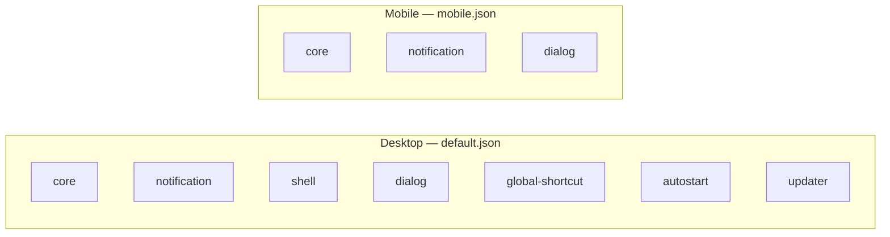

# Other — librefang-desktop-capabilities

# LibreFang Desktop Capabilities

## Overview

This module defines the Tauri capability configurations for the LibreFang desktop application. Capabilities in Tauri serve as a security boundary, specifying which APIs and features are available to the application's windows on each platform. The module contains two declarative JSON files that gate access to system-level functionality across desktop and mobile builds.

## Purpose

Tauri uses a capability-based security model rather than traditional blanket permissions. Each capability file declares:

- **Which windows** the permissions apply to
- **Which platforms** the configuration targets
- **Which Tauri plugin APIs** are explicitly allowed

This ensures the application only requests the minimum set of system permissions it needs, and that mobile builds don't attempt to invoke desktop-only APIs that aren't bundled.

## Configuration Files

### `default.json` — Desktop Platforms

Targets **macOS**, **Windows**, and **Linux**. Applied to the `main` window.

| Permission | Purpose |
|---|---|
| `core:default` | Base Tauri runtime functionality |
| `notification:default` | System notification delivery |
| `shell:default` | Shell and process execution |
| `dialog:default` | Native file and message dialogs |
| `global-shortcut:allow-register` | Register global keyboard shortcuts |
| `global-shortcut:allow-unregister` | Remove registered global shortcuts |
| `global-shortcut:allow-is-registered` | Query whether a shortcut is registered |
| `autostart:default` | Launch at system login |
| `updater:default` | In-app update checks and installation |

The `global-shortcut` permissions use fine-grained `allow-*` scopes rather than the plugin's `default` set, limiting access to only the three operations the application needs.

### `mobile.json` — Mobile Platforms

Targets **iOS** and **Android**. Applied to the `main` window.

| Permission | Purpose |
|---|---|
| `core:default` | Base Tauri runtime functionality |
| `notification:default` | System notification delivery |
| `dialog:default` | Native file and message dialogs |

Mobile builds intentionally exclude `shell`, `global-shortcut`, `autostart`, and `updater`. These plugins either lack mobile implementations or provide functionality (system-wide hotkeys, login-item registration, self-updating) that is inappropriate or unsupported on iOS/Android.

## Permission Coverage by Platform

## Adding a New Permission

When introducing a new Tauri plugin to the application:

1. **Add the plugin dependency** to `Cargo.toml` and/or `package.json` as required.
2. **Determine platform support.** Check whether the plugin works on mobile or is desktop-only.
3. **Add the permission identifier** to the relevant capability file(s):
   - Cross-platform plugin → add to both `default.json` and `mobile.json`.
   - Desktop-only plugin → add to `default.json` only.
4. **Prefer specific scopes.** Use `allow-<action>` over `<plugin>:default` when you only need a subset of the plugin's functionality.

### Permission Identifier Format

Identifiers follow the pattern `<plugin>:<scope>`:

- `core:default` — the core plugin's default permission set
- `global-shortcut:allow-register` — a specific allowed action
- `notification:default` — the notification plugin's default permission set

Each file references the [Tauri schema](https://raw.githubusercontent.com/nicedoc/tauri/refs/heads/dev/crates/tauri-utils/schema.json) in its `$schema` field, which enumerates all valid permission identifiers.

## Relationship to the Application

These capability files are consumed at build time by the Tauri bundler. The frontend code in `librefang-desktop` can only invoke Tauri APIs that are explicitly listed in the capability configuration matching the current platform. Calling an unlisted API produces a runtime permission error.

The capability system is purely declarative — there are no function calls, imports, or execution flows within this module. It acts as a static security policy enforced by the Tauri runtime.

## Key Considerations

- **Least privilege.** Only add permissions the application actively uses. Avoid `default` scopes when specific `allow-*` permissions suffice.
- **Platform isolation.** Keep the mobile capability set minimal. Plugins like `shell` and `autostart` have no meaningful implementation on iOS/Android and must not be included.
- **Window scoping.** Both configurations target only the `main` window. If additional windows are introduced, new capability files must explicitly list them in the `windows` array, or the existing files must be updated to include the new window names.