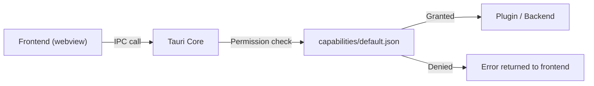

# Other — librefang-desktop-capabilities

# LibreFang Desktop — Capabilities Configuration

## Overview

The `capabilities/default.json` file defines the **Tauri security capabilities** granted to the LibreFang desktop application. In Tauri's capability-based security model, every privileged operation (filesystem access, shell commands, notifications, etc.) must be explicitly declared before the frontend can invoke it. This file is the single source of truth for what the app's main window is allowed to do.

## Purpose

- **Lock down the attack surface** — the webview frontend cannot call any backend APIs that aren't listed here.
- **Declare intent** — makes the app's privilege requirements auditable and version-controlled.
- **Scope to windows** — permissions are bound to specific windows (here, only `"main"`).

## File Location

```
librefang-desktop/capabilities/default.json
```

## Schema

The file validates against Tauri's published JSON schema:

```json
"$schema": "https://raw.githubusercontent.com/nicedoc/tauri/refs/heads/dev/crates/tauri-utils/schema.json"
```

IDEs that support `$schema` (VS Code, JetBrains) will provide autocomplete and validation when editing this file.

## Permission Reference

### Bundle Permissions (Wildcard Sets)

These are predefined permission groups provided by each Tauri plugin. They expand into multiple granular permissions.

| Permission | Plugin | Grants |
|---|---|---|
| `core:default` | `tauri` core | Standard core IPC, event system, window management basics |
| `notification:default` | `tauri-plugin-notification` | Send desktop notifications |
| `shell:default` | `tauri-plugin-shell` | Execute shell commands from the frontend |
| `dialog:default` | `tauri-plugin-dialog` | Open native file/save/message dialogs |
| `autostart:default` | `tauri-plugin-autostart` | Register/unregister the app to launch at login |
| `updater:default` | `tauri-plugin-updater` | Check for and apply application updates |

### Granular Permissions

Individual capabilities that aren't covered by the default sets:

| Permission | Allows |
|---|---|
| `global-shortcut:allow-register` | Register a global keyboard shortcut (system-wide, even when app is unfocused) |
| `global-shortcut:allow-unregister` | Remove a previously registered global shortcut |
| `global-shortcut:allow-is-registered` | Query whether a shortcut is currently registered |

## How It Connects to the Codebase



1. The frontend (in the `main` window) calls a Tauri command or plugin API.
2. Tauri core checks whether the originating window has the required permission in the matched capability set.
3. If the permission exists in `default.json`, the call proceeds to the plugin or Rust backend handler.
4. If not, the call is rejected with a permission error — no backend code runs.

This means adding a new plugin or privileged feature requires updating this file, or the feature will silently fail with a security denial.

## Modifying This File

**When to add a permission:**
- You install a new Tauri plugin (e.g., `tauri-plugin-clipboard`).
- You need a specific granular permission not included in a `:default` set.
- You add a new window that needs different privileges.

**Steps:**

1. Add the permission identifier to the `permissions` array.
2. If adding a new window, add its label to the `windows` array (or create a separate capability file scoped to that window).
3. Rebuild the app — Tauri validates capabilities at build time and will error on unknown identifiers.

**Example — adding clipboard access:**

```json
"permissions": [
  "core:default",
  "notification:default",
  "shell:default",
  "dialog:default",
  "global-shortcut:allow-register",
  "global-shortcut:allow-unregister",
  "global-shortcut:allow-is-registered",
  "autostart:default",
  "updater:default",
  "clipboard-manager:default"
]
```

## Security Considerations

- **`shell:default`** grants the frontend the ability to spawn processes. Ensure no user-controlled input is passed unsanitized to shell commands.
- **`global-shortcut:allow-register`** registers shortcuts at the OS level. Conflicting shortcuts can interfere with other applications.
- **`updater:default`** allows the frontend to trigger updates. The update endpoint and signing configuration are controlled in `tauri.conf.json`, not here — this permission only gates whether the frontend can *initiate* the check.
- This capability file applies to **all instances of the `main` window**. If the app opens secondary windows with different trust levels, create a separate capability file scoped to those window labels.