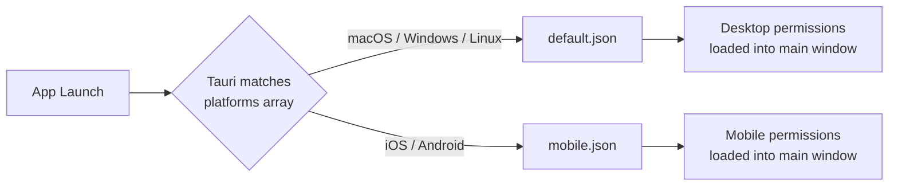

# Other — librefang-desktop-capabilities

# LibreFang Desktop Capabilities

Capability configurations that define which Tauri plugins and APIs the app's frontend is permitted to access. Tauri uses these as a permission boundary — if a permission isn't listed here, the corresponding IPC calls will be rejected at runtime.

## Files

| File | Platforms | Description |
|---|---|---|
| `capabilities/default.json` | macOS, Windows, Linux | Full desktop permission set |
| `capabilities/mobile.json` | iOS, Android | Reduced set excluding desktop-only plugins |

Both files target the `main` window and use the Tauri JSON schema (`$schema`) for IDE validation and autocompletion of permission strings.

## Desktop Permissions (`default.json`)

```json
"permissions": [
  "core:default",
  "notification:default",
  "shell:default",
  "dialog:default",
  "global-shortcut:allow-register",
  "global-shortcut:allow-unregister",
  "global-shortcut:allow-is-registered",
  "autostart:default",
  "updater:default"
]
```

| Permission | Grants access to |
|---|---|
| `core:default` | Base Tauri runtime APIs (event system, window management, etc.) |
| `notification:default` | System notification dispatch |
| `shell:default` | Shell command execution and process spawning |
| `dialog:default` | Native file pickers, message boxes, confirm dialogs |
| `global-shortcut:allow-register` | Register a global keyboard shortcut |
| `global-shortcut:allow-unregister` | Unregister a previously registered shortcut |
| `global-shortcut:allow-is-registered` | Query whether a shortcut is currently registered |
| `autostart:default` | Read/write launch-at-login behavior |
| `updater:default` | Check for and apply in-app updates |

The `global-shortcut` permissions are listed individually rather than using the `global-shortcut:default` blanket. This is intentional — only the three specific operations the app needs are exposed, following least-privilege.

## Mobile Permissions (`mobile.json`)

```json
"permissions": [
  "core:default",
  "notification:default",
  "dialog:default"
]
```

Desktop-only plugins (`shell`, `global-shortcut`, `autostart`, `updater`) are excluded because they are either not bundled in mobile builds, don't apply on mobile (autostart), or use platform-native update mechanisms (app store updates instead of Tauri's updater).

## How Tauri Selects a Capability File



At build time and runtime, Tauri checks each capability file's `platforms` array against the current OS. Only matching files are active. Because the two files have non-overlapping platform lists (`["macOS", "windows", "linux"]` vs `["iOS", "android"]`), exactly one set of permissions is ever in effect.

## Adding a New Plugin

When introducing a new Tauri plugin to the app:

1. **Rust side** — add the plugin crate and register it with the Tauri builder.
2. **JS side** — install the `@tauri-apps/plugin-*` binding.
3. **Capabilities** — add the permission string to the appropriate file(s):
   - `default.json` if needed on desktop.
   - `mobile.json` if needed on mobile.
   - Both if the plugin works everywhere.
4. **Use specific scopes** (`allow-*`) over `default` when the app only needs a subset of the plugin's API.

The `$schema` reference at the top of each file enables autocompletion in editors like VS Code, which helps discover available permission strings for installed plugins.

## Design Notes

- **Single window (`"windows": ["main"]`)** — the app operates one webview. If multi-window support is introduced later, capabilities will need to be expanded or additional capability files created for per-window scoping.
- **No custom permissions** — all entries reference standard plugin permission identifiers. If the app adds custom Tauri commands or state, corresponding permission entries will need to be authored.
- **Schema pinned to dev branch** — the `$schema` URL references `refs/heads/dev` of the Tauri repo. This should be updated to a tagged release once the Tauri version used by the app stabilizes.