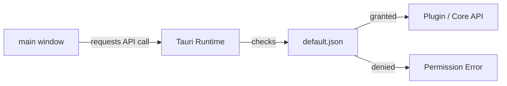

# Other — librefang-desktop-capabilities

# librefang-desktop-capabilities

## Overview

This module defines the **default capability set** for the LibreFang desktop application. It is a Tauri security configuration that declares which core APIs and plugins the app's frontend is permitted to invoke at runtime.

Tauri uses a capability-based security model: no API is accessible from the webview unless an explicit capability grants permission. This module is the single source of truth for those grants in the default configuration.

## Location

```
librefang-desktop/capabilities/default.json
```

## Structure

The configuration is a JSON document conforming to the [Tauri capabilities schema](https://raw.githubusercontent.com/nicedoc/tauri/refs/heads/dev/crates/tauri-utils/schema.json).

| Field          | Value       | Description                                              |
|----------------|-------------|----------------------------------------------------------|
| `identifier`   | `"default"` | Unique name for this capability set.                     |
| `description`  | Human-readable string | Explains the purpose of this capability file.  |
| `windows`      | `["main"]`  | Applies these permissions only to the `main` window.    |
| `permissions`  | Array       | Ordered list of granted permissions (see below).         |

## Granted Permissions

### Core and Plugin Defaults

| Permission             | Plugin / Scope    | Effect                                                    |
|------------------------|-------------------|-----------------------------------------------------------|
| `core:default`         | Tauri core        | Baseline core APIs (event system, window management, etc.)|
| `notification:default` | `notification`    | Send desktop notifications to the OS.                     |
| `shell:default`        | `shell`           | Execute shell-side commands defined in the Tauri config.  |
| `dialog:default`       | `dialog`          | Open native file pickers, message boxes, and ask dialogs. |
| `autostart:default`    | `autostart`       | Register/unregister the app to launch at login.           |
| `updater:default`      | `updater`         | Check for and apply application updates.                  |

### Global Shortcut Permissions (Fine-Grained)

Rather than granting `global-shortcut:default` (the full set), this configuration explicitly allows only three operations:

| Permission                          | Effect                                          |
|-------------------------------------|-------------------------------------------------|
| `global-shortcut:allow-register`    | Register a new global keyboard shortcut.        |
| `global-shortcut:allow-unregister`  | Remove a previously registered shortcut.        |
| `global-shortcut:allow-is-registered`| Query whether a shortcut is currently active.  |

This restricts the frontend to the minimum shortcut APIs needed, following the principle of least privilege.

## How It Fits in the Application



1. The `main` window's JavaScript/TypeScript code calls a Tauri API (e.g., `invoke`, `dialog.open`, `notification.send`).
2. The Tauri runtime intercepts the call and checks it against all matching capability files.
3. `default.json` is the only capability file, scoped to the `main` window via `"windows": ["main"]`.
4. If the permission is listed, the call proceeds to the underlying plugin or core handler.
5. If not listed, the call is rejected with a permission error at runtime.

## Modifying Capabilities

When adding a new Tauri plugin or core API feature to LibreFang, you must update this file to grant the required permission. Steps:

1. **Identify the permission identifier.** Plugin documentation lists available permissions, typically in the format `plugin-name:default` or `plugin-name:allow-specific-action`.
2. **Add it to the `permissions` array.** Prefer fine-grained `allow-*` permissions over `default` sets when only specific operations are needed.
3. **Validate the schema.** The `$schema` field at the top of the file enables IDE autocompletion and validation against the Tauri schema.
4. **Test.** A missing or typoed permission will silently fail at runtime (the call is denied). Check the browser console or Tauri dev tools for permission errors.

### Example: Adding Clipboard Access

To allow read-only clipboard access, append to the `permissions` array:

```json
"clipboard-manager:allow-read"
```

Do **not** add `clipboard-manager:default` unless write access is also required.

## Security Considerations

- **Scope is limited to `main`.** If additional windows are created in the future, they will not automatically inherit these permissions. A separate capability file or an entry in the `windows` array is required.
- **Shell access is enabled.** The `shell:default` permission allows executing commands defined in `tauri.conf.json` under `plugins.shell`. Ensure only intended sidecar binaries and commands are configured there.
- **Updater access is enabled.** `updater:default` permits the frontend to trigger update checks and installs. The update endpoint and signing configuration are controlled separately in `tauri.conf.json`.