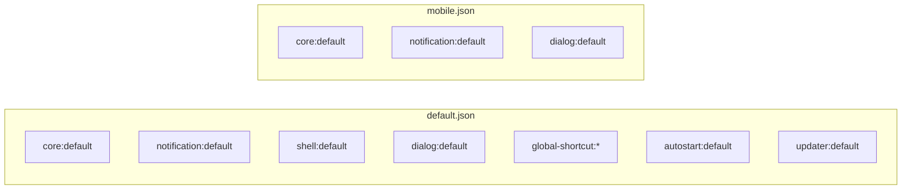

# Other — librefang-desktop-capabilities

# LibreFang Desktop — Capabilities

## Overview

The `librefang-desktop/capabilities/` directory contains Tauri v2 **capability configurations** — declarative JSON files that define which plugin permissions are granted to the application's webview windows, and on which platforms those permissions apply.

Tauri's capability system is a security boundary: the webview frontend can only invoke commands and access APIs that have been explicitly allowed by a capability file. These configurations are parsed at build time by `tauri-utils` and compiled into the application's runtime permission graph.

## Capability Files

```mermaid
graph LR
    subgraph Desktop ["default.json"]
        D_CORE["core:default"]
        D_NOTIF["notification:default"]
        D_SHELL["shell:default"]
        D_DIALOG["dialog:default"]
        D_GS["global-shortcut:*"]
        D_AUTO["autostart:default"]
        D_UPD["updater:default"]
    end

    subgraph Mobile ["mobile.json"]
        M_CORE["core:default"]
        M_NOTIF["notification:default"]
        M_DIALOG["dialog:default"]
    end
```

### `default.json` — Desktop Platforms

Grants the full set of plugin permissions for the three desktop operating systems.

| Field | Value |
|---|---|
| **Identifier** | `default` |
| **Target window** | `main` |
| **Platforms** | macOS, Windows, Linux |

**Granted permissions:**

| Permission | Purpose |
|---|---|
| `core:default` | Base Tauri runtime APIs (window management, event system, etc.) |
| `notification:default` | System notification delivery |
| `shell:default` | Spawning and communicating with child processes |
| `dialog:default` | Native file/message dialogs |
| `global-shortcut:allow-register` | Register global keyboard shortcuts |
| `global-shortcut:allow-unregister` | Unregister global keyboard shortcuts |
| `global-shortcut:allow-is-registered` | Query whether a shortcut is registered |
| `autostart:default` | Launch-on-boot / login item management |
| `updater:default` | In-app update checking and installation |

Note that `global-shortcut` permissions are specified granularly (individual `allow-*` entries) rather than via the `default` scope, because the default scope for that plugin may expose more operations than required. Only register, unregister, and the registration check are needed.

### `mobile.json` — Mobile Platforms

A strictly reduced permission set for iOS and Android builds. Desktop-only Tauri plugins (shell, global-shortcut, autostart, updater) are not bundled into mobile targets and therefore cannot be granted.

| Field | Value |
|---|---|
| **Identifier** | `mobile` |
| **Target window** | `main` |
| **Platforms** | iOS, Android |

**Granted permissions:**

| Permission | Purpose |
|---|---|
| `core:default` | Base Tauri runtime APIs |
| `notification:default` | Push / local notification delivery |
| `dialog:default` | Native alert and input dialogs |

## How Capabilities Are Resolved

At build time, Tauri reads every JSON file in the `capabilities/` directory. For each file:

1. **Schema validation** — The `$schema` field points to the Tauri JSON Schema hosted in the `tauri-utils` crate repository. Editors that support JSON Schema will provide autocomplete and validation against this schema.
2. **Platform filtering** — Only the listed `platforms` receive the permissions. The `default.json` permissions have zero effect on iOS/Android builds, and `mobile.json` permissions have zero effect on desktop builds.
3. **Window scoping** — The `windows` array binds permissions to specific webview windows by label. Both files target `"main"`, which is the primary application window created by the Tauri config. If additional windows are added later, they will not inherit these permissions unless explicitly listed.
4. **Permission resolution** — Each `"permission"` string maps to a permission identifier exported by a Tauri plugin. Plugins prefixed with `allow-` grant a specific command; `default` scopes grant the plugin's recommended baseline set.

## Adding a New Permission

When integrating an additional Tauri plugin:

1. **Determine scope** — Does the plugin need to work on mobile, desktop, or both?
2. **Edit the appropriate file(s)** — Add the permission identifier to `default.json`, `mobile.json`, or both.
3. **Prefer explicit allow-lists** — For plugins where only specific commands are needed (as done with `global-shortcut`), list individual `allow-*` permissions rather than the blanket `default` scope.
4. **Validate** — Rebuild the app. Tauri will emit a compile-time error if a referenced permission does not exist in any bundled plugin.

## Relationship to the Rest of the Codebase

These capability files sit alongside the main Tauri configuration (`tauri.conf.json`) and the plugin initialization code in the Rust backend. They do not call into application code and no application code calls into them — they are consumed entirely by the Tauri build pipeline.

The frontend JavaScript/TypeScript code that invokes Tauri APIs (e.g., `@tauri-apps/plugin-shell`, `@tauri-apps/plugin-global-shortcut`) will silently fail or throw permission errors at runtime if the corresponding capability entries are missing or misconfigured.