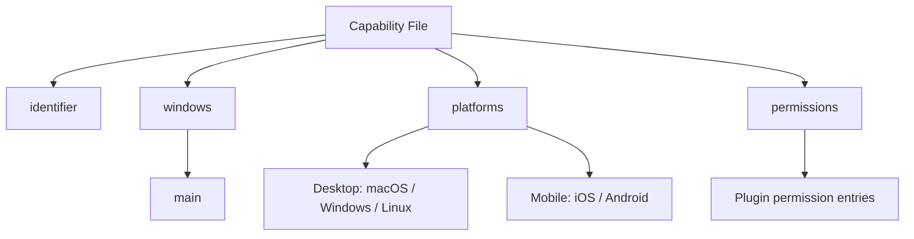

# Other — librefang-desktop-capabilities

# LibreFang Desktop Capabilities

This module defines Tauri capability configurations that control which plugins and APIs are available to the application's frontend. It consists of two JSON configuration files — one for desktop platforms and one for mobile — that declaratively grant permissions to the Tauri runtime.

## Purpose

Tauri uses a capability-based security model. Each capability file specifies:

- Which windows the permissions apply to
- Which platforms the capability is active on
- Which plugin permissions are granted

This module centralizes those permission declarations for the LibreFang desktop application.

## Files

### `default.json` — Desktop Permissions

Applies to **macOS**, **Windows**, and **Linux**. Grants the following permissions:

| Permission | Purpose |
|---|---|
| `core:default` | Standard Tauri core APIs |
| `notification:default` | System notification support |
| `shell:default` | Shell command execution |
| `dialog:default` | Native file/message dialogs |
| `global-shortcut:allow-register` | Register global keyboard shortcuts |
| `global-shortcut:allow-unregister` | Unregister global keyboard shortcuts |
| `global-shortcut:allow-is-registered` | Check if a shortcut is registered |
| `autostart:default` | Launch at system startup |
| `updater:default` | In-app update checks |

### `mobile.json` — Mobile Permissions

Applies to **iOS** and **Android**. Includes only the subset of permissions available on mobile platforms:

| Permission | Purpose |
|---|---|
| `core:default` | Standard Tauri core APIs |
| `notification:default` | System notification support |
| `dialog:default` | Native file/message dialogs |

Desktop-only plugins (`shell`, `global-shortcut`, `autostart`, `updater`) are intentionally excluded because they are not bundled for mobile targets.

## Structure

Both capability files share the same schema:

```mermaid
graph TD
    A[Capability File] --> B[identifier]
    A --> C[windows]
    A --> D[platforms]
    A --> E[permissions]
    C --> C1["main"]
    D --> D1["Desktop: macOS / Windows / Linux"]
    D --> D2["Mobile: iOS / Android"]
    E --> E1[Plugin permission entries]
```

The `windows: ["main"]` field means these capabilities apply only to the main application window. The `platforms` array determines which OS targets activate the capability — Tauri selects the matching file at build time.

## How It Connects to the Codebase

- **Tauri runtime** reads these files at build time to generate the security policy embedded in the compiled binary.
- **Frontend code** can invoke the permitted APIs (e.g., `dialog.open()`, `notification.send()`) only because these capabilities explicitly allow it. Any API call not covered by a capability will be rejected at runtime.
- **Plugin registration** in the Tauri builder (Rust side) must include the corresponding plugins — capabilities alone authorize but do not load plugins.

## Modifying Capabilities

**To add a new permission:**

1. Identify the plugin and the specific permission identifier (e.g., `fs:allow-read-text-file`).
2. Add it to the `permissions` array in the relevant capability file (`default.json` for desktop, `mobile.json` for mobile).
3. Ensure the plugin is registered in the Tauri builder on the Rust side.

**To add a new platform-specific capability:**

Create a new JSON file with a unique `identifier` and the appropriate `platforms` array. Tauri merges all applicable capabilities for the current build target automatically.