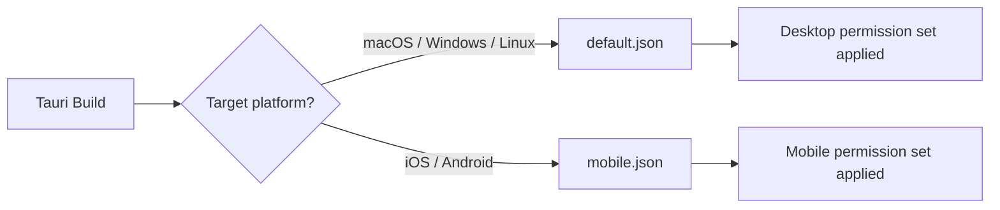

# Other — librefang-desktop-capabilities

# LibreFang Desktop — Capabilities

## Overview

This module defines the **Tauri capability sets** that govern which system APIs the LibreFang desktop application is allowed to invoke. Tauri uses a capability-based security model: even if a plugin is compiled into the app, its IPC commands are blocked at runtime unless explicitly permitted in a capability file.

Two capability sets ship with LibreFang:

| File | Target Platforms | Purpose |
|---|---|---|
| `default.json` | macOS, Windows, Linux | Full desktop permission set |
| `mobile.json` | iOS, Android | Reduced set excluding desktop-only plugins |

## How Tauri Capabilities Work

Capability files are **build-time configuration** consumed by the Tauri bundler. Each file declares:

- **`identifier`** — a unique name referenced by Tauri's permission resolver.
- **`windows`** — which app windows this capability applies to. Both files target `"main"`.
- **`platforms`** — OS targets. The bundler selects the matching capability at build time.
- **`permissions`** — an array of granted permission tokens.

At runtime, when the frontend invokes a Tauri command (e.g., `registerGlobalShortcut`), the framework checks whether the current platform's capability set includes a matching permission token. If not found, the call is rejected.

No code in this module is executable — these are static JSON manifests consumed entirely by the Tauri build pipeline.

## Permission Reference

### `default.json` — Desktop

| Permission | Plugin | Grants |
|---|---|---|
| `core:default` | Tauri Core | Standard core IPC (event system, window management, etc.) |
| `notification:default` | Notification | Sending desktop notifications |
| `shell:default` | Shell | Opening URLs/files in external applications and executing shell commands |
| `dialog:default` | Dialog | Native file open/save dialogs, message boxes |
| `global-shortcut:allow-register` | Global Shortcut | Registering system-wide keyboard shortcuts |
| `global-shortcut:allow-unregister` | Global Shortcut | Removing registered shortcuts |
| `global-shortcut:allow-is-registered` | Global Shortcut | Querying whether a shortcut is currently registered |
| `autostart:default` | Autostart | Launching the app at login/boot |
| `updater:default` | Updater | Checking for and applying app updates |

The global-shortcut permissions are enumerated individually (`allow-register`, `allow-unregister`, `allow-is-registered`) rather than using the `global-shortcut:default` catch-all, giving precise control over which operations the frontend can perform.

### `mobile.json` — iOS / Android

Only three plugins are permitted:

- `core:default`
- `notification:default`
- `dialog:default`

Shell, global-shortcut, autostart, and updater plugins are **not bundled on mobile targets**, so permissions for them are omitted. Including permissions for absent plugins would cause a build error.

## Platform Selection Logic


```mermaid
graph LR
    A[Tauri Build] --> B{Target platform?}
    B -->|macOS / Windows / Linux| C[default.json]
    B -->|iOS / Android| D[mobile.json]
    C --> E[Desktop permission set applied]
    D --> F[Mobile permission set applied]
```

The bundler matches based on the `platforms` array. Because the two files have disjoint platform lists (`["macOS", "windows", "linux"]` vs `["iOS", "android"]`), exactly one capability set is active for any given build.

## Adding a New Permission

When integrating an additional Tauri plugin:

1. **Add the dependency** to `Cargo.toml` (Rust side) and `package.json` or the JS API (frontend side).
2. **Determine platform availability** — if the plugin works on all platforms, add to both files. If desktop-only, add only to `default.json`.
3. **Choose granularity** — use `plugin-name:default` for full access, or specific `plugin-name:allow-<command>` tokens for least-privilege.
4. **Verify the schema** — each file references the Tauri JSON Schema via `$schema`. Validate the file after edits to catch typos in permission tokens.

Example — adding the clipboard plugin to desktop only:

```jsonc
// In default.json, append to the "permissions" array:
"clipboard-manager:allow-read",
"clipboard-manager:allow-write"
```

## Adding a New Capability File

To introduce a separate window (e.g., an "about" or "settings" window) with its own permissions:

1. Create a new JSON file in this directory (e.g., `settings.json`).
2. Set `identifier` to a unique value (e.g., `"settings-window"`).
3. Set `windows` to match the window label (e.g., `["settings"]`).
4. Set `platforms` to the applicable targets.
5. List only the permissions that window needs.
6. The `$schema` field should point to the same Tauri schema URL used by the existing files.

## Relationship to the Rest of the Codebase

This module has **no direct code dependencies** — no imports, no function calls, no runtime execution. Its consumers are:

- **The Tauri CLI / bundler**, which reads these files during `tauri build` or `tauri dev` to generate the permission graph compiled into the binary.
- **Frontend code**, which must only call Tauri APIs that are permitted here. Attempting to call an unpermitted command will fail at the IPC boundary with a permission-denied error.
- **Plugin registration in `Cargo.toml`**, which must include every plugin referenced by these permission tokens for the current target platform.

If a permission is listed here but the corresponding plugin is not added as a Cargo dependency, the build will fail with an unresolved permission error.