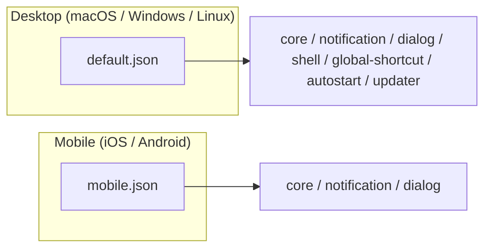

# Other — librefang-desktop-capabilities

# LibreFang Desktop — Capabilities

## Purpose

This module defines the **Tauri capability configurations** that control which plugins and system APIs the LibreFang app is permitted to use. Tauri's capability system is a security layer: the app cannot invoke any plugin command unless that command is explicitly listed in a capability file that matches the current platform and window.

There are two capability files, each targeting a different set of platforms with a tailored permission set.

## File Reference

### `default.json` — Desktop Platforms

| Field | Value |
|---|---|
| Identifier | `default` |
| Target windows | `main` |
| Target platforms | macOS, Windows, Linux |

**Granted permissions:**

| Permission | Plugin | What it enables |
|---|---|---|
| `core:default` | `core` | Standard Tauri runtime APIs (window management, event system, etc.) |
| `notification:default` | `notification` | Sending native OS notifications |
| `shell:default` | `shell` | Spawning child processes and executing shell commands |
| `dialog:default` | `dialog` | Native file open/save dialogs, message boxes |
| `global-shortcut:allow-register` | `global-shortcut` | Registering global keyboard shortcuts |
| `global-shortcut:allow-unregister` | `global-shortcut` | Removing previously registered shortcuts |
| `global-shortcut:allow-is-registered` | `global-shortcut` | Querying whether a shortcut is currently registered |
| `autostart:default` | `autostart` | Launching the app automatically at login/boot |
| `updater:default` | `updater` | Checking for and applying app updates |

Note that `global-shortcut` permissions are granted at the individual-command level rather than using the `:default` bundle, giving fine-grained control over which shortcut operations are allowed.

### `mobile.json` — Mobile Platforms

| Field | Value |
|---|---|
| Identifier | `mobile` |
| Target windows | `main` |
| Target platforms | iOS, Android |

**Granted permissions:**

| Permission | Plugin |
|---|---|
| `core:default` | `core` |
| `notification:default` | `notification` |
| `dialog:default` | `dialog` |

This is a strict subset of the desktop capability. Several plugins are excluded because they have no meaningful implementation on mobile:

- **`shell`** — Mobile platforms restrict arbitrary process spawning.
- **`global-shortcut`** — Mobile OSes don't expose system-wide hotkey APIs to apps.
- **`autostart`** — Not applicable on iOS/Android.
- **`updater`** — Mobile apps are distributed and updated through app stores, not self-updated.

## Architecture

```mermaid
graph LR
    subgraph Desktop ["Desktop (macOS / Windows / Linux)"]
        D[default.json]
    end
    subgraph Mobile ["Mobile (iOS / Android)"]
        M[mobile.json]
    end
    D --> P[core / notification / dialog / shell / global-shortcut / autostart / updater]
    M --> Q[core / notification / dialog]
```

Tauri loads the capability file whose `platforms` array matches the current OS at build time. Only one capability set is active for a given build target — the files are mutually exclusive by platform.

## How to Modify

**Adding a new permission** — Add the permission identifier string to the `permissions` array in the appropriate file(s). Use individual command permissions (e.g., `plugin:allow-command`) for fine-grained control, or `plugin:default` to grant the plugin's recommended default set.

**Adding a new plugin** — If the plugin is desktop-only, add its permissions only to `default.json`. If it works cross-platform, add it to both files. Update the `$schema` field if the schema URL changes.

**Targeting a new window** — Add the window label to the `windows` array in the relevant capability file. Currently only the `main` window is configured.