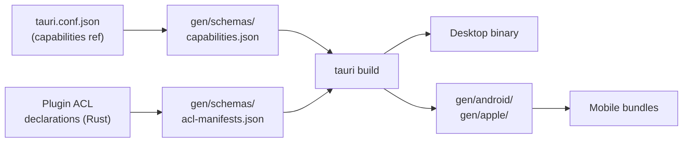

# Other — librefang-desktop-gen

# librefang-desktop/gen — Tauri Generated Build Artifacts

## Purpose

The `gen/` directory holds **auto-generated Tauri build artifacts** produced by the Tauri CLI. It is not hand-written source code — it is populated and regenerated by tooling during build initialization and schema resolution. Do not edit these files directly unless you are extending Tauri plugin permissions via the standard capability workflow.

## Directory Layout

```
gen/
├── android/              # Android project scaffold (populated by cargo tauri android init)
│   └── README.md
├── apple/                # Apple (iOS/macOS) project scaffold (populated by cargo tauri ios init)
│   └── README.md
└── schemas/
    ├── acl-manifests.json    # All plugin ACL permission definitions
    ├── capabilities.json     # Active capability sets for this app
    └── desktop-schema.json   # JSON Schema for capability file validation
```

## Platform Scaffolds

### `android/`

Empty by default. Populate it by running from `crates/librefang-desktop/`:

```bash
cargo tauri android init
```

This generates the full Gradle-based Android wrapper project that Tauri uses to produce an APK/AAB.

### `apple/`

Empty by default. Populate it by running from `crates/librefang-desktop/`:

```bash
cargo tauri ios init
```

macOS only. Generates the Xcode project wrapper for iOS builds.

Both directories are typically `.gitignore`d or committed after initial generation depending on project policy. They contain no application logic — only platform glue.

## Schema Files

### `schemas/acl-manifests.json`

A single JSON object containing the complete ACL manifest for every Tauri plugin used by LibreFang. Each top-level key is a plugin identifier, and its value declares the plugin's **default permissions**, **individual permissions**, and **permission sets**.

**Plugins present in this manifest:**

| Plugin | Purpose |
|---|---|
| `autostart` | Launch-on-boot control |
| `core` | Umbrella for all core sub-plugins |
| `core:app` | App metadata, listeners, theming |
| `core:event` | IPC event emit/listen |
| `core:image` | Image creation and manipulation |
| `core:menu` | Application and window menus |
| `core:path` | Path resolution and manipulation |
| `core:resources` | Resource handle cleanup |
| `core:tray` | System tray icons and menus |
| `core:webview` | Webview lifecycle, zoom, devtools |
| `core:window` | Window state, position, decorations |
| `dialog` | Native file/message dialogs |
| `global-shortcut` | System-wide keyboard shortcuts |
| `notification` | OS notification dispatch |
| `shell` | Process spawning and URL opening |
| `updater` | Self-update check/download/install |

Each permission entry follows a consistent shape:

```json
{
  "identifier": "allow-open",
  "description": "Enables the open command without any pre-configured scope.",
  "commands": {
    "allow": ["open"],
    "deny": []
  }
}
```

`deny-*` variants mirror their `allow-*` counterparts but invert the command lists. This is how Tauri's capability system does fine-grained IPC allowlisting.

### `schemas/capabilities.json`

Defines the **actual capabilities granted to windows** in the LibreFang app. Two capability sets exist:

#### `default` — Desktop (macOS / Windows / Linux)

```json
{
  "identifier": "default",
  "windows": ["main"],
  "local": true,
  "platforms": ["macOS", "windows", "linux"],
  "permissions": [
    "core:default",
    "notification:default",
    "shell:default",
    "dialog:default",
    "global-shortcut:allow-register",
    "global-shortcut:allow-unregister",
    "global-shortcut:allow-is-registered",
    "autostart:default",
    "updater:default"
  ]
}
```

Note that `global-shortcut` does **not** use its `default` permission set (which is empty by design — the plugin authors consider shortcuts inherently dangerous). Instead, the specific commands `allow-register`, `allow-unregister`, and `allow-is-registered` are individually granted. `allow-register-all` and `allow-unregister-all` are deliberately excluded.

#### `mobile` — iOS / Android

```json
{
  "identifier": "mobile",
  "windows": ["main"],
  "local": true,
  "platforms": ["iOS", "android"],
  "permissions": [
    "core:default",
    "notification:default",
    "dialog:default"
  ]
}
```

Desktop-only plugins (`shell`, `global-shortcut`, `autostart`, `updater`) are omitted entirely. These plugins are not bundled into mobile builds, so referencing them would cause build failures.

### `schemas/desktop-schema.json`

A full JSON Schema (Draft-07) for the Tauri capability file format. Used by tooling — including `tauri build` and IDE autocomplete — to validate capability declarations. Defines the `Capability`, `CapabilityRemote`, `PermissionEntry`, and `Identifier` types along with the shell scope schema (`ShellScopeEntry`, `ShellScopeEntryAllowedArg`, `ShellScopeEntryAllowedArgs`).

## How It Connects to the Rest of the Codebase



1. **Build time**: `cargo tauri build` (or `dev`) reads `tauri.conf.json`, resolves which capability files to load, cross-references them against `acl-manifests.json`, and validates the result against `desktop-schema.json`.
2. **Permission enforcement**: At runtime, Tauri's IPC layer checks every command invocation against the resolved capability set. If the frontend calls a command not listed in the active capability's permissions, the call is rejected.
3. **Platform filtering**: The `platforms` field in each capability ensures that mobile builds never attempt to resolve desktop-only plugin permissions.

## Working With This Directory

### Regenerating schemas

After changing plugin dependencies in `Cargo.toml` or modifying `tauri.conf.json`:

```bash
cargo tauri build
# or just
cargo tauri dev
```

The CLI regenerates `schemas/` automatically.

### Adding a new permission

1. Edit the capability files referenced by `tauri.conf.json` (typically in `src-tauri/capabilities/`).
2. Add the desired permission identifier (e.g., `"fs:allow-read"`).
3. Run `cargo tauri dev` — the schema files in `gen/` will update to reflect the change.

### Adding mobile platform support

```bash
cd crates/librefang-desktop
cargo tauri android init   # generates gen/android/
cargo tauri ios init       # generates gen/apple/ (macOS only)
```

These commands are idempotent — safe to re-run if the directories already exist.