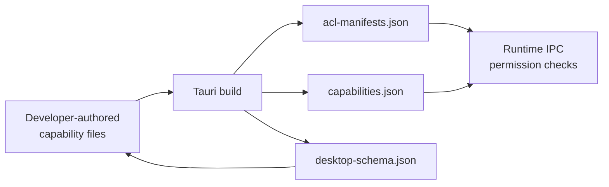

# Other — librefang-desktop-gen

# librefang-desktop-gen — Tauri Security & Permissions Layer

## Overview

`librefang-desktop/gen` contains auto-generated Tauri security artifacts that define the **capability-based access control** (CBAC) boundary between the LibreFang desktop frontend (webview) and the native backend. These files are produced by the Tauri build system and should not be hand-edited — they are regenerated each build from the permissions declared in `src-tauri/capabilities/` and the plugin configurations in `Cargo.toml` / `tauri.conf.json`.

## File Inventory

| File | Purpose |
|------|---------|
| `schemas/acl-manifests.json` | Exhaustive registry of every permission, permission set, and global scope schema for all loaded plugins |
| `schemas/capabilities.json` | Resolved capability objects mapping windows to their granted permissions at build time |
| `schemas/desktop-schema.json` | JSON Schema (draft-07) that validates capability files authored by developers |

---

## Architecture



At build time, Tauri reads every plugin's permission manifest, the developer's capability files, and produces the three schema files in `gen/schemas/`. At runtime, the Tauri IPC layer consults the resolved capabilities to allow or deny each frontend-to-backend command invocation.

---

## Capability Resolution — `capabilities.json`

The resolved default capability grants the following to the `"main"` window:

```json
{
  "identifier": "default",
  "local": true,
  "windows": ["main"],
  "permissions": [
    "core:default",
    "notification:default",
    "shell:default",
    "dialog:default",
    "global-shortcut:allow-register",
    "global-shortcut:allow-unregister",
    "global-shortcut:allow-is-registered",
    "autostart:default",
    "updater:default"
  ]
}
```

Key points:

- **`local: true`** — Only local (app-bundled) URLs may exercise these permissions. No remote origin gets access.
- **`windows: ["main"]`** — Only the window labelled `main` receives these grants. Any secondary window has zero IPC access unless additional capabilities are defined.
- **`global-shortcut`** is granted on a per-command basis rather than via its `default` (which is intentionally empty) — only `register`, `unregister`, and `is-registered` are exposed.

---

## Permission Plugin Reference — `acl-manifests.json`

Every top-level key is a plugin namespace. Each namespace declares:

1. **`default_permission`** — The permission set activated when you write `"plugin-name:default"` in a capability.
2. **`permissions`** — Individual `allow-*` / `deny-*` entries, each mapping to one Tauri IPC command.
3. **`global_scope_schema`** (optional) — JSON Schema for scoped data that constrains the command at runtime.

### Plugin Breakdown

#### `core` (aggregate)
Bundles all core sub-plugin defaults: `path`, `event`, `window`, `webview`, `app`, `image`, `resources`, `menu`, `tray`.

#### `core:app`
App metadata queries (`version`, `name`, `tauri-version`, `identifier`, `bundle-type`) plus listener registration/removal. The default explicitly **excludes** destructive operations like `app_hide`, `app_show`, `remove_data_store`, `set_app_theme`, and `set_dock_visibility`.

#### `core:event`
Full event bus access: `listen`, `unlisten`, `emit`, `emit_to`. No restrictions in the default set.

#### `core:window`
Read-only window queries (position, size, state flags like `is_fullscreen`, `is_maximized`, etc.) plus `internal_toggle_maximize`. Mutating commands (`create`, `destroy`, `set_size`, `set_position`, etc.) require explicit individual permission grants.

#### `core:webview`
Query webview list, position, size, and toggle devtools. Creating webviews, zooming, or clearing browsing data requires explicit opt-in.

#### `core:path`, `core:image`, `core:resources`, `core:menu`, `core:tray`
Standard utility plugins with full command access in their defaults.

#### `autostart`
Three commands — `enable`, `disable`, `is_enabled` — all included in the default. Controls whether the app launches at OS login.

#### `dialog`
Five dialog types — `ask`, `confirm`, `message`, `save`, `open` — all allowed by default.

#### `global-shortcut`
Deliberately ships an **empty default** (no permissions). The app must explicitly grant individual commands. In LibreFang's case, `allow-register`, `allow-unregister`, and `allow-is-registered` are granted in the default capability.

#### `notification`
Full notification pipeline: permission checks, channel management (create/delete/list), sending, batching, and cancelling. All 16 commands are included in the default.

#### `shell`
Default allows only `open` (for `http(s)://`, `tel:`, `mailto:` links). This is the only plugin with a non-null `global_scope_schema`, which defines `ShellScopeEntry` objects for whitelisting specific commands or sidecars with argument validation.

**Shell scope entries** support two forms:

- **System command** — `{ "name": "...", "cmd": "...", "args": ... }` where `cmd` can start with directory variables like `$HOME`, `$CONFIG`, `$APPDATA`, etc.
- **Sidecar** — `{ "name": "...", "sidecar": true, "args": ... }` for bundled sidecar binaries.

Arguments can be a boolean (`true` = allow all, `false` = allow none) or an array of `ShellScopeEntryAllowedArg` objects that either pass a literal string or define a regex `validator` for dynamic input.

#### `updater`
Full update lifecycle: `check`, `download`, `install`, `download_and_install`.

---

## Capability File Schema — `desktop-schema.json`

This is the JSON Schema that validates developer-authored capability files under `src-tauri/capabilities/`. A valid file can be:

- A single `Capability` object
- An array of `Capability` objects
- An object with a `capabilities` array

### Capability Object Structure

| Field | Required | Description |
|-------|----------|-------------|
| `identifier` | **yes** | Unique string ID (e.g. `"main-user-files-write"`) |
| `permissions` | **yes** | Array of `PermissionEntry` items, unique |
| `description` | no | Human-readable intent |
| `windows` | no | Glob patterns matching window labels |
| `webviews` | no | Glob patterns matching webview labels (finer-grained than `windows`) |
| `local` | no | Whether local app URLs can use this capability (default `true`) |
| `remote` | no | `CapabilityRemote` with `urls` array using URLPattern syntax |
| `platforms` | no | Restrict to specific OS targets (e.g. `["macOS", "windows"]`) |

### PermissionEntry

Each entry is either:

- A plain identifier string (e.g. `"core:default"`, `"shell:allow-open"`)
- An object with `identifier` plus optional `allow` / `deny` arrays for scoped permissions (used exclusively with `shell:*` permissions in this app)

---

## Modifying Permissions

To change what the frontend can access:

1. Edit or create a capability file in `src-tauri/capabilities/`.
2. Reference permission identifiers using the `{plugin}:{permission}` format.
3. Rebuild — Tauri regenerates `gen/schemas/` automatically.
4. Never edit files in `gen/` directly; changes will be overwritten on the next build.

### Adding a new capability example

```json
{
  "identifier": "main-shell-scripts",
  "description": "Allow the main window to run specific shell commands",
  "windows": ["main"],
  "local": true,
  "permissions": [
    {
      "identifier": "shell:allow-execute",
      "allow": [
        {
          "name": "ping",
          "cmd": "ping",
          "args": [
            { "validator": "\\d{1,3}\\.\\d{1,3}\\.\\d{1,3}\\.\\d{1,3}" }
          ]
        }
      ]
    }
  ]
}
```

---

## Security Considerations

- The default capability is intentionally **local-only** — no remote URL can invoke IPC commands.
- `global-shortcut` registration requires explicit opt-in because keyboard shortcuts can conflict with OS-level bindings.
- Shell `execute` and `spawn` are **not** included in `shell:default`. They must be granted with explicit scope entries that constrain the command and validate arguments.
- Window/webview creation and destruction commands are not in any default set and must be individually granted if needed.
- The `deny` arrays in permission entries take precedence over `allow` during runtime validation.