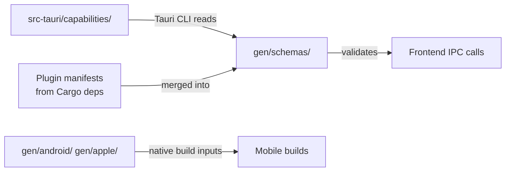

# Other — librefang-desktop-gen

# librefang-desktop-gen

Auto-generated Tauri v2 build artifacts and security configuration for the LibreFang desktop application. This directory is populated and consumed by the Tauri CLI and build toolchain — it is **not** hand-authored application code.

## Directory Layout

```
gen/
├── android/              # Android project scaffold (populated by `cargo tauri android init`)
│   └── README.md
├── apple/                # iOS/macOS project scaffold (populated by `cargo tauri ios init`)
│   └── README.md
└── schemas/
    ├── acl-manifests.json      # All available plugin permissions (full catalogue)
    ├── capabilities.json       # Permissions actually granted to this app
    └── desktop-schema.json     # JSON Schema for capability file validation
```

## Platform Scaffolds

The `android/` and `apple/` directories are placeholders until the corresponding Tauri mobile init commands are run from `crates/librefang-desktop/`:

| Platform | Command | Requirement |
|----------|---------|-------------|
| Android | `cargo tauri android init` | Android SDK/NDK |
| Apple | `cargo tauri ios init` | macOS with Xcode |

These directories will be populated with full native project structures (Gradle builds, Xcode projects, etc.) upon initialization. They are excluded from version control by default.

## Security Configuration

The `schemas/` directory defines the Tauri IPC security model — what the frontend webview is allowed to call on the native backend.

### Capabilities (`capabilities.json`)

The app declares a single capability set named `default`, scoped to the `main` window with local access only:

```json
{
  "identifier": "default",
  "local": true,
  "windows": ["main"],
  "permissions": [
    "core:default",
    "notification:default",
    "shell:default",
    "dialog:default",
    "global-shortcut:allow-register",
    "global-shortcut:allow-unregister",
    "global-shortcut:allow-is-registered",
    "autostart:default",
    "updater:default"
  ]
}
```

### Granted Permission Breakdown

| Permission Set | What It Enables | Scope |
|---|---|---|
| `core:default` | Path resolution, events, window management, webview control, app metadata, images, resources, menus, system tray | Read-only queries + standard window/webview manipulation |
| `notification:default` | Full notification lifecycle: permission checks, sending, channels, listeners, batch, cancel | All notification commands |
| `shell:default` | `open` for `http(s)://`, `tel:`, `mailto:` URLs | No arbitrary command execution |
| `dialog:default` | Message, save, and open file dialogs | All dialog types |
| `global-shortcut:allow-*` | Register, unregister, and query global keyboard shortcuts | Individual allow-listed commands only — no `register-all` or `unregister-all` |
| `autostart:default` | Enable, disable, and query OS login-startup state | All autostart commands |
| `updater:default` | Check for updates, download, install, and combined download-and-install | Full update workflow |

### Notable Restrictions

- **No `shell:allow-execute` or `shell:allow-spawn`** — the frontend cannot run arbitrary processes. Only URL opening via the system handler is permitted.
- **No filesystem permissions** — no `fs:*` entries are present, so the webview cannot directly read or write files through Tauri's FS plugin. File access is mediated through `dialog:default` (user-driven file picker) and any custom Tauri commands exposed by the Rust backend.
- **Single-window scope** — the capability targets only the `"main"` window label. Any additional windows created at runtime will have no IPC access unless new capabilities are added.
- **No remote access** — `local: true` with no `remote` block means only locally-served app content can invoke these permissions.

### ACL Manifests (`acl-manifests.json`)

This file is the exhaustive catalogue of every permission available from every Tauri plugin bundled into the app. It is generated by the Tauri build system and used for:

1. **Build-time validation** — ensuring capability files reference valid permission identifiers.
2. **IDE autocompletion** — feeding the schema for developer tooling.
3. **Security auditing** — comparing what is *available* against what is *granted*.

The manifest covers these plugin domains:

- `autostart` — 6 permissions
- `core` (umbrella) — 9 sub-plugin defaults
- `core:app` — 28 permissions
- `core:event` — 8 permissions
- `core:image` — 10 permissions
- `core:menu` — 44 permissions
- `core:path` — 16 permissions
- `core:resources` — 2 permissions
- `core:tray` — 22 permissions
- `core:webview` — 38 permissions
- `core:window` — 106 permissions
- `dialog` — 10 permissions
- `global-shortcut` — 10 permissions
- `notification` — 34 permissions
- `shell` — 10 permissions + global scope schema
- `updater` — 8 permissions

The `shell` plugin is the only one with a `global_scope_schema`, defining the `ShellScopeEntry` structure that controls which commands and sidecars can be invoked, with argument validation via regex.

### Desktop Schema (`desktop-schema.json`)

A JSON Schema (Draft-07) document describing the valid structure of Tauri capability files. It validates:

- **`Capability`** objects with `identifier`, `permissions`, optional `windows`/`webviews`/`platforms`/`remote` fields
- **`PermissionEntry`** — either a plain identifier string or an object with `identifier` + scoped `allow`/`deny` arrays
- **`CapabilityRemote`** — URL pattern allowlists for remote web content

The schema embeds conditional logic: when a permission identifier is a `shell:*` permission, the `allow`/`deny` arrays are validated against the `ShellScopeEntry` structure.

## Modifying Capabilities

To change what the frontend can access:

1. Edit the capability source file in `src-tauri/capabilities/` (the Tauri source, not this generated output).
2. Run `cargo tauri build` or `cargo tauri dev` — the CLI regenerates `gen/schemas/` from the source capabilities and plugin manifests.
3. Never edit files in `gen/` directly — they are overwritten on every build.

## Relationship to the Rest of the Codebase



- The Rust backend in `librefang-desktop` defines Tauri commands that are exempt from this ACL system (they use their own command-level permissions or are unrestricted).
- The frontend (webview) is constrained entirely by the capability set defined here.
- Platform scaffolds in `android/` and `apple/` feed into CI/CD mobile builds but are irrelevant for desktop (Windows/macOS/Linux) targets.