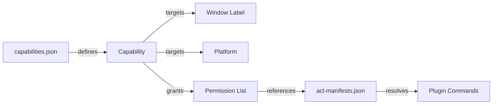

# Other — librefang-desktop-gen

# librefang-desktop-gen

Auto-generated Tauri build output containing platform scaffolding and security permission schemas for the LibreFang desktop application. This directory is managed by the Tauri CLI and should not be hand-edited unless you are intentionally modifying the capability/permission configuration.

## Directory Structure

```
gen/
├── android/              # Android project scaffold (populated by `cargo tauri android init`)
│   └── README.md
├── apple/                # Apple (iOS/macOS) project scaffold (populated by `cargo tauri ios init`)
│   └── README.md
└── schemas/
    ├── acl-manifests.json    # Full catalog of every plugin permission
    ├── capabilities.json     # Active capability grants for this app
    └── desktop-schema.json   # JSON Schema for validating capability files
```

## Platform Scaffolding

### Android

Populated by running `cargo tauri android init` from `crates/librefang-desktop/`. Generates the Gradle-based Android project wrapping the Tauri webview.

### Apple

Populated by running `cargo tauri ios init` from `crates/librefang-desktop/` (macOS only). Generates the Xcode project for iOS builds.

Both directories start as stub README files and are filled in by the Tauri CLI during platform initialization.

## Security Model

LibreFang uses Tauri's capability-based security system. The webview frontend has zero access to native APIs unless explicitly granted through a capability. This is enforced at build time via the schemas in this directory.

### How Capabilities Work



Each capability specifies:
- **`identifier`** — unique name for the capability
- **`windows`** — which app windows receive these permissions (glob patterns supported)
- **`platforms`** — which OS targets the capability applies to
- **`permissions`** — list of granted permission identifiers
- **`local`** — whether locally-served content can use these permissions (default `true`)

### Active Capabilities

The app defines two capabilities in `capabilities.json`:

#### `default` — Desktop Platforms

| Field | Value |
|-------|-------|
| Windows | `main` |
| Platforms | macOS, Windows, Linux |

Granted permissions:
- `core:default` — all standard Tauri core plugins (path, event, window, webview, app, image, resources, menu, tray)
- `notification:default` — full notification API
- `shell:default` — `shell:allow-open` (opens `http(s)://`, `tel:`, `mailto:` links)
- `dialog:default` — message, save, and open dialogs
- `global-shortcut:allow-register`
- `global-shortcut:allow-unregister`
- `global-shortcut:allow-is-registered`
- `autostart:default` — enable, disable, and query auto-start on boot
- `updater:default` — check, download, and install updates

#### `mobile` — iOS / Android

| Field | Value |
|-------|-------|
| Windows | `main` |
| Platforms | iOS, Android |

Granted permissions:
- `core:default`
- `notification:default`
- `dialog:default`

Desktop-only plugins (shell, global-shortcut, autostart, updater) are excluded from mobile builds.

## Permission Reference

All available permissions are cataloged in `acl-manifests.json`. Below is a summary of the plugin groups used by LibreFang.

### Core Plugins (`core:default`)

The `core:default` permission set aggregates defaults for all core subsystems:

| Plugin | Default Grants |
|--------|---------------|
| `core:path` | resolve, resolve-directory, normalize, join, dirname, extname, basename, is-absolute |
| `core:event` | listen, unlisten, emit, emit-to |
| `core:window` | read-only window queries (position, size, state) + internal-toggle-maximize |
| `core:webview` | get-all-webviews, webview-position, webview-size, internal-toggle-devtools |
| `core:app` | version, name, tauri-version, identifier, bundle-type, listener registration |
| `core:image` | new, from-bytes, from-path, rgba, size |
| `core:resources` | close |
| `core:menu` | full menu CRUD and manipulation |
| `core:tray` | full tray icon management |

### Shell Plugin

`shell:default` only grants `allow-open`, which opens URLs in the system browser. The shell scope schema in `desktop-schema.json` supports configuring allowed commands with argument validation via regex, but LibreFang does not use this — only URL opening is permitted.

### Notification Plugin

`notification:default` grants the full notification API: permission checks, sending notifications, managing channels (Android), canceling, and batching.

### Dialog Plugin

`dialog:default` grants `allow-message`, `allow-save`, and `allow-open`.

### Global Shortcut Plugin

No default set. LibreFang explicitly grants three permissions:
- `global-shortcut:allow-register`
- `global-shortcut:allow-unregister`
- `global-shortcut:allow-is-registered`

### Autostart Plugin

`autostart:default` grants `allow-enable`, `allow-disable`, `allow-is-enabled` for managing boot-time auto-start.

### Updater Plugin

`updater:default` grants `allow-check`, `allow-download`, `allow-install`, `allow-download-and-install`.

## Modifying Permissions

To add or restrict a permission:

1. Edit `capabilities.json` to add or remove permission identifiers from the relevant capability.
2. The build will validate your changes against `desktop-schema.json` and `acl-manifests.json`.
3. Permission identifiers follow the format `plugin-name:permission-name` (e.g., `dialog:allow-open`). Core plugins use a two-segment prefix (e.g., `core:window:allow-center`).

Permissions can be simple strings or objects with scoped `allow`/`deny` arrays. The shell plugin is the primary example supporting scoped entries, where you can restrict which commands and arguments the webview can invoke.

## Regenerating

This directory is regenerated by the Tauri CLI during builds. To regenerate manually:

```bash
# From crates/librefang-desktop/
cargo tauri build          # regenerates schemas
cargo tauri android init   # populates android/
cargo tauri ios init       # populates apple/ (macOS only)
```

The `schemas/` directory is overwritten on each build based on the app's `tauri.conf.json` and any capability files in the source tree. The platform directories are only populated by the respective init commands.