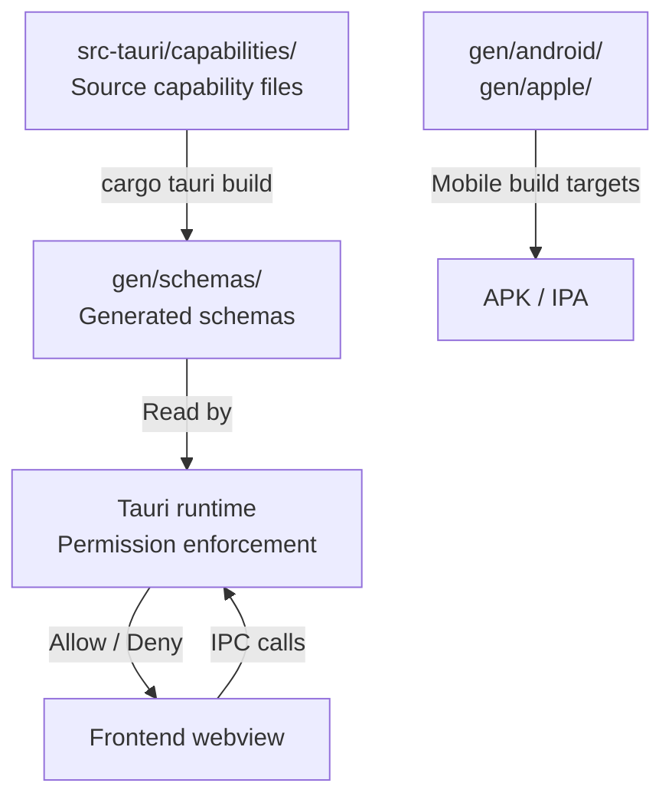

# Other — librefang-desktop-gen

# librefang-desktop/gen — Tauri Generated Scaffolding & Security Schemas

## Purpose

The `gen/` directory is automatically generated by Tauri v2's build tooling and contains two categories of output:

1. **Platform scaffolding** (`android/`, `apple/`) — native project stubs for mobile builds
2. **Security schemas** (`schemas/`) — ACL manifests, capability definitions, and JSON Schema files that govern what the frontend webview may access via the Tauri IPC layer

This directory is **not hand-edited** in normal development. It is regenerated by `cargo tauri build`, `cargo tauri dev`, or the platform-specific init commands. The source of truth for capabilities lives in the Tauri configuration, not here.

---

## Directory Structure

```
gen/
├── android/            # Android Studio project (populated by cargo tauri android init)
│   └── README.md
├── apple/              # Xcode project (populated by cargo tauri ios init, macOS only)
│   └── README.md
└── schemas/
    ├── acl-manifests.json      # All plugin permission definitions
    ├── capabilities.json       # Resolved capability sets for this app
    └── desktop-schema.json     # JSON Schema validating capability files
```

---

## Platform Scaffolding

### Android

Populated by running from `crates/librefang-desktop/`:

```bash
cargo tauri android init
```

This generates a standard Android Studio project under `gen/android/` that wraps the Tauri webview in an Android activity.

### Apple (iOS / macOS)

Populated by running from `crates/librefang-desktop/` on macOS:

```bash
cargo tauri ios init
```

Generates an Xcode project under `gen/apple/`.

Both directories start as stub README files and are populated only when mobile builds are initialized.

---

## Security Schemas

### `acl-manifests.json`

Declares every permission available from every Tauri plugin bundled into LibreFang. Each plugin entry contains:

| Field | Description |
|---|---|
| `default_permission` | The permission set applied when you reference `plugin-name:default` |
| `permissions` | Individual `allow-*` / `deny-*` identifiers mapping to specific IPC commands |
| `permission_sets` | Named groups of permissions (beyond the default) |
| `global_scope_schema` | JSON Schema for scoped permissions (e.g., shell command allowlists) |

**Plugins present in the manifest:**

| Plugin | Default allows | Key capability |
|---|---|---|
| `core` | Aggregates all core plugin defaults | Umbrella for path, event, window, webview, app, image, resources, menu, tray |
| `core:app` | App metadata, listeners, multi-window query | `version`, `name`, `tauri-version`, `identifier` |
| `core:event` | All event commands | `listen`, `unlisten`, `emit`, `emit_to` |
| `core:image` | All image commands | `new`, `from-bytes`, `from-path`, `rgba`, `size` |
| `core:menu` | All menu commands | Full CRUD for menu items, accelerators, app/window menus |
| `core:path` | All path commands | `resolve`, `join`, `dirname`, `basename`, etc. |
| `core:resources` | Resource close | `close` |
| `core:tray` | All tray commands | Create, remove, set icon/menu/tooltip/title/visible |
| `core:webview` | Webview introspection + devtools | `get_all_webviews`, position/size queries, `internal_toggle_devtools` |
| `core:window` | Window state queries | Position, size, fullscreen, minimized, maximized, focused, theme, monitors |
| `autostart` | Enable, disable, check auto-start on boot | `allow-enable`, `allow-disable`, `allow-is-enabled` |
| `dialog` | Message, save, open dialogs | `allow-message`, `allow-save`, `allow-open` |
| `global-shortcut` | None by default (opt-in) | `register`, `unregister`, `is_registered` |
| `notification` | Full notification lifecycle | Permission checks, notify, channels, batch, cancel |
| `shell` | `open` for `http(s)://`, `tel:`, `mailto:` | `execute`, `spawn`, `kill`, `stdin_write` available but not default |
| `updater` | Full update lifecycle | `check`, `download`, `install`, `download_and_install` |

### `capabilities.json`

Defines the actual capabilities granted to windows in LibreFang. Two capability sets are configured:

#### `default` — Desktop

```json
{
  "identifier": "default",
  "windows": ["main"],
  "permissions": [
    "core:default",
    "notification:default",
    "shell:default",
    "dialog:default",
    "global-shortcut:allow-register",
    "global-shortcut:allow-unregister",
    "global-shortcut:allow-is-registered",
    "autostart:default",
    "updater:default"
  ],
  "platforms": ["macOS", "windows", "linux"]
}
```

Granted to the `main` window on desktop platforms. Notable decisions:

- **`global-shortcut`** is granted individual permissions rather than a blanket default — only `register`, `unregister`, and `is_registered` are exposed.
- **`shell:default`** allows opening `http(s)://`, `tel:`, and `mailto:` links but does **not** expose `execute`, `spawn`, or `kill` to the frontend.
- **`updater:default`** gives the frontend full control over the update check/download/install cycle.

#### `mobile` — iOS / Android

```json
{
  "identifier": "mobile",
  "windows": ["main"],
  "permissions": [
    "core:default",
    "notification:default",
    "dialog:default"
  ],
  "platforms": ["iOS", "android"]
}
```

A reduced permission set — desktop-only plugins (`shell`, `global-shortcut`, `autostart`, `updater`) are omitted since they are not bundled on mobile targets.

### `desktop-schema.json`

A JSON Schema (Draft 7) document that validates capability files. It defines the structure for:

- **`Capability`** — identifier, description, windows/webviews matchers, permissions list, platform filter, remote URL config, local flag
- **`PermissionEntry`** — either a bare identifier string (`"core:default"`) or an object with `identifier` + scoped `allow`/`deny` arrays
- **`Identifier`** — exhaustive enum of every valid permission string across all bundled plugins
- **`ShellScopeEntry`** — defines allowed shell commands with argument validators (regex-based) and support for sidecar commands

This schema is used by Tauri's CLI and build system to validate capability files at build time.

---

## How to Modify Permissions

The `gen/schemas/` files are derived artifacts. To change what the frontend can access:

1. **Edit the source capability files** in `src-tauri/capabilities/` (or wherever the Tauri config references them)
2. **Rebuild** with `cargo tauri build` or `cargo tauri dev` — the schemas are regenerated automatically
3. **Verify** by checking `gen/schemas/capabilities.json` reflects your changes

Never edit `gen/` files directly — they will be overwritten on the next build.

---

## Relationship to the Rest of the Codebase



- The **source capability files** define intent
- The **generated schemas** are the resolved, machine-readable form
- The **Tauri runtime** reads the generated schemas at app startup to enforce the permission boundary between the frontend and the native backend
- The **platform directories** are only relevant when building for mobile