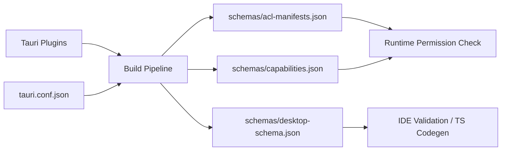

# Other — librefang-desktop-gen

# librefang-desktop-gen — Tauri Generated Schemas

Auto-generated security and capability schemas for the LibreFang desktop application. This directory is produced by Tauri's build pipeline and should not be manually edited.

## Purpose

Tauri v2 enforces a capability-based security model. Every IPC command the frontend can invoke must be explicitly permitted through a permission system. During compilation, Tauri introspects all registered plugins and application commands, then writes three schema files into this directory:

| File | Role |
|---|---|
| `schemas/acl-manifests.json` | Full catalog of every permission every plugin exposes — identifiers, descriptions, and the allow/deny command lists. |
| `schemas/capabilities.json` | The resolved set of capabilities actually granted to windows at runtime. |
| `schemas/desktop-schema.json` | JSON Schema (draft-07) that validates capability definition files. Used by IDEs and tooling. |

These files are consumed by the Tauri runtime at startup and by the TypeScript/JavaScript bindings generator.

## Architecture



## acl-manifests.json — Permission Catalog

Each top-level key is a plugin namespace. Within each namespace there are two important structures:

### Default Permission Sets

A `default_permission` defines the bundle of permissions granted when you reference `plugin-name:default` in a capability. For example, `core:default` expands to the defaults of nine sub-plugins:

```
core:path:default, core:event:default, core:window:default,
core:webview:default, core:app:default, core:image:default,
core:resources:default, core:menu:default, core:tray:default
```

### Individual Permissions

Each permission entry follows an `allow-*/deny-*` naming convention that maps directly to backend command names:

```json
{
  "allow-enable": {
    "identifier": "allow-enable",
    "description": "Enables the enable command without any pre-configured scope.",
    "commands": { "allow": ["enable"], "deny": [] }
  }
}
```

- **`allow-*`** entries whitelist a specific command.
- **`deny-*`** entries explicitly block a command, overriding any broader allow.

### Plugin Namespaces Present

| Namespace | Purpose | Default Grants |
|---|---|---|
| `autostart` | Boot auto-start control | `enable`, `disable`, `is_enabled` |
| `core` | Umbrella for all core sub-plugins | All core sub-plugin defaults |
| `core:app` | App metadata, listeners, theme | `version`, `name`, `tauri_version`, `identifier`, `bundle_type`, `register_listener`, `remove_listener` |
| `core:event` | Event system (emit/listen) | `listen`, `unlisten`, `emit`, `emit_to` |
| `core:image` | Image creation and inspection | `new`, `from_bytes`, `from_path`, `rgba`, `size` |
| `core:menu` | Native menu construction | All menu CRUD and mutation commands |
| `core:path` | Path resolution utilities | `resolve`, `resolve_directory`, `join`, `normalize`, etc. |
| `core:resources` | Resource handle management | `close` |
| `core:tray` | System tray operations | All tray CRUD and property setters |
| `core:webview` | Webview lifecycle and props | `get_all_webviews`, `webview_position`, `webview_size`, `internal_toggle_devtools` |
| `core:window` | Window management | Read-only queries (position, size, state) + `internal_toggle_maximize` |
| `dialog` | Native dialogs | `ask`, `confirm`, `message`, `save`, `open` |
| `global-shortcut` | Keyboard shortcut registration | **None by default** — must be explicitly granted |
| `notification` | OS notification system | Full notification lifecycle |
| `shell` | Shell/process execution | `open` only (http/https, tel, mailto) |
| `updater` | Self-update workflow | `check`, `download`, `install`, `download_and_install` |

### Shell Global Scope

The `shell` plugin is the only namespace with a `global_scope_schema`. It defines `ShellScopeEntry` objects that restrict which system commands and sidecars the frontend can invoke, with optional argument validation via regex.

## capabilities.json — Active Capability Grants

This file contains the resolved capabilities the app actually uses. The LibreFang default capability:

```
Identifier:  default
Windows:     ["main"]
Local:       true
Permissions:
  core:default
  notification:default
  shell:default
  dialog:default
  global-shortcut:allow-register
  global-shortcut:allow-unregister
  global-shortcut:allow-is-registered
  autostart:default
  updater:default
```

Key observations:

- **Only the `main` window** receives any IPC access. Any additional windows would need their own capability entries or must match a glob pattern.
- **`global-shortcut`** is deliberately not granted as a default set. Only the three specific commands (`register`, `unregister`, `is_registered`) are allowed — not `register_all` or `unregister_all`.
- **`shell`** is restricted to the default set, meaning only `open` is available. `execute`, `spawn`, `kill`, and `stdin_write` are not granted.

## desktop-schema.json — Capability File Validation Schema

A JSON Schema (draft-07) defining the legal structure of Tauri capability files. Key definitions:

### `Capability`

The core object. Fields:

- **`identifier`** (required) — Unique name for the capability grouping.
- **`permissions`** (required) — Array of `PermissionEntry` objects.
- **`windows`** / **`webviews`** — Glob patterns matching window/webview labels.
- **`local`** — Whether local app URLs can use this capability (default `true`).
- **`remote`** — Optional `CapabilityRemote` for specific external domains.
- **`platforms`** — Optional filter to restrict to macOS, Windows, Linux, etc.

### `PermissionEntry`

Either a plain string identifier (`"core:default"`) or an object with scope:

```json
{
  "identifier": "shell:allow-execute",
  "allow": [{ "cmd": "/usr/bin/ls", "name": "list-files", "args": true }],
  "deny": []
}
```

The schema uses conditional `if/then` blocks so that `allow`/`deny` scope arrays are only validated when the identifier belongs to the `shell` plugin (the only plugin with a global scope schema).

### `Identifier`

An exhaustive `oneOf` enumerating every valid permission string across all plugins. This enables IDE autocomplete and validation when editing capability files.

## Regeneration

These files are regenerated automatically on every build. To force regeneration:

```bash
cd librefang-desktop
cargo tauri dev    # or: cargo tauri build
```

The files appear at `gen/schemas/` relative to the Tauri app root. Do not commit manual changes — they will be overwritten.

## Adding New Permissions

1. **New plugin command**: Define the command in Rust with `#[tauri::command]`, register it in the builder. Tauri auto-generates the corresponding `allow-*`/`deny-*` entries on next build.

2. **Grant to frontend**: Edit the capability file (typically in `src-tauri/capabilities/default.json`) to add the permission identifier, then rebuild.

3. **Scope-restricted permissions**: For plugins like `shell` that support scoping, provide `allow`/`deny` arrays in the capability entry to constrain what arguments or paths the frontend can pass.