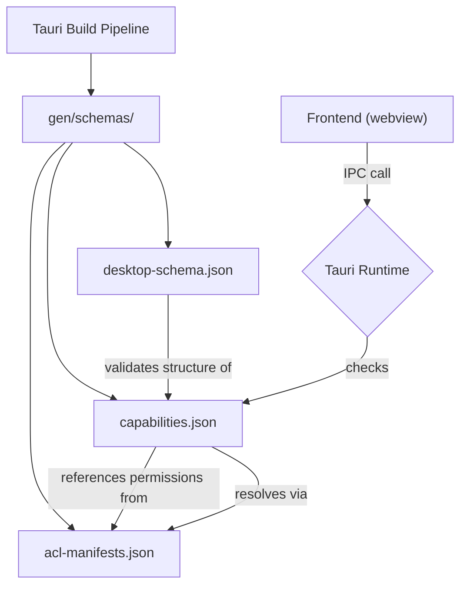

# Other — librefang-desktop-gen

# librefang-desktop-gen

Auto-generated Tauri security configuration and JSON schemas for the LibreFang desktop application. This directory is produced by the Tauri build pipeline and should not be hand-edited.

## What This Module Contains

The `gen/schemas/` directory holds three files that collectively define the IPC security boundary between the frontend webview and the native backend:

| File | Purpose |
|------|---------|
| `acl-manifests.json` | Declares every permission (allow/deny) available across all registered plugins |
| `capabilities.json` | Maps the **default** capability to the `main` window, listing which permissions are granted |
| `desktop-schema.json` | JSON Schema for validating capability files, including scoped permission entries |

## Architecture



## Default Capability

The `capabilities.json` defines a single capability called `default`, applied to the `main` window with local access enabled. It grants:

| Permission | Scope |
|------------|-------|
| `core:default` | All core sub-plugin defaults (path, event, window, webview, app, image, resources, menu, tray) |
| `notification:default` | Full notification API (send, cancel, channels, permissions) |
| `shell:default` | `open` command for `http(s)://`, `tel:`, `mailto:` URLs |
| `dialog:default` | Message, save, and open dialogs |
| `global-shortcut:allow-register` | Register global keyboard shortcuts |
| `global-shortcut:allow-unregister` | Unregister global keyboard shortcuts |
| `global-shortcut:allow-is-registered` | Check if a shortcut is registered |
| `autostart:default` | Enable, disable, and check auto-start on boot |
| `updater:default` | Check, download, and install application updates |

Note that `global-shortcut` intentionally does **not** use its `default` permission set (which is empty). Instead, specific allow permissions are granted individually — this is by design, as global shortcuts are considered inherently dangerous and must be explicitly opted into.

## ACL Manifest Structure

Each plugin entry in `acl-manifests.json` follows this pattern:

```
{
  "default_permission": { "identifier", "description", "permissions": [...] },
  "permissions": {
    "allow-<command>": { "identifier", "description", "commands": { "allow": ["<command>"], "deny": [] } },
    "deny-<command>":  { "identifier", "description", "commands": { "allow": [], "deny": ["<command>"] } }
  },
  "permission_sets": {},
  "global_scope_schema": null | { ... }
}
```

### Plugins with Scoped Permissions

The `shell` plugin is the only one that defines a `global_scope_schema`. It accepts `ShellScopeEntry` objects that control which system commands the webview can execute. Each entry specifies either a `cmd` path (with optional `$HOME`, `$CONFIG`, etc. variable prefix) or a `sidecar` flag, plus optional argument validation via regex.

### Core Sub-Plugins

The `core:default` permission set aggregates defaults from nine sub-plugins:

- **core:path** — `resolve`, `join`, `normalize`, `basename`, `dirname`, `extname`, `is_absolute`, `resolve_directory`
- **core:event** — `listen`, `unlisten`, `emit`, `emit_to`
- **core:window** — Window queries (`get_all_windows`, `inner_size`, `is_fullscreen`, etc.) and `internal_toggle_maximize`
- **core:webview** — Webview queries (`get_all_webviews`, `webview_position`, `webview_size`) and `internal_toggle_devtools`
- **core:app** — `version`, `name`, `tauri_version`, `identifier`, `bundle_type`, `register_listener`, `remove_listener`
- **core:image** — `new`, `from_bytes`, `from_path`, `rgba`, `size`
- **core:resources** — `close`
- **core:menu** — Full menu CRUD: `new`, `append`, `prepend`, `insert`, `remove`, `remove_at`, `items`, `get`, `popup`, `create_default`, `set_as_app_menu`, `set_as_window_menu`, text/enabled/checked/accelerator/icon setters, and macOS-specific NSApp menu assignments
- **core:tray** — Tray lifecycle and appearance: `new`, `get_by_id`, `remove_by_id`, `set_icon`, `set_menu`, `set_tooltip`, `set_title`, `set_visible`, `set_temp_dir_path`, `set_icon_as_template`, `set_show_menu_on_left_click`

## desktop-schema.json

This is the JSON Schema (draft-07) used by Tauri's tooling to validate capability files. It defines:

- **CapabilityFile** — accepts a single `Capability`, an array of them, or an object with a `capabilities` key
- **Capability** — requires `identifier` and `permissions`; optionally `windows`, `webviews`, `platforms`, `remote`, `local`
- **PermissionEntry** — either a bare identifier string or an object with `identifier` plus optional `allow`/`deny` scope arrays
- **CapabilityRemote** — `urls` array using URLPattern syntax for granting IPC access to remote origins

The schema uses conditional `if/then` blocks to provide scope-specific validation for `shell:*` permissions, referencing `ShellScopeEntry` and `ShellScopeEntryAllowedArgs` definitions.

## Regeneration

These files are regenerated on every `tauri build` or `tauri dev` invocation. To update them:

1. Modify plugin registrations in the Rust source (`src-tauri/`)
2. Run `cargo tauri dev` or `cargo tauri build`
3. The build script regenerates all files under `gen/schemas/`

Do not commit manual changes to this directory — they will be overwritten on the next build.