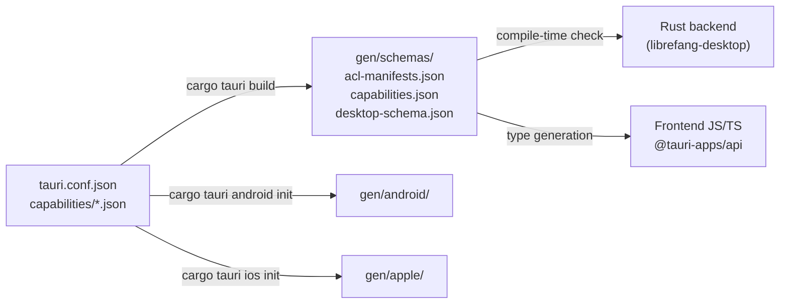

# Other — librefang-desktop-gen

# librefang-desktop/gen

Auto-generated Tauri scaffolding directory containing platform project stubs and the security permission model that gates all IPC between the webview frontend and native backend.

## Purpose

When `cargo tauri build` (or `init`/`dev`) runs, it populates the `gen/` directory with:

1. **Platform project templates** — native Xcode and Android Studio projects needed to build for iOS and Android.
2. **Schema files** — machine-readable descriptions of every permission, capability, and ACL rule the app declares. These are consumed by Tauri's build system to enforce least-privilege at compile time and by IDE tooling for autocomplete/validation.

This directory should **not be hand-edited** in normal workflows. Changes to permissions are made in the Tauri configuration files (e.g. `tauri.conf.json`, `capabilities/*.json`) under `librefang-desktop/`; the build step regenerates `gen/schemas/` accordingly.

## Directory Layout

```
gen/
├── android/          # Android Studio project (populated by cargo tauri android init)
│   └── README.md
├── apple/            # Xcode project (populated by cargo tauri ios init, macOS host only)
│   └── README.md
└── schemas/
    ├── acl-manifests.json    # Every plugin's full permission tree
    ├── capabilities.json     # Resolved capabilities per platform
    └── desktop-schema.json   # JSON Schema for capability files
```

## Platform Initialization

| Platform | Command | Working Directory |
|----------|---------|-------------------|
| Android | `cargo tauri android init` | `crates/librefang-desktop/` |
| iOS / macOS | `cargo tauri ios init` | `crates/librefang-desktop/` |

Each command populates the corresponding subdirectory with a full native project. Until the init command is run, only the placeholder `README.md` exists. The generated projects are designed to be committed to version control after initialisation.

## Security Model

Tauri uses a **capability-based permission system**. The webview frontend can only invoke commands that are explicitly allowed. The schema files in `gen/schemas/` are the compiled representation of that policy.

### Capabilities

Defined in `capabilities.json`, two capability sets exist:

#### `default` — Desktop (macOS, Windows, Linux)

```json
{
  "identifier": "default",
  "windows": ["main"],
  "permissions": [
    "core:default",
    "notification:default",
    "shell:default",
    "dialog:default",
    "global-shortcut:allow-register",
    "global-shortcut:allow-unregister",
    "global-shortcut:allow-is-registered",
    "autostart:default",
    "updater:default"
  ],
  "platforms": ["macOS", "windows", "linux"]
}
```

#### `mobile` — iOS and Android

```json
{
  "identifier": "mobile",
  "windows": ["main"],
  "permissions": [
    "core:default",
    "notification:default",
    "dialog:default"
  ],
  "platforms": ["iOS", "android"]
}
```

The mobile capability is intentionally narrower — `shell`, `global-shortcut`, `autostart`, and `updater` are desktop-only plugins and are omitted to avoid bundling dead code and to reduce the attack surface on mobile.

### Permission Plugins

Each plugin exposes a set of allow/deny permissions. The full catalogue is in `acl-manifests.json`. Here is a summary of the plugins currently available:

| Plugin | Default Permissions | Key Commands |
|--------|--------------------|--------------|
| `core` | `core:default` (bundles path, event, window, webview, app, image, resources, menu, tray) | Window management, event emit/listen, path resolution |
| `core:app` | version, name, tauri-version, identifier, bundle-type, listeners, supports-multiple-windows | Read-only app metadata |
| `core:event` | listen, unlisten, emit, emit-to | All event bus commands |
| `core:image` | new, from-bytes, from-path, rgba, size | Image creation and inspection |
| `core:menu` | new, append, prepend, insert, remove, items, get, popup, create-default, set-as-app-menu, etc. | Full menu lifecycle |
| `core:path` | resolve-directory, resolve, normalize, join, dirname, extname, basename, is-absolute | Path utilities |
| `core:resources` | close | Resource handle cleanup |
| `core:tray` | new, get-by-id, remove-by-id, set-icon, set-menu, set-tooltip, set-title, set-visible, etc. | System tray lifecycle |
| `core:webview` | get-all-webviews, webview-position, webview-size, internal-toggle-devtools | Webview inspection |
| `core:window` | get-all-windows, scale-factor, positions, sizes, state queries, internal-toggle-maximize | Window state queries (default is read-heavy) |
| `dialog` | message, save, open | Native file/message dialogs |
| `global-shortcut` | *(none by default)* | register, unregister, is-registered |
| `notification` | is-permission-granted, request-permission, notify, register-action-types, register-listener, cancel, get-pending, get-active, check-permissions, show, batch, list-channels, delete-channel, create-channel, permission-state | Full notification API |
| `shell` | open (http/https, tel:, mailto:) | open, execute, spawn, kill, stdin-write |
| `autostart` | enable, disable, is-enabled | Boot auto-start control |
| `updater` | check, download, install, download-and-install | Self-update lifecycle |

### Permission Naming Convention

Every permission follows `plugin:allow-command` or `plugin:deny-command`. For example:

- `shell:allow-open` — webview may call `shell.open()`
- `shell:deny-execute` — webview may **not** call `shell.execute()`
- `global-shortcut:allow-register` — webview may register global keyboard shortcuts

Default permission sets (e.g. `core:default`, `shell:default`) bundle commonly-needed allows and can be referenced as a unit.

### Shell Scope

The `shell` plugin supports an additional `global_scope_schema` that constrains **which** commands and arguments the webview may invoke. The scope is defined as an array of `ShellScopeEntry` objects:

```json
{
  "name": "my-script",
  "cmd": "$HOME/scripts/my-script.sh",
  "args": [
    { "validator": "\\w+" }
  ]
}
```

Or for sidecars:

```json
{
  "name": "my-sidecar",
  "sidecar": true,
  "args": true
}
```

Arguments can be `true` (allow all), `false` (deny all), or an array of validators (regex patterns). This prevents arbitrary command injection from a compromised frontend.

## How It Connects to the Rest of the Codebase



- The **developer** edits Tauri config files in the crate root.
- The **Tauri CLI** reads those configs and regenerates `gen/`.
- At **build time**, the Rust macro framework reads `gen/schemas/` to wire up IPC handlers and enforce that only permitted commands are reachable.
- The **frontend** uses `@tauri-apps/api` bindings which are typed according to the same schema.

## When to Regenerate

The `gen/` directory becomes stale when:

- Plugins are added or removed from `Cargo.toml`
- Permissions are modified in capability files
- The Tauri version is bumped

Run `cargo tauri build`, `cargo tauri dev`, or the relevant platform init command to regenerate. Commit the updated files afterward.