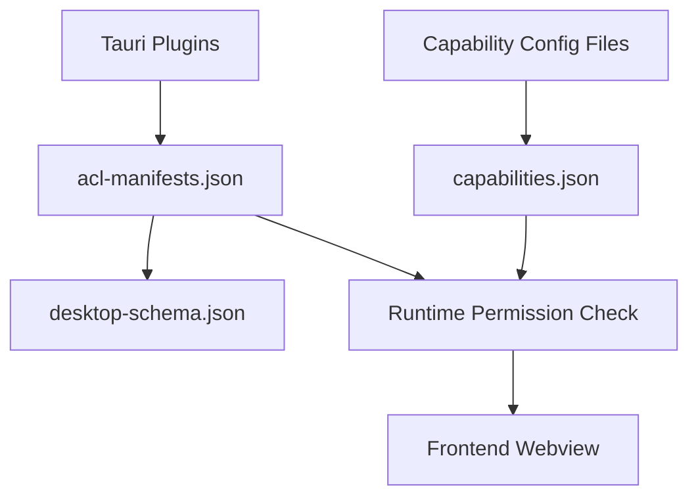

# Other — librefang-desktop-gen

# librefang-desktop-gen

Auto-generated Tauri build artifacts that define the security and permissions model for the LibreFang desktop application. The `gen/` directory is produced during the Tauri build process and is **not intended for manual editing**.

## Purpose

Tauri uses a capability-based security system. Before any frontend (webview) code can invoke a Tauri command, that command must be explicitly allowed through the ACL (Access Control List) system. This module contains three generated files that together define what the LibreFang desktop app's frontend is permitted to do:

| File | Role |
|------|------|
| `schemas/acl-manifests.json` | Registry of every permission available from every plugin used by the app |
| `schemas/capabilities.json` | The resolved capability set assigned to app windows |
| `schemas/desktop-schema.json` | JSON Schema for validating capability files at build time |

## Architecture



At build time, Tauri reads the plugin manifests and the developer-authored capability configuration files (typically in `src-tauri/capabilities/`), then generates these three schema files. At runtime, every IPC call from the webview is validated against the resolved capability set.

## acl-manifests.json

The manifest declares every permission exposed by each plugin integrated into the app. Each plugin entry follows a consistent structure:

- **`default_permission`** — The permission set granted when a capability references `plugin-name:default`.
- **`permissions`** — Individual `allow-*` and `deny-*` entries that map to specific commands.
- **`global_scope_schema`** — Optional JSON Schema for scoped permissions (used by the `shell` plugin).

### Plugin Permission Summary

| Plugin | Default Grants | Key Commands |
|--------|---------------|--------------|
| `autostart` | `allow-enable`, `allow-disable`, `allow-is-enabled` | Boot auto-start control |
| `core` | Aggregates all `core:*:default` sets | Umbrella for core sub-plugins |
| `core:app` | `allow-version`, `allow-name`, `allow-tauri-version`, `allow-identifier`, `allow-bundle-type`, `allow-register-listener`, `allow-remove-listener` | App metadata and lifecycle listeners |
| `core:event` | `allow-listen`, `allow-unlisten`, `allow-emit`, `allow-emit-to` | Event bus |
| `core:image` | `allow-new`, `allow-from-bytes`, `allow-from-path`, `allow-rgba`, `allow-size` | Image handling |
| `core:menu` | All menu commands (`allow-new`, `allow-append`, `allow-popup`, `allow-set-as-app-menu`, etc.) | Application and window menus |
| `core:path` | `allow-resolve-directory`, `allow-resolve`, `allow-normalize`, `allow-join`, `allow-dirname`, `allow-extname`, `allow-basename`, `allow-is-absolute` | Path operations |
| `core:resources` | `allow-close` | Resource cleanup |
| `core:tray` | `allow-new`, `allow-get-by-id`, `allow-remove-by-id`, `allow-set-icon`, `allow-set-menu`, `allow-set-tooltip`, `allow-set-title`, `allow-set-visible`, etc. | System tray |
| `core:webview` | `allow-get-all-webviews`, `allow-webview-position`, `allow-webview-size`, `allow-internal-toggle-devtools` | Webview management |
| `core:window` | Window state queries (`allow-is-fullscreen`, `allow-is-minimized`, `allow-is-maximized`, etc.) and `allow-internal-toggle-maximize` | Window management |
| `dialog` | `allow-ask`, `allow-confirm`, `allow-message`, `allow-save`, `allow-open` | Native dialogs |
| `global-shortcut` | Empty by default | Keyboard shortcut registration (`allow-register`, `allow-unregister`, `allow-is-registered`) |
| `notification` | All notification commands including `allow-notify`, `allow-request-permission`, `allow-batch`, channel management | System notifications |
| `shell` | `allow-open` (http/https, tel:, mailto:) | Shell execution, process spawning, URL opening |
| `updater` | `allow-check`, `allow-download`, `allow-install`, `allow-download-and-install` | Self-update workflow |

### Permission Identifier Format

Every permission follows the naming convention:

```
{plugin}:{scope}
```

Where `scope` is one of:
- **`default`** — The plugin's recommended default set.
- **`allow-{command}`** — Grants access to a specific command.
- **`deny-{command}`** — Explicitly blocks a specific command.

## capabilities.json

Defines the resolved capabilities for the application. LibreFang uses a single capability called `default`:

```json
{
  "identifier": "default",
  "description": "Default permissions for the LibreFang desktop app",
  "local": true,
  "windows": ["main"],
  "permissions": [
    "core:default",
    "notification:default",
    "shell:default",
    "dialog:default",
    "global-shortcut:allow-register",
    "global-shortcut:allow-unregister",
    "global-shortcut:allow-is-registered",
    "autostart:default",
    "updater:default"
  ]
}
```

### What this means for the `main` window

The `main` window's webview can:

- Use all core Tauri commands (path, event, window, webview, app, image, resources, menu, tray).
- Send and manage system notifications.
- Open `http(s)://`, `tel:`, and `mailto:` URLs via the shell.
- Show native dialogs (ask, confirm, message, save, open).
- Register, unregister, and check global keyboard shortcuts.
- Control auto-start behavior on boot.
- Check for, download, and install application updates.

The `local: true` setting means these permissions apply only to locally-served content (the bundled frontend), not to any remote URLs. No `remote` block is configured, and no additional windows or webviews are granted access.

## desktop-schema.json

A JSON Schema (Draft-07) document that validates capability files. It defines the structure of:

- **`CapabilityFile`** — Top-level container (single capability, array, or object with `capabilities` key).
- **`Capability`** — A single capability definition with `identifier`, `permissions`, optional `windows`, `webviews`, `platforms`, `remote`, and `local` fields.
- **`CapabilityRemote`** — Remote URL patterns allowed to use the capability.
- **`PermissionEntry`** — Either a raw identifier string or an object with `identifier` plus scoped `allow`/`deny` arrays.
- **`Identifier`** — Enumerates every valid permission string across all plugins.

The schema includes conditional validation: when a `PermissionEntry` references a `shell:*` identifier, the `allow` and `deny` arrays must conform to the `ShellScopeEntry` schema, which validates command configurations including:
- `name` — The command name used from the webview API.
- `cmd` — The actual system command (supports `$HOME`, `$APPDATA`, and other Tauri directory variables).
- `sidecar` — Whether the command references a bundled sidecar binary.
- `args` — Argument rules (`true` for any, `false` for none, or an array of specific validators with regex patterns).

## Relationship to the Codebase

These generated files sit between two layers:

1. **Source of truth** — Developer-authored files in `src-tauri/capabilities/` and the plugin `tauri.conf.json` configuration.
2. **Runtime consumer** — The Tauri runtime reads the generated capabilities to enforce permissions when the webview invokes commands.

To change permissions, edit the capability files in the source directory (not in `gen/`). The `gen/` contents are regenerated on every build. For example, to add filesystem write access, create or modify a capability file in `src-tauri/capabilities/` to include `fs:allow-write-text-file` with the appropriate scope, then rebuild.

### Shell Scope Configuration

The `shell` plugin is the only plugin in this app with a `global_scope_schema`. When using `shell:allow-execute`, `shell:allow-spawn`, or `shell:allow-stdin-write` beyond the defaults, you must provide scoped entries in the permission configuration:

```json
{
  "identifier": "shell:allow-execute",
  "allow": [
    {
      "name": "my-command",
      "cmd": "$APPDATA/scripts/myscript.sh",
      "args": [
        { "validator": "\\w+" }
      ]
    }
  ]
}
```

This restricts which commands the frontend can execute and what arguments are accepted, validated by regex at runtime.