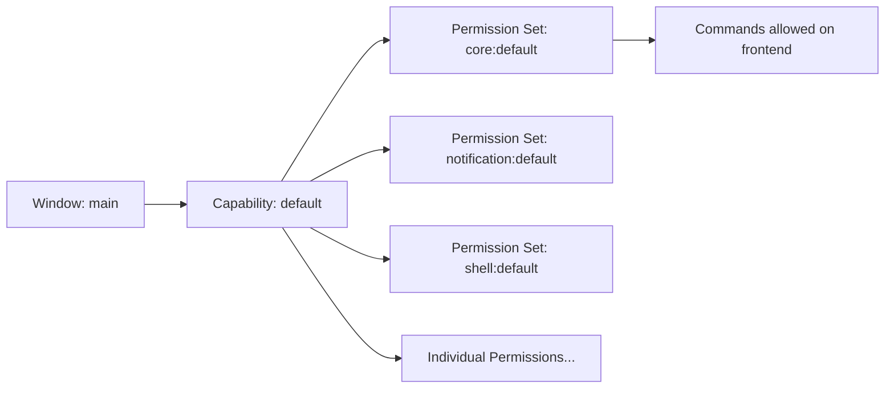

# Other — librefang-desktop-gen

# librefang-desktop-gen — Tauri Security Schema Layer

## Overview

`librefang-desktop-gen` contains the **auto-generated Tauri capability and permission schemas** that govern what the LibreFang desktop application's frontend (webview) is allowed to do. These files are produced by the Tauri build system and should not be manually edited — they reflect the permissions declared in the application's Tauri configuration and plugin registrations.

The module consists of three schema files in `gen/schemas/`:

| File | Purpose |
|------|---------|
| `acl-manifests.json` | Exhaustive registry of every permission every plugin can grant or deny |
| `capabilities.json` | The actual capability sets currently assigned to application windows |
| `desktop-schema.json` | JSON Schema (Draft 7) for validating capability files |

## Capability Model

Tauri uses a **capability-based access control** system. A *capability* binds a set of permissions to specific windows (or webviews). If a window doesn't match any capability, it has **zero access** to the IPC layer.



### How Permissions Work

Each permission follows the pattern `plugin-name:permission-name` and either **allows** or **denies** a specific IPC command. Permissions are resolved as follows:

- **`allow-*`** — explicitly permits a command
- **`deny-*`** — explicitly blocks a command (takes priority over allow)
- **`default`** — a bundled set of `allow-*` permissions that represent the plugin's recommended baseline

Permissions can also carry a **scope** (seen in the shell plugin) that constrains not just *whether* a command runs, but *with what arguments*.

## Default Capability

Defined in `capabilities.json`, the `default` capability is assigned to the `"main"` window and is **local only** (not served to remote URLs):

```json
{
  "identifier": "default",
  "local": true,
  "windows": ["main"],
  "permissions": [
    "core:default",
    "notification:default",
    "shell:default",
    "dialog:default",
    "global-shortcut:allow-register",
    "global-shortcut:allow-unregister",
    "global-shortcut:allow-is-registered",
    "autostart:default",
    "updater:default"
  ]
}
```

### Granted Access Summary

| Plugin / Permission | What the frontend can do |
|---------------------|--------------------------|
| `core:default` | Path operations, events, window/webview queries, app metadata, images, resources, menus, tray |
| `notification:default` | Full notification lifecycle: request permissions, show, cancel, batch, manage channels |
| `shell:default` | Open `http(s)://`, `tel:`, and `mailto:` links via the system handler |
| `dialog:default` | Show ask, confirm, message, save, and open dialogs |
| `global-shortcut:allow-*` | Register, unregister, and check global keyboard shortcuts (no wildcard registration) |
| `autostart:default` | Enable, disable, and query auto-start on boot |
| `updater:default` | Check, download, and install application updates |

## Plugin Permission Breakdown

### Core Plugins (via `core:default`)

`core:default` is a meta-set that includes the defaults of nine sub-plugins:

| Sub-plugin | Default Commands |
|------------|-----------------|
| `core:path` | `resolve`, `resolve_directory`, `normalize`, `join`, `dirname`, `extname`, `basename`, `is_absolute` |
| `core:event` | `listen`, `unlisten`, `emit`, `emit_to` |
| `core:window` | Read-only window queries: `get_all_windows`, `scale_factor`, `inner/outer_position`, `inner/outer_size`, `is_*` state checks, `current/primary/available_monitors`, `cursor_position`, `theme`, `internal_toggle_maximize` |
| `core:webview` | `get_all_webviews`, `webview_position`, `webview_size`, `internal_toggle_devtools` |
| `core:app` | `version`, `name`, `tauri_version`, `identifier`, `bundle_type`, `register_listener`, `remove_listener` |
| `core:image` | `new`, `from_bytes`, `from_path`, `rgba`, `size` |
| `core:resources` | `close` |
| `core:menu` | Full menu CRUD: `new`, `append`, `prepend`, `insert`, `remove`, `remove_at`, `items`, `get`, `popup`, `create_default`, `set_as_app_menu`, `set_as_window_menu`, text/enabled/checked/accelerator/icon setters, macOS-specific NSApp helpers |
| `core:tray` | Full tray management: `new`, `get_by_id`, `remove_by_id`, `set_icon`, `set_menu`, `set_tooltip`, `set_title`, `set_visible`, `set_temp_dir_path`, `set_icon_as_template`, `set_show_menu_on_left_click` |

**Notable restrictions in the default set:**
- `core:window:default` does **not** include mutating commands like `create`, `destroy`, `set_size`, `set_position`, `maximize`, `minimize`, `close`, or `set_fullscreen`. These must be individually added if needed.
- `core:app:default` does **not** include `app_hide`, `app_show`, `set_app_theme`, `set_dock_visibility`, or data store operations.
- `core:webview:default` does **not** include `create_webview`, `create_webview_window`, `webview_close`, navigation, or zoom commands.

### Shell Plugin

The shell plugin is unique in that it supports a **global scope schema** (`ShellScopeEntry`). This allows fine-grained control over which system commands the webview can execute:

```json
{
  "identifier": "shell:allow-execute",
  "allow": [{
    "name": "my-cmd",
    "cmd": "$HOME/my-script.sh",
    "args": [{ "validator": "^\\w+$" }]
  }]
}
```

The scope supports:
- **Regular commands** — requires `cmd` (may use `$HOME`, `$CONFIG`, etc. variables) and `name`
- **Sidecar commands** — requires `name` and `"sidecar": true`
- **Argument validation** — `true` (allow all), `false` (allow none), or an array of `{ validator: "<regex>" }` objects

The `shell:default` permission only grants `allow-open`, which opens URLs matching `http(s)://`, `tel:`, and `mailto:` schemes.

### Global Shortcut Plugin

The default permission set for `global-shortcut` is intentionally **empty** — no shortcuts are registered by default because the security implications are application-specific. The `default` capability manually adds the three individual allow permissions:

- `global-shortcut:allow-register` — register a single shortcut
- `global-shortcut:allow-unregister` — unregister a single shortcut
- `global-shortcut:allow-is-registered` — check if a shortcut is registered

Notably absent from the default capability are `allow-register-all` and `allow-unregister-all`.

## Desktop Schema (desktop-schema.json)

This file is a JSON Schema Draft 7 definition that validates the structure of Tauri capability files. Key definitions:

| Definition | Purpose |
|------------|---------|
| `CapabilityFile` | Top-level — accepts a single `Capability`, an array, or `{ capabilities: [...] }` |
| `Capability` | Binds `permissions` to `windows`/`webviews` with optional `platforms` filter and `remote` URL config |
| `CapabilityRemote` | Lists URL patterns (URLPattern spec) allowed to use the capability |
| `PermissionEntry` | Either a bare identifier string or `{ identifier, allow?, deny? }` with scope data |
| `Identifier` | Enumerates every valid permission string across all plugins |

The schema includes conditional logic (`if`/`then`) that adds scope validation specifically for shell-related permissions, requiring `ShellScopeEntry` shapes for the `allow`/`deny` arrays.

## Modifying Capabilities

To change what the frontend can access:

1. **Edit the Tauri configuration** (typically `tauri.conf.json` or `capabilities/*.json` in the source directory — **not** the `gen/` files).
2. **Rebuild** — Tauri regenerates `gen/schemas/` during the build process.
3. **Verify** — Check `capabilities.json` in `gen/schemas/` to confirm the new permissions took effect.

### Adding a new capability

Create a new capability file (e.g., `capabilities/admin.json`) with a structure like:

```json
{
  "identifier": "admin-ops",
  "description": "Extended permissions for admin windows",
  "windows": ["admin-*"],
  "permissions": [
    "core:default",
    "core:window:allow-close",
    "core:window:allow-set-fullscreen"
  ]
}
```

## Security Considerations

- **Principle of least privilege**: The `core:window:default` set is read-heavy by design. Mutating operations (resize, reposition, close, destroy) must be explicitly added.
- **Remote access is disabled by default**: The `default` capability sets `"local": true` with no `"remote"` block. Never enable remote access without understanding the implications.
- **Shell execute/spawn are not in the default capability**: Only `shell:allow-open` (URL opening) is granted. Arbitrary command execution requires explicit opt-in with scope constraints.
- **Deny overrides allow**: If both an `allow-*` and `deny-*` permission exist for the same command, the deny always wins, regardless of ordering.