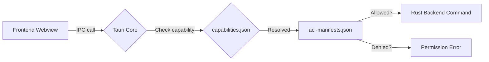

# Other — librefang-desktop-gen

# librefang-desktop/gen — Tauri Generated Scaffolding & ACL Schemas

## Overview

The `gen/` directory is an **auto-generated output** of the Tauri v2 build system. It is not hand-written application code. Tauri populates this directory during `cargo tauri build`, `cargo tauri dev`, and the platform-specific init commands. The contents define the security perimeter (capabilities and permissions) that the frontend webview has when communicating with the Rust backend over Tauri's IPC layer.

> **Do not edit files in this directory directly.** Changes will be overwritten on the next build. To modify permissions, edit the `capabilities/` directory in the Tauri source config (under `librefang-desktop/`), then rebuild.

## Directory Layout

```
gen/
├── android/           # Android Studio project (populated by cargo tauri android init)
│   └── README.md
├── apple/             # Xcode project (populated by cargo tauri ios init, macOS only)
│   └── README.md
└── schemas/
    ├── acl-manifests.json     # All plugin permission declarations
    ├── capabilities.json      # Resolved capability sets for this app
    └── desktop-schema.json    # JSON Schema for validating capability files
```

## Platform Scaffolding

| Directory | How to populate | Command working directory |
|-----------|----------------|--------------------------|
| `android/` | `cargo tauri android init` | `crates/librefang-desktop/` |
| `apple/` | `cargo tauri ios init` (macOS only) | `crates/librefang-desktop/` |

Both directories start as stub READMEs. Running the init command generates a full native project (Gradle/Android Studio or Xcode) that wraps the Tauri webview for that platform.

## Schema Files

### `schemas/acl-manifests.json`

A consolidated registry of every Tauri plugin permission available to the application. Each top-level key is a plugin identifier containing:

- **`default_permission`** — the permission set applied when you reference `plugin-name:default`.
- **`permissions`** — fine-grained `allow-*` and `deny-*` entries, each gating a specific IPC command.

The plugins included in this application:

| Plugin | Default grants | Purpose |
|--------|---------------|---------|
| `autostart` | enable, disable, is_enabled | Launch-on-boot control |
| `core` | path, event, window, webview, app, image, resources, menu, tray | Umbrella for all core sub-plugins |
| `core:app` | version, name, tauri-version, identifier, bundle-type, listeners | App metadata & event registration |
| `core:event` | listen, unlisten, emit, emit_to | Event bus |
| `core:image` | new, from-bytes, from-path, rgba, size | Image handling |
| `core:menu` | full CRUD + popup + set-as-app-menu | Application menus |
| `core:path` | resolve, resolve-directory, normalize, join, dirname, extname, basename, is-absolute | Path utilities |
| `core:resources` | close | Resource cleanup |
| `core:tray` | new, get-by-id, remove, set-icon/menu/tooltip/title/visible | System tray |
| `core:webview` | get-all-webviews, position, size, internal-toggle-devtools | Webview management |
| `core:window` | extensive read-only queries + internal-toggle-maximize | Window state queries |
| `dialog` | message, save, open | Native file/message dialogs |
| `global-shortcut` | *(none by default)* | System-wide keyboard shortcuts |
| `notification` | full lifecycle (request, show, batch, channels, cancel) | OS notifications |
| `shell` | open (http/https, tel:, mailto:) | URL opening & process spawning |
| `updater` | check, download, install, download-and-install | Self-update |

### `schemas/capabilities.json`

The resolved capability profiles that determine which IPC commands the webview can invoke. Two profiles are defined:

#### `default` — Desktop

```json
{
  "identifier": "default",
  "windows": ["main"],
  "platforms": ["macOS", "windows", "linux"],
  "permissions": [
    "core:default",
    "notification:default",
    "shell:default",
    "dialog:default",
    "global-shortcut:allow-register",
    "global-shortcut:allow-unregister",
    "global-shortcut:allow-is-registered",
    "autostart:default",
    "updater:default"
  ]
}
```

Desktop grants the full default sets for core, notifications, shell, dialogs, autostart, and the updater. Global-shortcut is granted at the individual command level (register, unregister, is-registered) rather than as a blanket default — this is intentional because shortcut registration is inherently dangerous if misused.

#### `mobile` — iOS / Android

```json
{
  "identifier": "mobile",
  "windows": ["main"],
  "platforms": ["iOS", "android"],
  "permissions": [
    "core:default",
    "notification:default",
    "dialog:default"
  ]
}
```

Mobile omits shell, global-shortcut, autostart, and updater entirely. These plugins either don't exist on mobile or have no meaningful implementation. The `notification:default` on mobile includes channel management primitives (`create-channel`, `delete-channel`, `list-channels`) that are Android-specific but harmless on iOS.

### `schemas/desktop-schema.json`

A JSON Schema (draft-07) document that validates capability files. It defines the structure of `Capability` objects including:

- **`identifier`** — unique name for the capability
- **`permissions`** — array of permission entries (string identifiers or objects with `identifier` + scoped `allow`/`deny`)
- **`windows`** / **`webviews`** — glob patterns matching window/webview labels
- **`platforms`** — target OS filter (`"macOS"`, `"windows"`, `"linux"`, `"iOS"`, `"android"`)
- **`remote`** — optional configuration for non-local URLs (security-sensitive)
- **`local`** — whether local app URLs are covered (default `true`)

The schema also includes the `ShellScopeEntry` definitions that allow fine-grained control over which shell commands the webview can execute, including argument validation via regex.

## Security Model



1. The webview attempts an IPC call (e.g., `shell.open()`).
2. Tauri resolves which capability profiles apply to the current window label and platform.
3. It checks the permission against `acl-manifests.json`.
4. If the command is in an `allow` list and not in a `deny` list, the call reaches the Rust handler. Otherwise, a permission error is returned to the frontend.

## How to Modify Permissions

Permissions are **not** edited in `gen/`. The workflow is:

1. Edit capability files in the Tauri source configuration (typically `src-tauri/capabilities/` or inline in `tauri.conf.json`).
2. Run `cargo tauri build` or `cargo tauri dev`. Tauri regenerates `gen/schemas/` from the source configuration and plugin manifests.
3. The regenerated files reflect the updated permission set.

To add a new plugin's permissions, add the plugin crate dependency and include its permission identifier in the relevant capability profile.

## Regenerating Everything

```bash
# From the workspace root or crates/librefang-desktop/

# Desktop schemas (happens automatically during build)
cargo tauri build
cargo tauri dev

# Android scaffolding
cargo tauri android init

# Apple/iOS scaffolding (macOS only)
cargo tauri ios init
```