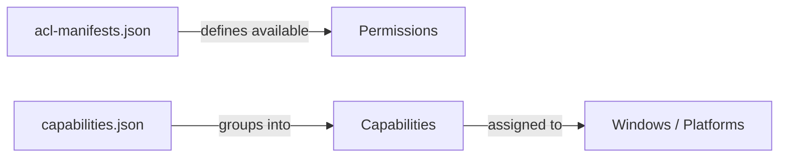

# Other — librefang-desktop-gen

# librefang-desktop-gen

Auto-generated Tauri build artifacts that define the security and permission model for the LibreFang desktop application. This directory is populated by Tauri CLI commands and should not be hand-edited unless you are intentionally modifying the capability/permission configuration.

## Directory Layout

```
gen/
├── android/                  # Android project scaffold (generated)
│   └── README.md
├── apple/                    # Apple (iOS/macOS) project scaffold (generated)
│   └── README.md
└── schemas/
    ├── acl-manifests.json    # Full ACL permission registry for all plugins
    ├── capabilities.json     # Active capability sets assigned to windows
    └── desktop-schema.json   # JSON Schema for validating capability files
```

## Mobile Platform Scaffolds

The `android/` and `apple/` directories are populated by running Tauri CLI commands from `crates/librefang-desktop/`:

| Platform | Command |
|----------|---------|
| Android  | `cargo tauri android init` |
| iOS      | `cargo tauri ios init` (macOS only) |

These directories contain the native Xcode/Android Studio project wrappers that Tauri uses to build mobile bundles. They are empty placeholders until the corresponding init command is run.

## Permission Architecture

Tauri v2 uses a capability-based security model. Three layers work together:


```mermaid
flowchart LR
    A[acl-manifests.json] -->|defines available| B[Permissions]
    C[capabilities.json] -->|groups into| D[Capabilities]
    D -->|assigned to| E[Windows / Platforms]
```

### 1. ACL Manifests (`schemas/acl-manifests.json`)

The authoritative registry of every permission available across all Tauri plugins used by the app. Each plugin entry declares:

- **`default_permission`** — the permission set granted when you reference `plugin-name:default`
- **`permissions`** — individual `allow-*` and `deny-*` entries, each mapping to a specific IPC command

The following plugins are registered:

| Plugin | Default Grants | Key Capabilities |
|--------|---------------|------------------|
| `core` | Bundles all sub-plugin defaults | Umbrella for path, event, window, webview, app, image, resources, menu, tray |
| `core:app` | `allow-version`, `allow-name`, `allow-tauri-version`, etc. | App metadata, theme, dock visibility, listeners |
| `core:event` | `allow-listen`, `allow-unlisten`, `allow-emit`, `allow-emit-to` | Inter-window and app-wide event system |
| `core:image` | `allow-new`, `allow-from-bytes`, `allow-from-path`, `allow-rgba`, `allow-size` | Image creation and manipulation |
| `core:menu` | 21 permissions for menu CRUD | Menu bar construction and management |
| `core:path` | `allow-resolve-directory`, `allow-resolve`, `allow-join`, etc. | Filesystem path resolution |
| `core:resources` | `allow-close` | Resource handle management |
| `core:tray` | `allow-new`, `allow-set-icon`, `allow-set-tooltip`, etc. | System tray icon and menu |
| `core:webview` | `allow-get-all-webviews`, position/size/devtools queries | Webview creation, sizing, zoom, navigation |
| `core:window` | 30+ query + mutation permissions | Window state, positioning, decorations, monitors |
| `dialog` | `allow-message`, `allow-save`, `allow-open` | Native file/message dialogs |
| `global-shortcut` | Empty by default (no shortcuts auto-registered) | Keyboard shortcut registration |
| `notification` | Full lifecycle: permission check → notify → cancel | System notifications with channel support |
| `shell` | `allow-open` only (http(s), tel:, mailto:) | URL opening, command execution/spawning |
| `autostart` | `allow-enable`, `allow-disable`, `allow-is-enabled` | Boot-time auto-start control |
| `updater` | `allow-check`, `allow-download`, `allow-install`, `allow-download-and-install` | Self-update workflow |

Every permission follows the pattern `{plugin}:allow-{command}` or `{plugin}:deny-{command}`. Deny entries take precedence over allow entries when both are present.

### 2. Capabilities (`schemas/capabilities.json`)

Capabilities bind permission sets to specific windows and platforms. Two capability sets are defined:

#### `default` — Desktop

```json
{
  "windows": ["main"],
  "platforms": ["macOS", "windows", "linux"],
  "permissions": [
    "core:default",
    "notification:default",
    "shell:default",
    "dialog:default",
    "global-shortcut:allow-register",
    "global-shortcut:allow-unregister",
    "global-shortcut:allow-is-registered",
    "autostart:default",
    "updater:default"
  ]
}
```

The `main` window on all desktop platforms gets core functionality plus notifications, shell URL opening, native dialogs, global shortcuts, autostart, and the auto-updater.

#### `mobile` — iOS / Android

```json
{
  "windows": ["main"],
  "platforms": ["iOS", "android"],
  "permissions": [
    "core:default",
    "notification:default",
    "dialog:default"
  ]
}
```

Mobile builds are restricted to core, notifications, and dialogs. Desktop-only plugins (shell, global-shortcut, autostart, updater) are not bundled.

### 3. Desktop Schema (`schemas/desktop-schema.json`)

A JSON Schema (Draft 07) that validates capability configuration files. It defines the structure for:

- **`Capability`** — top-level object with `identifier`, `permissions`, optional `windows`, `webviews`, `platforms`, `remote`, and `local` fields
- **`PermissionEntry`** — either a plain identifier string (`"core:default"`) or an object with `identifier` plus `allow`/`deny` scope arrays
- **`CapabilityRemote`** — configures which remote URLs may invoke local IPC commands (uses URLPattern syntax)
- **`ShellScopeEntry`** — scoped command execution definitions for the shell plugin (local commands or sidecars with argument validation)

The schema enforces that shell-related permissions (`shell:default`, `shell:allow-execute`, etc.) can only carry scope entries with the correct `ShellScopeEntry` shape — either `{cmd, name, args?}` for system commands or `{name, sidecar, args?}` for bundled sidecars.

## Modifying Permissions

To change what the frontend can access:

1. Edit the capability files in `src-tauri/capabilities/` (the Tauri source-of-truth, not this gen directory)
2. Run `cargo tauri build` or `cargo tauri dev` — the CLI regenerates `gen/schemas/` from your capability files and plugin manifests
3. The `gen/` contents are overwritten; any manual edits here will be lost

To add a new plugin:

1. Add the plugin crate dependency to `Cargo.toml`
2. Register the plugin in the Tauri builder
3. Add the desired permissions to the appropriate capability file
4. Rebuild to regenerate schemas

## Security Considerations

- The `global-shortcut` plugin uses individually-granted permissions rather than a default set, because registering system-wide hotkeys is inherently sensitive
- The `shell:default` permission only allows `open` (URL launching) — `execute` and `spawn` require explicit permission grants with scope validation
- Remote URL access (`CapabilityRemote`) is not configured for any current capability; all IPC is restricted to locally-served content
- The `local` flag defaults to `true` on all capabilities, meaning only the app's own webview content can invoke IPC commands