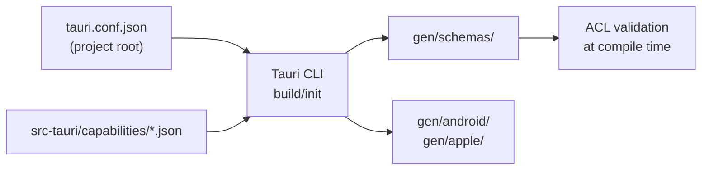

# Other — librefang-desktop-gen

# librefang-desktop/gen — Tauri Generated Artifacts

## Overview

The `gen/` directory holds **auto-generated Tauri build artifacts** that define the security model and platform scaffolding for the LibreFang desktop application. These files are produced by Tauri's CLI during initialization and build processes. **They should not be manually edited** — they are regenerated from the project's Tauri configuration and capability files.

## Directory Structure

```
gen/
├── android/
│   └── README.md          # Placeholder — populated by `cargo tauri android init`
├── apple/
│   └── README.md          # Placeholder — populated by `cargo tauri ios init`
└── schemas/
    ├── acl-manifests.json  # Full ACL manifest for all Tauri plugins
    ├── capabilities.json   # Active capability definitions (desktop + mobile)
    └── desktop-schema.json # JSON Schema for capability file validation
```

## Platform Scaffolding

### Android

The `android/` directory is a placeholder for the Android Studio project scaffold. Populate it by running from `crates/librefang-desktop/`:

```bash
cargo tauri android init
```

### Apple (iOS / macOS)

The `apple/` directory is a placeholder for the Xcode project scaffold. Populate it on macOS by running from `crates/librefang-desktop/`:

```bash
cargo tauri ios init
```

## Security Schemas

The `schemas/` directory defines the entire IPC permission model that gates frontend-to-backend communication.

### acl-manifests.json

The **ACL manifest** enumerates every plugin, its default permission set, and individual allow/deny permission identifiers. This is the authoritative reference for what Tauri commands exist and what each permission controls.

**Plugins covered:**

| Plugin | Default Permission Scope |
|---|---|
| `autostart` | Enable, disable, and query auto-start on boot |
| `core` | Aggregates all core plugin defaults |
| `core:app` | App metadata queries, listener registration |
| `core:event` | Event listen, unlisten, emit, emit-to |
| `core:image` | Image creation from bytes/path, RGBA data, size |
| `core:menu` | Full menu CRUD, popup, accelerators, app/window menu assignment |
| `core:path` | Path resolution, join, normalize, dirname, basename, extname |
| `core:resources` | Resource close |
| `core:tray` | System tray CRUD, icon, tooltip, title, visibility |
| `core:webview` | Webview CRUD, size, position, zoom, devtools toggle, browsing data |
| `core:window` | Full window management (position, size, state queries, cursor, monitors, decorations) |
| `dialog` | Message, open, and save dialogs |
| `global-shortcut` | No default — requires explicit allow permissions |
| `notification` | Full notification lifecycle including channels |
| `shell` | `open` only (http/https, tel:, mailto:) — execute/spawn are denied by default |
| `updater` | Check, download, install, and download-and-install |

Each permission entry contains:
- `identifier` — the string used in capability files (e.g., `"core:window:allow-set-title"`)
- `description` — human-readable description
- `commands.allow` / `commands.deny` — the Tauri command names affected

### capabilities.json

Defines the **active capabilities** applied to application windows at runtime. LibreFang declares two capabilities:

#### `default` — Desktop

```json
{
  "identifier": "default",
  "windows": ["main"],
  "platforms": ["macOS", "windows", "linux"],
  "permissions": [
    "core:default",
    "notification:default",
    "shell:default",
    "dialog:default",
    "global-shortcut:allow-register",
    "global-shortcut:allow-unregister",
    "global-shortcut:allow-is-registered",
    "autostart:default",
    "updater:default"
  ]
}
```

Applied to the `main` window on all desktop platforms. Grants core Tauri access plus notification, shell link-opening, dialog, global shortcut registration, autostart control, and auto-update functionality.

#### `mobile` — iOS / Android

```json
{
  "identifier": "mobile",
  "windows": ["main"],
  "platforms": ["iOS", "android"],
  "permissions": [
    "core:default",
    "notification:default",
    "dialog:default"
  ]
}
```

A reduced set that omits desktop-only plugins (`shell`, `global-shortcut`, `autostart`, `updater`) which are not bundled on mobile.

### desktop-schema.json

A **JSON Schema (draft-07)** for validating capability files. It defines the `CapabilityFile` type and all supporting types (`Capability`, `CapabilityRemote`, `PermissionEntry`, `Identifier`). Used by Tauri's build tooling to validate capability configurations at compile time.

Key schema structures:
- **`Capability`** — groups permissions to specific windows/webviews on specific platforms
- **`PermissionEntry`** — either a plain identifier string or an object with `identifier` + `allow`/`deny` scopes (used by shell for argument whitelisting)
- **`ShellScopeEntry`** — defines allowed commands with optional argument validators using regex patterns

## How It Connects to the Codebase


```mermaid
flowchart LR
    A["tauri.conf.json<br/>(project root)"] --> B["Tauri CLI<br/>build/init"]
    B --> C["gen/schemas/"]
    C --> D["ACL validation<br/>at compile time"]
    E["src-tauri/capabilities/*.json"] --> B
    B --> F["gen/android/<br/>gen/apple/"]
```

1. The Tauri CLI reads plugin configurations and source capability files from `src-tauri/capabilities/`
2. During `cargo tauri build` or `cargo tauri dev`, it generates the `gen/schemas/` files
3. `acl-manifests.json` is produced from the merged plugin ACL declarations
4. `capabilities.json` is the resolved set of active capabilities
5. `desktop-schema.json` provides validation metadata
6. Platform directories are populated separately via `android init` / `ios init`

## Working With This Module

- **Do not manually edit** files in `gen/`. They are overwritten on each build.
- To change permissions, edit capability files in the Tauri source configuration (typically under `src-tauri/capabilities/`), then rebuild.
- To add Android/iOS support, run the appropriate `init` command from `crates/librefang-desktop/`.
- The `global-shortcut` plugin intentionally has no default permissions — individual commands (`allow-register`, `allow-unregister`, `allow-is-registered`) are explicitly listed in the `default` capability.
- Shell `execute` and `spawn` are **not** included in any capability. If needed, they must be explicitly added with scoped `allow` entries to prevent arbitrary command execution from the frontend.