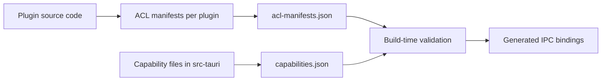

# Other — librefang-desktop-gen

# librefang-desktop-gen

Auto-generated build artifacts produced by the Tauri CLI during initialization and build of the LibreFang desktop application. This directory is managed entirely by tooling and should not be hand-edited.

## Directory Layout

```
gen/
├── android/           # Android Studio project (populated by `cargo tauri android init`)
├── apple/             # Xcode project (populated by `cargo tauri ios init`, macOS only)
└── schemas/
    ├── acl-manifests.json      # Aggregated ACL manifests from all Tauri plugins
    ├── capabilities.json       # Resolved capability sets for the LibreFang app
    └── desktop-schema.json     # JSON Schema for Tauri capability files
```

## Mobile Platform Directories

### `android/` and `apple/`

Empty placeholder directories until the respective init commands are run from `crates/librefang-desktop/`:

```bash
# Populate the Android project
cd crates/librefang-desktop && cargo tauri android init

# Populate the Apple project (macOS host only)
cd crates/librefang-desktop && cargo tauri ios init
```

After initialization, these directories contain full native build projects (Gradle/Android Studio and Xcode respectively) that Tauri uses to produce mobile bundles.

## Schemas

The `schemas/` directory contains three JSON files that together define the security and permission model for the desktop app.

### `acl-manifests.json`

Aggregated access-control manifests from every Tauri plugin used by LibreFang. Each top-level key is a plugin identifier and contains:

- **`default_permission`** — the permission set granted when referencing the plugin's `default` identifier
- **`permissions`** — granular `allow-*` and `deny-*` entries, each mapping to specific IPC commands
- **`global_scope_schema`** — optional JSON Schema for scoped permissions (e.g., file system paths, shell commands)

**Plugins included in this application:**

| Plugin | Default Grants | Purpose |
|---|---|---|
| `autostart` | enable, disable, is_enabled | Launch on OS boot |
| `core` | All core sub-plugins | Tauri runtime foundation |
| `core:app` | App metadata and listeners | App identity, theme, listeners |
| `core:event` | listen, unlisten, emit, emit_to | IPC event bus |
| `core:image` | Image creation and inspection | Image manipulation |
| `core:menu` | Full menu CRUD | Application and context menus |
| `core:path` | Path resolution and manipulation | Filesystem path utilities |
| `core:resources` | Resource close | Resource management |
| `core:tray` | Tray icon CRUD | System tray |
| `core:webview` | Webview queries and devtools | Webview management |
| `core:window` | Window state queries and maximize toggle | Window management |
| `dialog` | message, save, open | Native file/message dialogs |
| `global-shortcut` | None (empty default) | Keyboard shortcuts |
| `notification` | Full notification lifecycle | System notifications |
| `shell` | open (http/tel/mailto) | URL and process spawning |
| `updater` | check, download, install | Self-update mechanism |

### `capabilities.json`

The resolved capability configuration for the LibreFang app, defining two distinct capability profiles:

#### Default (Desktop)

```json
{
  "identifier": "default",
  "windows": ["main"],
  "platforms": ["macOS", "windows", "linux"],
  "permissions": [
    "core:default",
    "notification:default",
    "shell:default",
    "dialog:default",
    "global-shortcut:allow-register",
    "global-shortcut:allow-unregister",
    "global-shortcut:allow-is-registered",
    "autostart:default",
    "updater:default"
  ]
}
```

Desktop platforms receive the full plugin set including shell access, autostart, global shortcuts, and the auto-updater.

#### Mobile

```json
{
  "identifier": "mobile",
  "windows": ["main"],
  "platforms": ["iOS", "android"],
  "permissions": [
    "core:default",
    "notification:default",
    "dialog:default"
  ]
}
```

Mobile platforms are restricted to core functionality, notifications, and dialogs. Desktop-only plugins (`shell`, `global-shortcut`, `autostart`, `updater`) are excluded because they are not bundled on mobile targets.

Both capabilities are scoped to the `"main"` window and have `"local": true`, meaning they only apply to locally-served application content — not remote URLs.

### `desktop-schema.json`

A comprehensive JSON Schema (Draft 07) that validates capability files. It defines:

- **`CapabilityFile`** — accepts a single capability, an array, or an object with a `capabilities` key
- **`Capability`** — the core security boundary object with fields for `identifier`, `windows`, `webviews`, `permissions`, `platforms`, `remote`, and `local`
- **`PermissionEntry`** — either a plain permission identifier string or an object with `identifier` + scoped `allow`/`deny` arrays
- **`ShellScopeEntry`** — defines allowed shell commands with `name`, `cmd`/`sidecar`, and optional argument validators

This schema is what Tauri's CLI uses to validate capability files at build time.

## Architecture: How Permissions Flow


```mermaid
flowchart LR
    A[Plugin source code] --> B[ACL manifests per plugin]
    B --> C[acl-manifests.json]
    D[Capability files in src-tauri] --> E[capabilities.json]
    C --> F[Build-time validation]
    E --> F
    F --> G[Generated IPC bindings]
```

1. Each Tauri plugin ships its own ACL manifest declaring commands and their default permission sets
2. The Tauri CLI aggregates all manifests into `acl-manifests.json`
3. Developer-authored capability files (in the Tauri source directory) define which windows get which permissions
4. The CLI resolves those into `capabilities.json` and validates against the manifests
5. At runtime, the Tauri IPC layer enforces these capabilities — any command not explicitly allowed is rejected

## Working With This Directory

### When to regenerate

These files are regenerated automatically by:

- `cargo tauri build`
- `cargo tauri dev`
- Any change to `Cargo.toml` plugin dependencies
- Changes to capability files in `src-tauri/capabilities/`

### What not to do

- **Do not edit** any files under `gen/` — changes will be overwritten on the next build
- **Do not delete** the `android/` or `apple/` directories — Tauri expects them to exist
- **Do not commit mobile project changes** without running the init commands first

### Modifying permissions

To add or remove permissions, edit the capability files in the Tauri source directory (typically `src-tauri/capabilities/`), not here. The valid permission identifiers are enumerated in `desktop-schema.json` under the `Identifier` definition. The schema provides autocomplete and validation in editors that support JSON Schema.