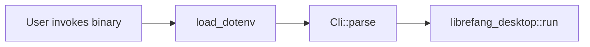

# Other — librefang-desktop-src

# librefang-desktop (binary entry point)

## Purpose

This module is the **executable entry point** for the LibreFang Desktop application — the binary users launch to run LibreFang in desktop/agent mode. It is intentionally minimal: it handles CLI argument parsing and early environment initialization, then immediately delegates to the `librefang_desktop` library crate for all real work.

## Architecture



## Startup Sequence

### 1. Environment Loading

```rust
librefang_extensions::dotenv::load_dotenv();
```

This runs **before anything else** — before argument parsing, before any async runtime or threads are spawned. It reads configuration files (`~/.librefang/.env`, `secrets.env`, `vault`) and injects their values into the process environment via `std::env::set_var`.

This ordering is critical. `std::env::set_var` is undefined behavior once additional threads exist, so environment mutation must happen at the synchronous `main()` boundary. Any code that reads environment variables (including code inside `librefang_desktop::run`) can safely assume the values are available.

### 2. CLI Argument Parsing

Arguments are parsed via `clap` using the `Parser` derive macro:

| Flag | Type | Description |
|------|------|-------------|
| `--server-url <URL>` | `Option<String>` | Connect to a remote LibreFang server (e.g. `http://192.168.1.100:4545`). When omitted, the application decides its own connection behavior. |
| `--local` | `bool` | Start a local server immediately, skipping the connection screen. |

Example invocations:

```bash
# Start with connection screen (default behavior)
librefang-desktop

# Connect directly to a known server
librefang-desktop --server-url http://192.168.1.100:4545

# Start a local server immediately
librefang-desktop --local
```

### 3. Delegation

```rust
librefang_desktop::run(cli.server_url, cli.local);
```

All application logic — window creation, UI rendering, networking, state management — lives in the `librefang_desktop` library crate. This binary passes the parsed arguments straight through.

## Platform Note

```rust
#![cfg_attr(not(debug_assertions), windows_subsystem = "windows")]
```

On Windows release builds, this attribute prevents a console window from appearing alongside the GUI. In debug builds, the console remains visible for `stdout`/`stderr` output.

## Dependencies on Other Crates

| Crate | Usage |
|-------|-------|
| `librefang_desktop` | Library crate containing the full application; calls `run(server_url, local)` |
| `librefang_extensions` | Provides `dotenv::load_dotenv()` for early environment setup |
| `clap` | CLI argument parsing with derive macros |

## Contributing

This binary should stay thin. If you find yourself adding logic here, it almost certainly belongs in `librefang_desktop` or `librefang_extensions` instead. The only invariant to preserve is that `load_dotenv()` must remain the very first call in `main()`.