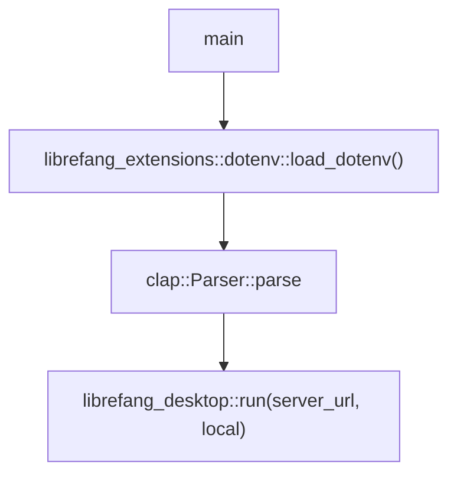

# Other — librefang-desktop-src

# librefang-desktop (Binary Entry Point)

## Overview

`librefang-desktop` is the thin binary crate that serves as the executable entry point for the LibreFang Desktop application (referred to internally as "Agent OS"). Its responsibilities are minimal by design:

1. **Load environment secrets** from disk into the process environment.
2. **Parse CLI arguments** (remote server URL or local mode flag).
3. **Delegate** to `librefang_desktop::run`, which owns the actual application lifecycle.

The crate contains no business logic. It exists because environment variables must be loaded synchronously at the process boundary before any async runtime or additional threads are spawned.

## Startup Sequence


```mermaid
flowchart TD
    A[main] --> B["librefang_extensions::dotenv::load_dotenv()"]
    B --> C[clap::Parser::parse]
    C --> D["librefang_desktop::run(server_url, local)"]
```

## CLI Interface

The binary exposes two optional flags via `clap`:

| Flag | Type | Description |
|------|------|-------------|
| `--server-url <URL>` | `Option<String>` | Connect to a remote LibreFang server (e.g. `http://192.168.1.100:4545`) |
| `--local` | `bool` | Start a local server directly, skipping the connection screen |

Both flags are optional. When neither is provided, the behavior is determined by `librefang_desktop::run` (typically presenting a UI for the user to choose).

### Examples

```bash
# Launch with connection screen (default)
librefang-desktop

# Connect to a specific remote server
librefang-desktop --server-url http://192.168.1.100:4545

# Start in local/offline mode
librefang-desktop --local
```

## Environment Loading

`librefang_extensions::dotenv::load_dotenv()` is called as the very first operation in `main`. It reads dotfiles (`.env`, `secrets.env`, `vault`) from `~/.librefang/` and injects them into the process environment via `std::env::set_var`.

> **Why here and not inside the library?** `std::env::set_var` is undefined behavior once multiple threads exist. The synchronous `main()` function is the only safe place to call it — before the Tokio runtime (or any other thread pool) is spawned by `librefang_desktop::run`.

The search path and file precedence are handled entirely by `librefang_extensions::dotenv`.

## Windows Console Behavior

The attribute:

```rust
#![cfg_attr(not(debug_assertions), windows_subsystem = "windows")]
```

Suppresses the allocation of a console window on Windows when building in release mode. In debug builds, the console remains visible for `println!` / `eprintln!` output. This has no effect on non-Windows platforms.

## Relationship to Other Crates

| Crate | Direction | Role |
|-------|-----------|------|
| `librefang_desktop` (library) | Called | Contains `run(server_url, local)` — the actual application bootstrapping, UI, and runtime |
| `librefang_extensions::dotenv` | Called | Handles `.env` / secrets file discovery and loading |

This binary crate has **no incoming calls** — it is the leaf node at the top of the call graph.