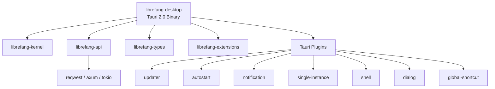

# Other — librefang-desktop

# librefang-desktop

Native desktop application for the LibreFang Agent OS, built on **Tauri 2.0**. This crate produces the `librefang-desktop` binary — a self-contained desktop client that bundles a local HTTP server with a native window shell, system tray, auto-updater, and platform installer.

## Architecture



The desktop app sits at the top of the dependency tree. It imports the core crates but does not export anything consumed by other workspace members — it is a pure **leaf node** in the module graph.

## Key Dependencies

### Internal crates

| Crate | Role |
|---|---|
| `librefang-kernel` | Core agent runtime and orchestration |
| `librefang-api` | HTTP API layer (axum-based). Feature flags propagate through |
| `librefang-types` | Shared type definitions |
| `librefang-extensions` | Extension system for agents |

### Tauri plugins

| Plugin | Purpose |
|---|---|
| `tauri-plugin-notification` | Native OS notifications |
| `tauri-plugin-shell` | Open external URLs and spawn processes |
| `tauri-plugin-single-instance` | Prevent duplicate app instances |
| `tauri-plugin-dialog` | Native file/message dialogs |
| `tauri-plugin-global-shortcut` | System-wide keyboard shortcuts |
| `tauri-plugin-autostart` | Launch at login / system boot |
| `tauri-plugin-updater` | In-app updates signed with minisign |

### Notable external crates

- **clap** — CLI argument parsing (the binary accepts runtime flags)
- **dirs** — Platform-standard directory paths for config/cache/data
- **toml** — TOML configuration file parsing
- **open** — Open URLs in the user's default browser
- **axum** / **tokio** — Embedded HTTP server for local API
- **tracing** / **tracing-subscriber** — Structured logging

## Feature Flags

Features primarily control which communication channels `librefang-api` includes. They forward directly into the `librefang-api` crate.

| Feature | Effect |
|---|---|
| `default` | Standard channel set via `librefang-api/default` |
| `all-channels` | Enables every supported channel |
| `mini` | Minimal channel subset for lighter builds |
| `custom-protocol` | Tauri production flag; switches asset loading from `dev-server` to `custom-protocol`. Enabled automatically in release bundles. |

## Build System

### `build.rs`

The build script delegates entirely to `tauri_build::build()`, which generates the embeddable assets and protocol handlers Tauri needs at compile time.

### Bundle configuration (`tauri.conf.json`)

| Field | Value |
|---|---|
| **Product name** | `LibreFang` |
| **Identifier** | `ai.librefang.desktop` |
| **Bundle targets** | All (`.deb`, `.AppImage`, `.dmg`, `.msi`, etc.) |
| **Category** | Productivity |
| **Minimum macOS** | 12.0 |
| **Windows WebView** | Download bootstrapper |

The app declares **no windows** in the config (`"windows": []`). Windows are created programmatically at runtime — this is typical for system-tray–driven apps that may show/hide a main window based on user interaction.

## Content Security Policy

The CSP is configured to allow:

- Connections to `http://127.0.0.1:*` and `ws://127.0.0.1:*` — communication with the embedded local API server
- Google Fonts loading over HTTPS
- Inline styles and eval'd scripts (required for the webview UI framework)
- Image and media sources from `self`, `data:`, `blob:`, and localhost
- `object-src 'none'` — blocks plugin content

All other sources are restricted to `'self'`.

## Auto-Updater

The updater is configured with:

- **Public key**: Minisign ed25519 key for signature verification
- **Endpoint**: `https://github.com/librefang/librefang/releases/latest/download/latest.json`
- **Windows install mode**: `passive` (shows progress, requires no user interaction)

Updates are checked and applied through the `tauri-plugin-updater` integration. The release signing key is embedded in `tauri.conf.json` under `plugins.updater.pubkey`.

## Building

```bash
# Development (uses dev-server for frontend assets)
cargo build -p librefang-desktop

# Production bundle (enables custom-protocol)
cargo build -p librefang-desktop --features custom-protocol --release
```

To produce platform installers, run through Tauri's bundler which invokes `cargo tauri build`. This automatically enables the `custom-protocol` feature and generates platform-specific installers in `target/release/bundle/`.

## Platform Notes

- **Linux**: AppImage and `.deb` are generated. No media framework bundling (`bundleMediaFramework: false`).
- **macOS**: Requires macOS 12.0+. No special entitlements or exception domains are configured by default.
- **Windows**: Uses SHA-256 digest for signing. WebView2 is installed via download bootstrapper if not present. No code-signing certificate thumbprint is set in the default config — supply one via environment or config override for signed builds.