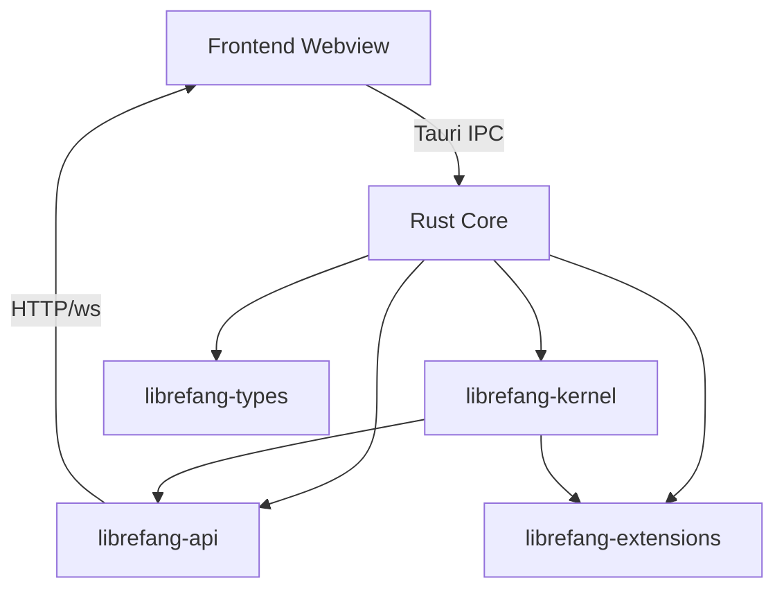

# Other — librefang-desktop

# librefang-desktop

Native desktop application for the LibreFang Agent OS, built on **Tauri 2.0**. It wraps the core agent runtime, API server, and extension system into a cross-platform desktop experience with system tray integration, auto-updates, and single-instance enforcement.

## Architecture



The desktop app is a thin host layer. The frontend (not included in this crate) communicates with the Rust backend via Tauri's IPC bridge, while also connecting directly to the embedded API server over `http://127.0.0.1:*` and `ws://127.0.0.1:*` for real-time streaming. The heavy lifting — agent orchestration, channel management, extension loading — is delegated entirely to the workspace crates.

## Feature Flags

Features propagate to `librefang-api` to control which channel backends are compiled in.

| Flag | Effect |
|------|--------|
| `default` | Standard feature set (forwards to `librefang-api/default`) |
| `all-channels` | Enables every available channel backend |
| `mini` | Minimal build with reduced channel support |
| `custom-protocol` | Production-only; switches Tauri to use `tauri://` protocol instead of `localhost` for asset loading |

`custom-protocol` should **only** be enabled in release/bundled builds. Development builds rely on the dev server on localhost.

## Tauri Plugins

| Plugin | Purpose |
|--------|---------|
| `tauri-plugin-notification` | Native OS notifications for agent events |
| `tauri-plugin-shell` | Spawning external processes from the frontend |
| `tauri-plugin-single-instance` | Prevents multiple app instances from running simultaneously |
| `tauri-plugin-dialog` | Native file/dialog pickers |
| `tauri-plugin-global-shortcut` | System-wide keyboard shortcuts to summon the app |
| `tauri-plugin-autostart` | Launch on system login |
| `tauri-plugin-updater` | Signed auto-update from GitHub Releases |

Tauri itself is built with the `tray-icon` and `image-png` features to support a system tray with a PNG icon.

## Configuration (`tauri.conf.json`)

### App Identity

- **Product name**: `LibreFang`
- **Identifier**: `ai.librefang.desktop`
- **Version**: follows the workspace version (currently `26.4.32276`)

### Windows

The `windows` array is intentionally empty (`[]`). Windows are created dynamically at runtime by the Rust backend rather than declared statically in the config. This allows the app to start minimized to the system tray and open windows on demand.

### Security — CSP

The Content Security Policy is tuned for a hybrid Tauri + local API server setup:

- **connect-src** allows `self`, loopback HTTP, and loopback WebSockets — required for the frontend to reach the embedded `librefang-api` server.
- **script-src** includes `'unsafe-inline'` and `'unsafe-eval'` for framework compatibility.
- **object-src** is set to `none`.
- External font loading from Google Fonts is permitted.
- Media and frame sources allow `blob:` URLs for streamed agent output.

### Auto-Updater

Updates are fetched from:
```
https://github.com/librefang/librefang/releases/latest/download/latest.json
```

The updater is configured with an Ed25519 public key for signature verification. On Windows, installation mode is `passive` (prompts the user). The public key and endpoint are baked into the bundle config — they are not runtime-configurable.

## Bundling

The app bundles for all standard targets:

| Platform | Formats | Notes |
|----------|---------|-------|
| Linux | `.deb`, `.AppImage` | No media framework bundled (`bundleMediaFramework: false`) |
| macOS | `.dmg` / `.app` | Minimum macOS 12.0 |
| Windows | `.msi` / `.exe` | SHA-256 digests; WebView2 bootstrapped on demand |

Icons must be provided at `icons/` relative to the crate root: `icon.ico`, `icon.png`, `32x32.png`, `128x128.png`, `128x128@2x.png`.

## Build Process

`build.rs` delegates entirely to `tauri_build::build()`, which:
1. Parses `tauri.conf.json`.
2. Generates Rust code for the declared capabilities and plugins.
3. On `custom-protocol` builds, embeds the frontend dist as bundled assets.

The `[[bin]]` target is `src/main.rs` with the binary name `librefang-desktop`.

## Dependency Graph

```
librefang-desktop
├── librefang-kernel      (agent runtime)
├── librefang-api         (HTTP/WS server, feature-gated)
├── librefang-types       (shared domain types)
├── librefang-extensions  (extension loading)
├── tauri + plugins       (desktop shell)
├── tokio                 (async runtime)
├── axum                  (used by librefang-api, also available here)
├── clap                  (CLI argument parsing)
├── reqwest               (HTTP client)
├── tracing / tracing-subscriber  (structured logging)
├── serde / serde_json / toml     (serialization)
└── open                  (open URLs in default browser)
```

`librefang-api` is imported with `default-features = false` so that the desktop crate controls exactly which features are active via its own feature flags.