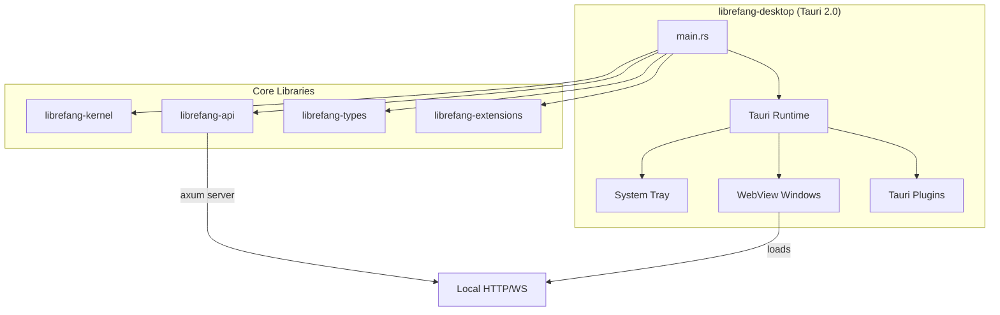

# Other — librefang-desktop

# librefang-desktop

Native desktop application for LibreFang Agent OS, built on Tauri 2.0. Provides a system-tray–resident agent host with a local web UI, auto-update support, and deep integration with the LibreFang core libraries.

## Architecture



The application starts a Tauri runtime with **no initial windows** (see `app.windows: []` in `tauri.conf.json`). Windows are created programmatically—typically pointing to a local axum HTTP server provided by `librefang-api`. This lets the desktop shell share the same frontend served to remote clients.

## Key Components

### Tauri Plugins

| Plugin | Purpose |
|--------|---------|
| `tauri-plugin-notification` | Native OS notifications for agent events |
| `tauri-plugin-shell` | Execute shell commands from the frontend |
| `tauri-plugin-single-instance` | Prevent multiple app instances from running simultaneously |
| `tauri-plugin-dialog` | Native file open/save dialogs |
| `tauri-plugin-global-shortcut` | System-wide keyboard shortcuts |
| `tauri-plugin-autostart` | Launch on system startup |
| `tauri-plugin-updater` | Signed auto-updates from GitHub Releases |

### Core Library Integration

- **`librefang-kernel`** — Agent orchestration engine, loaded as the primary runtime dependency.
- **`librefang-api`** — Provides the axum-based HTTP/WebSocket server. The desktop app runs this locally so the Tauri WebView can connect to `http://127.0.0.1:*` or `ws://127.0.0.1:*`.
- **`librefang-types`** — Shared data structures used across all crates.
- **`librefang-extensions`** — Plugin/extension system for agents.

Additional runtime dependencies include `clap` for CLI argument parsing, `dirs` for platform-specific paths, `reqwest` for outbound HTTP, `tokio` for async runtime, and `open` to launch external URLs in the default browser.

## Feature Flags

Features are defined in `Cargo.toml` and control which channel backends are compiled:

| Feature | Effect |
|---------|--------|
| `default` | Standard channel set via `librefang-api/default` |
| `all-channels` | Enables every available messaging channel |
| `mini` | Minimal build with reduced channel support |
| `custom-protocol` | Production-only; tells Tauri to use `tauri://` protocol instead of `dev://` |

For production builds, always enable `custom-protocol`:

```bash
cargo build --features custom-protocol
```

## Configuration (`tauri.conf.json`)

### Application Identity

- **Product name:** `LibreFang`
- **Identifier:** `ai.librefang.desktop`
- **Version:** `26.4.32222`

### Content Security Policy

The CSP is permissive toward `127.0.0.1` on any port, allowing the WebView to communicate with the local axum server over HTTP and WebSocket. External connections are restricted to Google Fonts. Key directives:

- `default-src 'self' http://127.0.0.1:* ws://127.0.0.1:*`
- `connect-src 'self' http://127.0.0.1:* ws://127.0.0.1:*`
- `object-src 'none'` — blocks plugin content entirely
- `script-src` allows `'unsafe-inline' 'unsafe-eval'` for framework compatibility

### Auto-Updater

Updates are fetched from GitHub Releases using a public key for signature verification:

```
endpoint: https://github.com/librefang/librefang/releases/latest/download/latest.json
```

On Windows, the install mode is `passive` (shows a progress bar but requires no user interaction).

### Bundle Targets

The bundler is configured to produce **all target formats**:

| Platform | Format | Notes |
|----------|--------|-------|
| Linux | `.deb`, `.AppImage` | No media framework bundled |
| macOS | `.dmg` / `.app` | Minimum macOS 12.0 |
| Windows | `.msi` / `.exe` | SHA-256 digest; WebView2 bootstrapped on install |

## Building

The build script (`build.rs`) delegates entirely to `tauri_build::build()`, which generates Tauri's runtime artifacts from `tauri.conf.json`.

```bash
# Development
cargo build -p librefang-desktop

# Production (release with custom protocol)
cargo build -p librefang-desktop --release --features custom-protocol

# Tauri CLI (recommended for full dev experience)
cargo tauri dev
cargo tauri build
```

## System Tray Behavior

The `tray-icon` feature flag is enabled, meaning the application registers a system tray icon on launch. Since no windows are declared in the config, the app starts as a background process and surfaces its UI on demand—either through the tray menu or a global shortcut. Combined with `tauri-plugin-autostart`, the agent host can run silently from login.