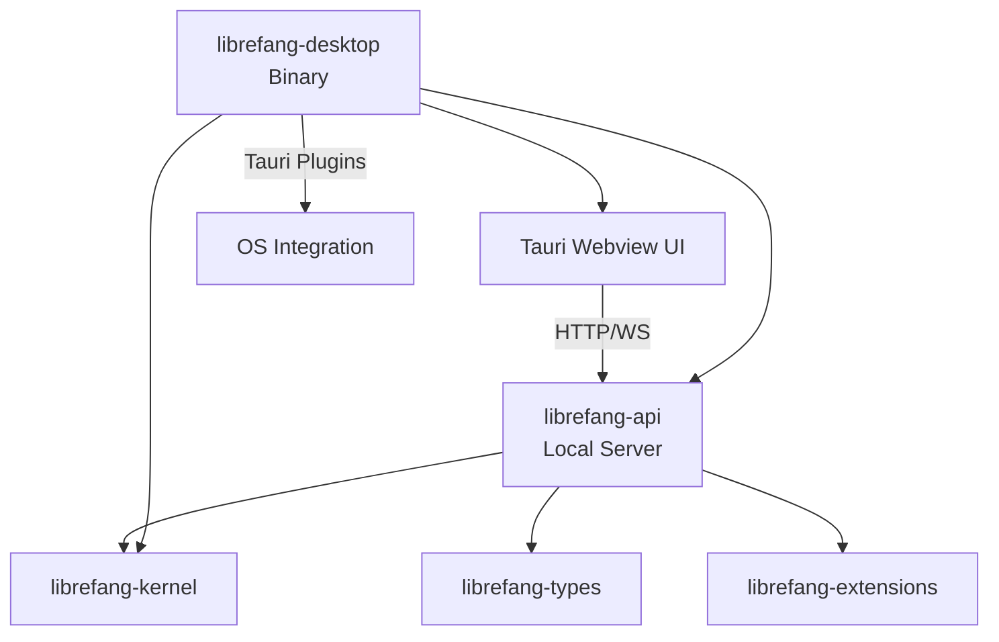

# Other — librefang-desktop

# librefang-desktop

Native desktop application for the LibreFang Agent OS, built on Tauri 2.0. This crate packages the LibreFang runtime as a platform-native desktop application with system tray integration, auto-update support, and single-instance enforcement.

## Architecture

The desktop app acts as a thin native shell around the core LibreFang libraries. It embeds a local HTTP/WebSocket server (via `librefang-api` and `axum`) and renders the frontend in a Tauri webview that connects to `127.0.0.1`.



## Dependencies on Core Crates

| Crate | Role |
|---|---|
| `librefang-kernel` | Core agent runtime and orchestration engine |
| `librefang-api` | HTTP/WebSocket server that the webview connects to |
| `librefang-types` | Shared type definitions |
| `librefang-extensions` | Agent extensions and plugins |

## Tauri Plugins

The application integrates several Tauri plugins for OS-level capabilities:

| Plugin | Purpose |
|---|---|
| `tauri-plugin-notification` | Native OS notifications for agent events |
| `tauri-plugin-shell` | Opening external URLs and shell interactions |
| `tauri-plugin-single-instance` | Prevents multiple instances from running simultaneously |
| `tauri-plugin-dialog` | Native file open/save dialogs |
| `tauri-plugin-global-shortcut` | System-wide keyboard shortcuts |
| `tauri-plugin-autostart` | Launch at system startup |
| `tauri-plugin-updater` | In-app auto-updates from GitHub Releases |

The `tauri` crate is built with the `tray-icon` and `image-png` features, enabling a system tray presence.

## Feature Flags

Feature flags delegate directly to `librefang-api` to control which communication channels are compiled in:

| Feature | Effect |
|---|---|
| `default` | Standard set of channels (delegates to `librefang-api/default`) |
| `all-channels` | Enables every available channel |
| `mini` | Minimal channel set for reduced binary size |
| `custom-protocol` | Required for production Tauri builds; switches the webview to use `tauri://` protocol instead of `localhost` |

## Configuration (`tauri.conf.json`)

### Application Identity

- **Product name:** `LibreFang`
- **Identifier:** `ai.librefang.desktop`
- **Version:** `26.4.32205`

### Content Security Policy

The CSP is configured to allow:
- Connections to `http://127.0.0.1:*` and `ws://127.0.0.1:*` (local API server)
- Google Fonts loading over HTTPS
- Inline styles and scripts within the webview
- Media and image loading from `blob:` and `data:` URIs
- No `object` embedding (`object-src 'none'`)

### Windows

The `app.windows` array is empty — windows are created programmatically at runtime rather than declared statically in the config. This allows the app to start in the system tray without immediately opening a window.

### Auto-Updater

The updater is configured to check GitHub Releases:

```json
"endpoints": [
  "https://github.com/librefang/librefang/releases/latest/download/latest.json"
]
```

Releases are signed. The public key is embedded in the config. On Windows, updates install in `passive` mode (progress bar shown, no user interaction required).

### Bundling

The app bundles for all supported targets:

- **Linux:** `.deb` and `.AppImage` formats. Media framework bundling is disabled.
- **macOS:** Minimum system version 10.12+ (Sierra and later). No special entitlements or frameworks.
- **Windows:** SHA-256 digest for signing. WebView2 is installed via download bootstrapper if not present.

## Build System

`build.rs` calls `tauri_build::build()`, which generates the embedded assets and compile-time configuration from `tauri.conf.json`. This is standard for Tauri projects — no custom build logic is added.

## Entry Point

The binary entry point is `src/main.rs`, which is expected to:

1. Initialize the Tauri app builder with the plugin set
2. Start the local `librefang-api` server on a localhost port
3. Register system tray icons and event handlers
4. Open the webview pointed at the local API server's frontend routes

## Relationship to Other Crates

This crate does not expose any libraries or APIs consumed by other workspace members. It is a leaf crate — it depends on the core libraries but nothing depends on it. It is the primary artifact for end-user distribution.