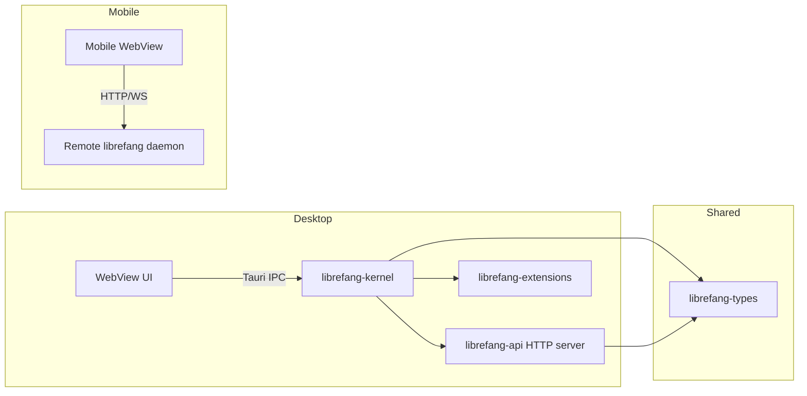

# Other — librefang-desktop

# librefang-desktop

Native desktop and mobile application for the LibreFang Agent OS, built on Tauri 2.0. Provides the system tray, bundled HTTP server, auto-updater, and a thin mobile client that connects to a remote daemon.

## Architecture



On **desktop**, the Tauri binary embeds the full LibreFang runtime — kernel, API server, and extensions all run in-process. The WebView communicates with the Rust backend through Tauri's IPC bridge.

On **mobile**, the app is a thin dashboard client. It connects over HTTP/WebSocket to a remote `librefang` daemon running on a server, NAS, or desktop machine. This is by design: cron jobs, autodream, channel adapters, and triggers require 24×7 uptime, which iOS and Android cannot guarantee in the background.

## Platform Targets

| Target | Identifier | Tray | Autostart | Updater | Shell |
|--------|-----------|------|-----------|---------|-------|
| macOS (`x86_64`, `aarch64`) | `ai.librefang.desktop` | ✅ always | ✅ | ✅ | ✅ |
| Windows | `ai.librefang.desktop` | ✅ always | ✅ | ✅ | ✅ |
| Linux desktop | `ai.librefang.desktop` | ⚠️ opt-in | ✅ | ✅ | ✅ |
| iOS | `ai.librefang.app` | — | — | — | — |
| Android | `ai.librefang.app` | — | — | — | — |

### Desktop-only plugins (compiled out on mobile)

These are gated by `cfg(not(any(target_os = "ios", target_os = "android")))`:

- **`tauri-plugin-single-instance`** — prevents multiple app instances
- **`tauri-plugin-autostart`** — launch at login
- **`tauri-plugin-global-shortcut`** — system-wide hotkeys
- **`tauri-plugin-updater`** — in-app updates with public key verification
- **`tauri-plugin-shell`** — CLI process spawning

### Mobile-only plugins

- **`tauri-plugin-barcode-scanner`** — QR code scanning for the connection wizard
- **`keyring`** — secure credential storage via platform keystores

## Cargo Features

| Feature | Default | Description |
|---------|---------|-------------|
| `default` | ✅ | Mirrors `librefang-api/default` (all stable channels) |
| `all-channels` | — | Enables all channel adapters including experimental ones |
| `mini` | — | Minimal channel set via `librefang-api/mini` |
| `custom-protocol` | — | Production Tauri builds (`tauri/custom-protocol`) |
| `mobile` | — | No-op documentation flag; mobile targets are `cfg`-gated |
| `linux-tray` | — | Re-enables system tray on Linux (see below) |
| `mobile-no-email` | — | Excludes `channel-email` for Android builds |

### The `linux-tray` feature and GTK3 advisory

Tauri 2.10's `tray-icon` feature on Linux pulls `libappindicator-rs 0.9`, which transitively depends on 8 unmaintained GTK3 crates (RUSTSEC-2024-0411 through RUSTSEC-0420) plus a `glib` unsoundness issue (RUSTSEC-2024-0429).

The default Linux build **does not include the system tray** to keep headless/CI builds clean. To opt in:

```bash
cargo build --features linux-tray
```

This accepts the audit advisories until Tauri migrates to `tray-icon 0.22+`/ksni. Tracked in #3667.

On macOS and Windows the tray is always enabled — those platforms use native APIs (`NSStatusItem` / `Shell_NotifyIconW`) with no GTK involvement.

### The `mobile-no-email` feature

The `channel-email` adapter depends on `rustls-connector 0.23.0`, which pulls `rustls-platform-verifier 0.7.0`. Its `Verifier::new_with_extra_roots` is not implemented for the Android target, causing a compile failure. The `mobile-no-email` feature builds with all channels except email:

```bash
cargo tauri android build --no-default-features --features mobile-no-email
```

## Configuration Files

Tauri uses a layered configuration system. The base `tauri.conf.json` is merged with platform-specific overlays at build time.

### `tauri.conf.json` — base config

- **Product**: LibreFang v26.5.32028
- **Identifier**: `ai.librefang.desktop`
- **CSP**: Restricts to `self`, `tauri:`, `ipc:`, `127.0.0.1:*` for HTTP/WS, plus Google Fonts domains
- **Bundle targets**: all (`.deb`, `.AppImage`, `.dmg`, `.msi`, `.exe`)
- **macOS minimum**: 12.0
- **Windows signing**: SHA-256 digest, WebView2 bootstrapper download

### `tauri.desktop.conf.json` — desktop overlay

Configures the auto-updater plugin:
- Public key for update signature verification
- Endpoint: `https://github.com/librefang/librefang/releases/latest/download/latest.json`
- Windows install mode: `passive` (shows progress, no user interaction required)

### `tauri.android.conf.json` — Android overlay

- **Identifier**: `ai.librefang.app`
- **Frontend**: served from `../librefang-api/static/react`
- **URL scheme**: `lfconnect://localhost/`
- **Minimum SDK**: API 26 (Android 8.0)

### `tauri.ios.conf.json` — iOS overlay

- **Identifier**: `ai.librefang.app`
- **Frontend**: same React bundle as Android
- **URL scheme**: `lfconnect://localhost/`
- **Minimum system version**: iOS 16.0

## Crate Type

The `[lib]` section produces three outputs:

```toml
crate-type = ["staticlib", "cdylib", "lib"]
```

- **`staticlib`** — linked into the native shell by Xcode (iOS)
- **`cdylib`** — loaded by the Tauri mobile runtime (Android)
- **`lib` (rlib)** — normal Rust library for the desktop binary in `src/main.rs`

Cargo cannot conditionalize `crate-type` on `cfg(mobile)` at the manifest level, so desktop builds also produce the `staticlib` and `cdylib` outputs. This adds approximately 10–20% to clean build times. If desktop build performance becomes a concern, this is a known bottleneck.

## Dependencies

The crate integrates the full LibreFang stack:

| Crate | Purpose |
|-------|---------|
| `librefang-kernel` | Core agent runtime, scheduling, triggers |
| `librefang-api` | HTTP/WS server serving the React dashboard |
| `librefang-types` | Shared domain types |
| `librefang-extensions` | Channel adapters and plugin system |

External dependencies include `tokio` (async runtime), `axum` (HTTP framework), `reqwest` (HTTP client), `clap` (CLI argument parsing), `tracing` (structured logging), and `toml`/`serde_json` for configuration serialization.

## Build Process

`build.rs` delegates entirely to `tauri_build::build()`, which:
1. Reads and merges the layered Tauri configuration files
2. Generates Rust bindings for Tauri IPC commands
3. Produces platform-specific build artifacts

For development:

```bash
# Desktop
cargo tauri dev

# Android emulator (after `cargo tauri android init`)
cargo tauri android dev

# iOS Simulator (macOS only, after `cargo tauri ios init`)
cargo tauri ios dev
```

For production builds:

```bash
cargo tauri build                           # desktop
cargo tauri build --features custom-protocol  # with custom protocol handler
```

## Mobile Deep Dive

See `MOBILE.md` in this directory for full mobile development documentation including:
- Android NDK/SDK requirements
- Xcode setup for iOS
- Scaffold generation (`gen/android/`, `gen/apple/`)
- Release pipeline details (`.aab`, `.apk`, `.ipa`)
- TestFlight and Play Internal Testing upload workflows

Minimum OS versions:

| Platform | Minimum |
|----------|---------|
| iOS | 16.0 |
| Android | API 26 (Android 8.0) |

## Related Issues

- Epic: #3351
- System tray / GTK3 advisory: #3667
- Mobile scaffold: #3342
- Mobile UX: #3343
- Connection wizard + QR: #3344
- CI build jobs: #3345
- Distribution: #3348