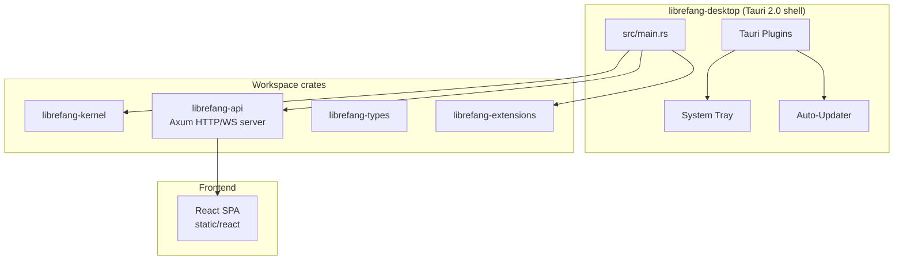

# Other — librefang-desktop

# librefang-desktop

Native desktop and mobile application for LibreFang, built on Tauri 2.0. This crate produces the installable binary that end-users run — it wraps the backend crates (`librefang-kernel`, `librefang-api`, `librefang-extensions`) behind a native window with system tray integration, auto-update, and platform-specific shell features.

## Architecture



The desktop binary is a thin native shell. It initialises the kernel, starts the Axum HTTP/WebSocket server from `librefang-api`, and serves the React frontend inside a Tauri webview window. Platform plugins (tray, autostart, updater, etc.) are layered on top depending on the target OS.

## Platform Support

| Platform | Binary type | Tray | Auto-update | Notes |
|----------|------------|------|-------------|-------|
| macOS 12+ | `.dmg` / `.app` | ✅ always | ✅ | NSStatusItem via native APIs |
| Windows | `.msi` / `.exe` | ✅ always | ✅ | Shell_NotifyIconW via native APIs |
| Linux | `.deb` / `.AppImage` | ⚠️ opt-in (`linux-tray`) | ✅ | Requires GTK3 stack; see [Linux tray](#linux-system-tray--gtk-advisories) |
| iOS 16+ | `.ipa` | — | — | Thin client; connects to remote daemon |
| Android 8+ (API 26) | `.aab` / `.apk` | — | — | Thin client; connects to remote daemon |

### Desktop vs. Mobile split

Desktop builds run the full LibreFang stack locally — the kernel, cron, channel adapters, and triggers all execute inside the same process.

Mobile builds are **thin clients**. The app opens a dashboard webview that connects over HTTP/WS to a remote `librefang` daemon running on a server, NAS, or desktop machine. This is by design: iOS and Android cannot guarantee the continuous background execution that LibreFang's cron and channel adapters require.

The following features are compiled out on mobile via `cfg(not(any(target_os = "ios", target_os = "android")))`:

- System tray icon
- Single-instance enforcement
- Autostart on login
- Global keyboard shortcuts
- Auto-updater
- Shell plugin (CLI process spawning)

Mobile builds additionally include:
- `tauri-plugin-barcode-scanner` — for QR-based connection setup
- `keyring` — native credential storage

## Feature Flags

Features are defined in `Cargo.toml` and control both this crate's behavior and downstream crate configurations.

| Feature | Default | Effect |
|---------|---------|--------|
| `default` | ✅ | Enables `librefang-api/default` (all stable channel adapters) |
| `all-channels` | — | Enables `librefang-api/all-channels` (includes experimental adapters) |
| `mini` | — | Minimal feature set via `librefang-api/mini` |
| `custom-protocol` | — | Production Tauri builds — uses `tauri://` custom protocol instead of dev server |
| `mobile` | — | No-op documentation flag; mobile targets are `cfg`-gated automatically |
| `linux-tray` | — | Opts into system tray on Linux (pulls GTK3 stack; macOS/Windows ignore this flag) |
| `mobile-no-email` | — | Excludes the email channel adapter — needed because `rustls-platform-verifier` lacks Android support for `Verifier::new_with_extra_roots` |

### Combining features

```bash
# Standard desktop build
cargo build -p librefang-desktop

# Linux desktop with system tray (accept GTK3 advisories)
cargo build -p librefang-desktop --features linux-tray

# Android build without email channel
cargo build -p librefang-desktop --target aarch64-linux-android \
  --no-default-features --features mobile-no-email

# Production (release) desktop build
cargo build -p librefang-desktop --features custom-protocol --release
```

## Linux System Tray & GTK Advisories

Tauri 2.10's `tray-icon` feature on Linux pulls `libappindicator-rs 0.9`, which transitively depends on 8 unmaintained GTK3 crates (RUSTSEC-2024-0411 through RUSTSEC-0420) plus a `glib` unsoundness issue (RUSTSEC-2024-0429).

To avoid forcing these dependencies on headless Linux servers and CI, the tray is **off by default on Linux**. macOS and Windows are unaffected — they use native tray APIs with no GTK dependency.

Opt in on Linux:

```bash
cargo build -p librefang-desktop --features linux-tray
```

This will be resolved when Tauri migrates to `tray-icon 0.22+` or the `ksni` backend. See issue #3667.

## Crate Type & Build Time

The `[lib]` section declares three crate types:

```toml
crate-type = ["staticlib", "cdylib", "lib"]
```

- `lib` — normal Rust library, used by `src/main.rs` for the desktop binary.
- `staticlib` / `cdylib` — required by `cargo tauri ios build` and `cargo tauri android build` so the Tauri mobile runtime and Xcode/Gradle can link the native shell.

Cargo does not support conditionalising crate types on `cfg(target)` at the manifest level, so **desktop builds also produce `staticlib` and `cdylib` outputs**. This adds ~10–20% to clean build times. If desktop build performance becomes a concern, splitting the mobile and desktop manifests is the available lever.

## Tauri Configuration

Tauri 2.0 uses a layered configuration system. The base config is `tauri.conf.json`, with platform overlays that merge on top.

### `tauri.conf.json` (base)

- **Identifier**: `ai.librefang.desktop`
- **CSP**: Restricts all resource loading to `self`, `tauri:`, `ipc:`, and `127.0.0.1:*` for HTTP/WS. External origins limited to Google Fonts. `object-src` is `none`.
- **Bundle targets**: All formats (`.dmg`, `.msi`, `.exe`, `.deb`, `.AppImage`).
- **macOS minimum**: 12.0
- **Windows webview**: Download bootstrapper if WebView2 is missing.
- **Windows digest**: SHA-256.

### `tauri.desktop.conf.json` (desktop overlay)

Configures the auto-updater:

```json
"updater": {
  "pubkey": "dW50cnVzdGVkIGNvbW1lbnQ6...",
  "endpoints": [
    "https://github.com/librefang/librefang/releases/latest/download/latest.json"
  ],
  "windows": { "installMode": "passive" }
}
```

The public key verifies the update signature. Endpoints point to the GitHub releases JSON. Windows install mode is `passive` (shows progress but requires no user interaction).

### `tauri.android.conf.json` & `tauri.ios.conf.json` (mobile overlays)

Both mobile configs:

- Override the identifier to `ai.librefang.app`.
- Set `frontendDist` to `../librefang-api/static/react` (the pre-built React SPA).
- Open a single main window at `lfconnect://localhost/` — the connection wizard URL for the thin client flow.

Platform-specifics:
- Android: `minSdkVersion: 26`
- iOS: `minimumSystemVersion: 16.0`

## Mobile Build & Development

See [`MOBILE.md`](./MOBILE.md) for full mobile documentation. Summary of prerequisites:

**Android:**
- Android NDK 26+ (`$ANDROID_NDK_HOME` set)
- Android SDK with API 26+ target
- Java 17
- One-time init: `cargo tauri android init`

**iOS (macOS only):**
- Xcode 15+
- iOS Simulator runtime
- One-time init: `cargo tauri ios init`

**Dev commands:**
```bash
cd crates/librefang-desktop

# Android emulator
cargo tauri android dev

# iOS Simulator
cargo tauri ios dev
```

The generated `gen/android/` and `gen/apple/` directories must be committed after running the init commands.

## Workspace Dependencies

This crate depends on four workspace crates:

| Crate | Purpose |
|-------|---------|
| `librefang-kernel` | Core agent runtime — initialisation, scheduling, state management |
| `librefang-api` | Axum HTTP/WS server that serves the React frontend and exposes the agent API |
| `librefang-types` | Shared data types used across the workspace |
| `librefang-extensions` | Plugin/extension system for agent capabilities |

External dependency highlights:

- **`tauri` 2** — native shell, webview, and plugin host
- **`clap`** — CLI argument parsing (desktop builds)
- **`tokio`** — async runtime (shared with kernel and API)
- **`axum`** — HTTP framework (used via `librefang-api`)
- **`reqwest`** — HTTP client for outbound requests
- **`tracing`** / **`tracing-subscriber`** — structured logging
- **`open`** — opens URLs in the system browser (used for OAuth flows)
- **`toml`** — config file parsing

## Build Script

`build.rs` contains a single call:

```rust
fn main() {
    tauri_build::build()
}
```

This generates the Tauri bindings, embeds the frontend assets, and produces the native shell glue code required by the Tauri runtime.

## Release & CI

Desktop release artifacts are produced by CI as signed installers for all platforms. Mobile release pipelines:

- **Android**: `.aab` / `.apk` uploaded to Play Internal Testing
- **iOS**: `.ipa` uploaded to TestFlight

Full release documentation including version-mapping rules, upload secret locations, and failure recovery runbooks is in `docs/src/app/operations/mobile-release/page.mdx`.