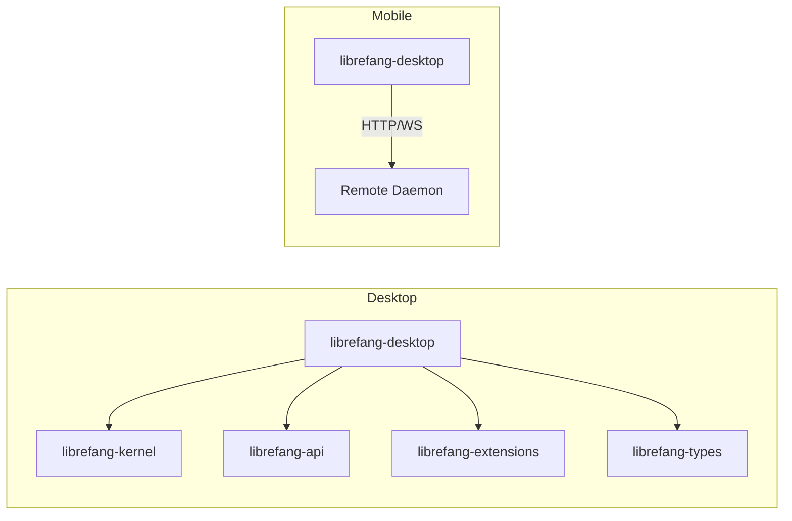

# Other — librefang-desktop

# librefang-desktop

Native desktop and mobile application for the LibreFang Agent OS, built on **Tauri 2.0**. This crate produces the installable GUI application that users interact with directly — a system-tray-aware desktop agent on macOS/Windows/Linux, and a thin remote-dashboard client on iOS/Android.

## Architecture Overview



**Desktop** runs the full LibreFang stack in-process — kernel, API server, extensions, and all channel adapters are embedded and communicate locally.

**Mobile** is a thin client only. The app renders a dashboard that connects over HTTP/WebSocket to a remote `librefang` daemon running on a server, VPS, NAS, or desktop machine. This is intentional: LibreFang needs 24×7 uptime for cron jobs, autodream, channel adapters, and triggers, which iOS/Android cannot guarantee due to OS background execution limits.

## Platform Matrix

| Platform | Role | Tray Icon | Autostart | Updater | Shell Plugin | Single Instance |
|----------|------|-----------|-----------|---------|--------------|-----------------|
| macOS | Full agent | Always on | ✓ | ✓ | ✓ | ✓ |
| Windows | Full agent | Always on | ✓ | ✓ | ✓ | ✓ |
| Linux | Full agent | Opt-in (`linux-tray`) | ✓ | ✓ | ✓ | ✓ |
| iOS | Thin client | — | — | — | — | — |
| Android | Thin client | — | — | — | — | — |

Mobile-only plugins (`tauri-plugin-barcode-scanner`, `keyring`) are gated behind `cfg(any(target_os = "ios", target_os = "android"))`. Desktop-only plugins are gated behind the inverse. See `MOBILE.md` for the full list of compiled-out features.

## Crate Layout

```
librefang-desktop/
├── Cargo.toml                  # Dependencies, features, crate-type
├── build.rs                    # tauri_build::build()
├── src/
│   ├── main.rs                 # Desktop binary entry point
│   └── lib.rs                  # Library crate (shared by desktop binary + mobile shells)
├── tauri.conf.json             # Base Tauri config (CSP, bundle, product metadata)
├── tauri.desktop.conf.json     # Desktop overlay (auto-updater pubkey + endpoints)
├── tauri.android.conf.json     # Android overlay (lfconnect:// scheme, minSdkVersion)
├── tauri.ios.conf.json         # iOS overlay (lfconnect:// scheme, minimumSystemVersion)
├── gen/                        # Generated mobile scaffolds (commit after init)
│   ├── android/                # Gradle project (cargo tauri android init)
│   └── apple/                  # Xcode project (cargo tauri ios init)
└── MOBILE.md                   # Mobile build/distribution guide
```

Tauri's configuration layering merges platform-specific `.conf.json` files over the base `tauri.conf.json`. The `identifier` field differentiates desktop (`ai.librefang.desktop`) from mobile (`ai.librefang.app`).

## Crate Types

```toml
[lib]
crate-type = ["staticlib", "cdylib", "lib"]
```

All three are required so the same crate works everywhere:

- **`lib`** (rlib) — the desktop binary in `src/main.rs` links against this normally.
- **`staticlib`** — iOS/Android native shells (Xcode/Gradle) link the static archive.
- **`cdylib`** — the Tauri mobile runtime loads the dynamic library.

**Side effect:** desktop builds also produce the `staticlib` and `cdylib` outputs, adding ~10–20% to clean build time. Cargo cannot conditionalize `crate-type` on target at the manifest level, so this cost is accepted for workspace uniformity.

## Cargo Features

| Feature | Effect |
|---------|--------|
| `default` | Inherits `librefang-api/default` |
| `all-channels` | Inherits `librefang-api/all-channels` |
| `mini` | Inherits `librefang-api/mini` (minimal channel set) |
| `custom-protocol` | Enables `tauri/custom-protocol` — required for production `.dmg`/`.msi`/`.deb` bundles |
| `mobile` | No-op flag documenting the mobile build path; mobile targets are cfg-gated |
| `linux-tray` | Re-enables the system tray on Linux desktop via `tauri/tray-icon` |
| `mobile-no-email` | Excludes the email channel (`librefang-api/all-channels-no-email`) — needed because `rustls-platform-verifier 0.7.0` has an unimplemented method on Android |

### The Linux Tray Situation

On macOS and Windows, the system tray uses native APIs (`NSStatusItem` / `Shell_NotifyIconW`) — no issues. On Linux, Tauri 2.10's `tray-icon` feature pulls `libappindicator-rs 0.9`, which transitively depends on 8 unmaintained GTK3 crates (RUSTSEC-2024-0411 through RUSTSEC-2024-0420) plus a `glib` unsoundness (RUSTSEC-2024-0429). Headless Linux servers and CI environments don't need a tray, so it's off by default. To opt in:

```bash
cargo build --features linux-tray
```

This will be revisited once Tauri migrates to `tray-icon 0.22+` or the `ksni` backend. See issue #3667.

## Tauri Configuration Details

### Content Security Policy (`tauri.conf.json`)

The desktop CSP is strict and explicit. Key directives:

- **`default-src 'self'`** — only local origin by default.
- **`connect-src`** — allows `http://127.0.0.1:*` and `ws://127.0.0.1:*` for the embedded API server and WebSocket communication.
- **`script-src`** — allows `tauri:` and `ipc:` schemes plus `'unsafe-inline'` (required for the React frontend bundle).
- **`img-src` / `media-src`** — permits `blob:` and `data:` URIs for dynamic content.
- **`object-src 'none'`** — blocks plugin content entirely.

### Auto-Updater (`tauri.desktop.conf.json`)

Desktop builds include `tauri-plugin-updater` configured with:

- A public key for update signature verification (minisign format).
- A GitHub Releases endpoint: `https://github.com/librefang/librefang/releases/latest/download/latest.json`.
- Windows install mode set to `passive` (shows progress, requires no user interaction beyond UAC).

Mobile builds do not include the updater — distribution goes through the App Store and Play Store.

### Mobile URL Scheme

Both `tauri.android.conf.json` and `tauri.ios.conf.json` configure the main window to load `lfconnect://localhost/` — a custom protocol scheme for the connection wizard. The frontend is served from `../librefang-api/static/react`, the same static React bundle used by the API server.

## Build Commands

### Desktop

```bash
# Development (hot reload)
cargo tauri dev

# Production bundle (requires custom-protocol)
cargo tauri build
```

### Mobile

```bash
# One-time scaffold generation (commit the gen/ directories afterward)
cargo tauri android init
cargo tauri ios init        # macOS only

# Development
cargo tauri android dev
cargo tauri ios dev          # macOS only

# CI smoke test (Android, no email channel)
cargo build --no-default-features --features mobile-no-email
```

Minimum OS versions: iOS 14.0 (config says 16.0 for the bundle), Android API 26 (Android 8.0).

## Dependencies on Workspace Crates

- **`librefang-kernel`** — the agent runtime (schedulers, triggers, automations). Embedded in desktop, not used on mobile.
- **`librefang-api`** — HTTP/WebSocket API server. Feature propagation (`default`, `all-channels`, `mini`, `all-channels-no-email`) controls which channel adapters are compiled in.
- **`librefang-types`** — shared domain types.
- **`librefang-extensions`** — extension loading and management.

The mobile builds depend on `librefang-api` with `default-features = false` (overridden per feature flag) to minimize binary size since the full API server stack isn't needed for a thin client.

## Release and Distribution

- Desktop bundles (`.dmg`, `.msi`, `.deb`, `.AppImage`) are produced by `cargo tauri build` and distributed via GitHub Releases with auto-update support.
- Mobile builds (signed `.aab`/`.apk`/`.ipa`) are handled by CI jobs `mobile_android` and `mobile_ios` in `.github/workflows/release.yml`.
- Store uploads go to TestFlight (iOS) and Play Internal Testing (Android) unattended from CI.
- Upload secrets, version-mapping rules, and the recovery runbook for failed uploads are in `docs/src/app/operations/mobile-release/page.mdx`.
- Required upload secrets are tracked in `.github/SECRETS.md`.
- The privacy policy template for both stores is at `.github/templates/PRIVACY_MOBILE_TEMPLATE.md`, pending legal review before publication.